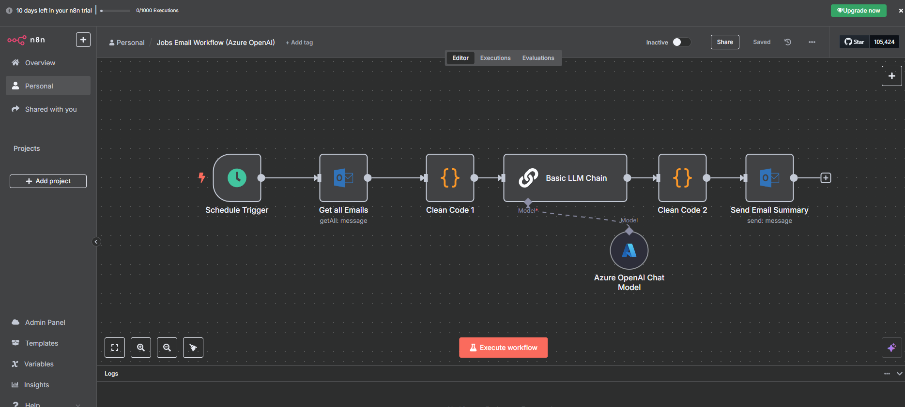

# 🤖 First Steps into AI Automation: My Journey from Trial to Self-Hosted Chaos

> What started as 'let me just automate some emails' somehow turned into a comprehensive exploration of every AI automation platform and deployment method known to mankind...

After months of reading about AI automation tools and watching everyone else's productivity skyrocket with clever workflows, I finally decided to stop being a spectator and dive in myself. What started as a simple "let's automate job alert emails" experiment quickly became a week-long journey through cloud trials, self-hosted deployments, OAuth authentication battles, and enough Docker containers to power a small data centre.

**In this post, you'll discover:**

- Real costs of AI automation experimentation ($10-50 range)
- Why self-hosted OAuth2 is significantly harder than cloud versions
- Performance differences: Pi 5 vs. desktop hardware for local AI
- When to choose local vs. cloud AI models
- Time investment reality: ~10 hours over 1 week for this project

Here's how my first real foray into AI automation unfolded — spoiler alert: it involved more container migrations than I initially planned.

**Hardware baseline for this project:**

> **💻 Development Environment**
>
> - **Primary machine:** AMD Ryzen 7 5800X, 32GB DDR4, NVMe SSD
> - **Pi 5 setup:** 8GB RAM, microSD storage  
> - **Network:** Standard home broadband (important for cloud API performance)

---

## 🎯 The Mission: Taming Job Alert Email Chaos

Let's set the scene. If you're drowning in recruitment emails like I was, spending 30+ minutes daily parsing through multiple job listings scattered across different emails, you'll understand the frustration. Each recruitment platform has its own format, some emails contain 5-10 different opportunities, and manually extracting the relevant URLs was becoming a productivity killer.

**The vision:** Create an automated workflow that would:

- Scrape job-related emails from my Outlook.com inbox
- Extract and clean the job data using AI
- Generate a neat summary email with all the job URLs in one place
- Send it back to me in a digestible format

Simple enough, right? *Famous last words.*

---

## 🔄 Phase 1: The n8n Cloud Trial Adventure

My research pointed to [n8n](https://n8n.io/) as the go-to tool for this kind of automation workflow. Being sensible, I started with their 14-day cloud trial rather than jumping straight into self-hosting complexities.

### ⚙️ Initial Setup & First Success

The n8n cloud interface is genuinely impressive — drag-and-drop workflow building with a proper visual editor that actually makes sense. Within a couple of hours, I had:

✅ **Connected to Outlook.com** via their built-in connector  
✅ **Set up email filtering** to grab job-related messages  
✅ **Configured basic data processing** to extract text content  
✅ **Integrated OpenAI API** for intelligent job URL extraction  

### 🤖 The AI Integration Challenge

This is where things got interesting. Initially, I connected the workflow to my [OpenAI API](https://openai.com/api/) account, using GPT-4 to parse email content and extract job URLs. The AI component worked brilliantly — almost too well, since I managed to burn through my $10 worth of token credits in just two days of testing.

**The cost reality:** Those "just testing a few prompts" sessions add up fast. A single complex email with multiple job listings processed through GPT-4 was costing around $0.15-0.30 per API call. When you're iterating on prompts and testing edge cases, those costs compound quickly.

**Lesson learned:** Test with smaller models first, then scale up. GPT-4 is excellent but not cheap for experimental workflows.

### 🎯 Partial Success (The Classic IT Story)

The workflow was *partially* successful — and in true IT fashion, "partially" is doing some heavy lifting here. While the automation successfully processed emails and generated summaries, it had one glaring limitation: **it only extracted one job URL per email**, when most recruitment emails contain multiple opportunities.

**What this actually meant:** A typical recruitment email might contain 5-7 job listings with individual URLs, but my workflow would only capture the first one it encountered. This wasn't a parsing issue — the AI was correctly identifying all the URLs in its response, but the n8n workflow was only processing the first result from the AI output.

**Why this limitation exists:** The issue stemmed from how I'd configured the data processing nodes in n8n. The workflow was treating the AI response as a single data item rather than an array of multiple URLs. This is a common beginner mistake when working with structured data outputs.

This became the recurring theme of my experimentation week: *everything works, just not quite how you want it to.*

### 💡 Enter Azure OpenAI

Rather than continue burning through OpenAI credits, I pivoted to [Azure OpenAI](https://azure.microsoft.com/en-gb/products/ai-services/openai-service). This turned out to be a smart move for several reasons:

- **Cost control:** Better integration with my existing Azure credits
- **Familiar environment:** Already comfortable with Azure resource management  
- **Testing flexibility:** My Visual Studio Developer subscription gives me £120 monthly credits

I deployed a **GPT-4 Mini** model in my test lab Azure tenant — perfect for experimentation without breaking the bank.

The Azure OpenAI integration worked seamlessly with n8n, and I successfully redirected my workflow to use the new endpoint. *Finally, something that worked first time.*

---

## 🐳 Phase 2: Self-Hosting Ambitions (Container Edition #1)

With the n8n cloud trial clocking ticking down, I faced the classic build-vs-buy decision. The cloud version was excellent, but I wanted full control and the ability to experiment without subscription constraints. The monthly $20 cost wasn't prohibitive, but the learning opportunity of self-hosting was too appealing to pass up.

Enter self-hosting with Docker containers — specifically, targeting my Raspberry Pi 5 setup.

### 🏠 The OpenMediaVault Experiment

My first attempt involved deploying n8n as a self-hosted Docker container on my [OpenMediaVault (OMV)](https://www.openmediavault.org/) setup. For those unfamiliar, OMV is a network-attached storage (NAS) solution built on Debian, perfect for home lab environments where you want proper storage management with container capabilities.

**Why the Pi 5 + OMV route:**

- **Always-on availability:** Unlike my main PC, the Pi runs 24/7
- **Low power consumption:** Perfect for continuous automation workflows
- **Storage integration:** OMV provides excellent Docker volume management
- **Learning opportunity:** Understanding self-hosted deployment challenges

**The setup:**

- **Host:** Raspberry Pi 5 running OpenMediaVault
- **Backend storage:** NAS device for persistent data
- **Database:** PostgreSQL container for n8n's backend
- **Edition:** n8n Community Edition (self-hosted)

### 😤 The Great OAuth Authentication Battle

This is where my self-hosting dreams met reality with a resounding thud.

I quickly discovered that replicating my cloud workflow wasn't going to be straightforward. The self-hosted community edition has functionality restrictions compared to the cloud version, but more frustratingly, I couldn't get OAuth2 authentication working properly.

**Why OAuth2 is trickier with self-hosted setups:**

- **Redirect URI complexity:** Cloud services handle callback URLs automatically, but self-hosted instances need manually configured redirect URIs
- **App registration headaches:** Azure app registrations expect specific callback patterns that don't align well with dynamic self-hosted URLs
- **Token management:** Cloud versions handle OAuth token refresh automatically; self-hosted requires manual configuration
- **Security certificate requirements:** Many OAuth providers now require HTTPS callbacks, adding SSL certificate management complexity

**The specific challenges I hit:**

- **Outlook.com authentication:** Couldn't configure OAuth2 credentials using an app registration from my test lab Azure tenant
- **Exchange Online integration:** Also failed to connect via app registration — kept getting "invalid redirect URI" errors
- **Documentation gaps:** Self-hosting authentication setup felt less polished than the cloud version

After several hours over two days debugging OAuth flows and Azure app registrations, I admitted defeat on the email integration front. *Sometimes retreat is the better part of valour.*

### 🌤️ Simple Success: Weather API Workflow

Rather than abandon the entire self-hosting experiment, I pivoted to a simpler proof-of-concept. I created a basic workflow using:

- **[OpenWeatherMap API](https://openweathermap.org/api)** for weather data
- **Gmail integration** with app passwords (much simpler than OAuth2)
- **Basic data processing** and email generation

This worked perfectly and proved that the self-hosted n8n environment was functional — the issue was specifically with the more complex authentication requirements of my original workflow.

---

## 🐳 Phase 3: The WSL Migration (Container Migration #2)

While the Pi 5 setup was working fine for simple workflows, I started feeling the hardware limitations when testing more complex operations. Loading even smaller AI models was painfully slow, and memory constraints meant I couldn't experiment with anything approaching production-scale workflows.

Time for **Container Migration #2**.

### 🖥️ Moving to WSL + Docker Desktop

With the Pi 5 hitting performance limits, I decided to experiment with local AI models using Ollama (a local LLM hosting platform) and OpenWebUI (a web interface for interacting with AI models). This required more computational resources than the Pi could provide, so I deployed these tools using Docker Compose inside Ubuntu running on Windows WSL (Windows Subsystem for Linux).

This setup offered several advantages:

**Why WSL over the Pi 5:**

- **Better hardware resources:** Access to my Windows PC's 32GB RAM and 8-core CPU vs. Pi 5's 8GB RAM limitation
- **Docker Desktop integration:** Visual container management through familiar interface
- **Development flexibility:** Easier to iterate and debug workflows with full IDE access
- **Performance reality:** Local LLM model loading went from 1+ minutes on Pi 5 to under 30 seconds

**My development machine specs:**

- **CPU:** AMD Ryzen 7 5800H with Radeon Graphics
- **RAM:** 32GB DDR4
- **Storage:** NVMe SSD for fast model loading
- **GPU:** None (pure CPU inference)

**Time Investment Reality:**

- **n8n cloud setup:** 2-3 hours (including initial workflow creation)
- **OAuth2 debugging:** 3+ hours over 2 days (ongoing challenge)
- **Pi 5 container setup:** 2+ hours
- **Docker Desktop container set up:** 2+ hours
- **Total project time:** ~10 hours over 1 week

**The new stack:**

- **Host:** Ubuntu in WSL2 on Windows
- **Container orchestration:** Docker Compose
- **Management:** Docker Desktop for Windows
- **Models:** [Ollama](https://ollama.ai/) for local LLM hosting
- **Interface:** [OpenWebUI](https://openwebui.com/) for model interaction

### 🧠 Local LLM Experimentation

This is where the project took an interesting turn. Rather than continuing to rely on cloud APIs, I started experimenting with local language models through Ollama.

**Why local LLMs?**

- **Cost control:** No per-token charges for experimentation
- **Privacy:** Sensitive data stays on local infrastructure
- **Learning opportunity:** Understanding how different models perform

The Docker Compose setup made it trivial to spin up different model combinations and test their performance on my email processing use case.

### ⚠️ Reality Check: Local vs. Cloud Performance

Let's be honest here — **using an LLM locally is never going to be a fully featured replacement for the likes of ChatGPT or Claude**. This became apparent pretty quickly during my testing.

**Performance realities:**

- **Speed:** Unless you're running some serious hardware, the performance will be a lot slower than the online AI counterparts
- **Model capabilities:** Local models (especially smaller ones that run on consumer hardware) lack the sophisticated reasoning of GPT-4 or Claude
- **Resource constraints:** My standard PC setup meant I was limited to smaller model variants
- **Response quality:** Noticeably less nuanced and accurate responses compared to cloud services

**Where local LLMs do shine:**

- **Privacy-sensitive tasks:** When you can't send data to external APIs
- **Development and testing:** Iterating on prompts without burning through API credits
- **Learning and experimentation:** Understanding how different model architectures behave
- **Offline scenarios:** When internet connectivity is unreliable

The key insight: **local LLMs are a complement to cloud services, not a replacement**. Use them when privacy, cost, or learning are the primary concerns, but stick with cloud APIs when you need reliable, high-quality results.

### 🔗 Hybrid Approach: Best of Both Worlds

The final configuration became a hybrid approach:

- **OpenWebUI connected to Azure OpenAI** for production-quality responses
- **Local Ollama models** for development and privacy-sensitive testing
- **Docker containers** exposed through Docker Desktop for easy management

This gave me the flexibility to choose the right tool for each task — cloud APIs when I need reliability and performance, local models when I want to experiment or maintain privacy.

### 💰 Cost Reality Check

After a week of experimentation, here's how the costs actually broke down:

| **Service** | **Trial Period** | **Monthly Cost** | **My Usage** | **Notes** |
|-------------|------------------|------------------|--------------|-----------|
| n8n Cloud | 14 days free | €20/month | 2 weeks testing | Full OAuth2 features |
| OpenAI API | Pay-per-use | Variable | $10 in 2 days | Expensive for testing |
| Azure OpenAI | Free credits | £120/month budget | ~£15 used | Better for experimentation |
| Self-hosted | Free | Hardware + time | 2 days setup | OAuth2 complexity |

**Key insight:** The "free" self-hosted option came with a significant time cost — debugging authentication issues for hours vs. having things work immediately in the cloud version.

---

## 📊 Current State: Lessons Learned & Next Steps

After a week of container deployments, OAuth battles, and API integrations, here's where I've landed:

### ✅ What's Working Well

**Technical Stack:**

- **n8n self-hosted:** Currently running 2 active workflows (weather alerts, basic data processing)
- **Azure OpenAI integration:** Reliable and cost-effective for AI processing — saving ~£25/month vs. direct OpenAI API
- **Docker containerisation:** Easy deployment and management across different environments
- **WSL environment:** 10x performance improvement over Pi 5 for local AI model loading

**Process Improvements:**

- **Iterative approach:** Start simple, add complexity gradually — this saved significant debugging time
- **Hybrid cloud/local strategy:** Use the right tool for each requirement rather than forcing one solution
- **Container flexibility:** Easy to migrate and scale across different hosts when hardware constraints appear

**Daily productivity impact:** While the original job email automation isn't fully solved, the weather automation saves ~10 minutes daily, and the learning has already paid dividends in other automation projects.

### ⚠️ Ongoing Challenges (The Work-in-Progress List)

**Authentication Issues:**

- OAuth2 integration with Outlook.com/Exchange Online still unresolved
- Need to explore alternative authentication methods or different email providers
- May require diving deeper into Azure app registration configurations

**Workflow Limitations:**

- Original job email processing goal partially achieved but needs refinement
- Multiple job URL extraction per email still needs work
- Error handling and retry logic need improvement

**Infrastructure Decisions:**

- Balancing local vs. cloud resources for different use cases
- Determining optimal Docker deployment strategy for production workflows
- Managing costs across multiple AI service providers

**Decision-making process during failures:** When something doesn't work, I typically: (1) Troubleshoot the exact error using ChatGPT or Anthropic Claude, (2) Search for similar issues in community forums, (3) Try a simpler alternative approach, (4) If still stuck after 2-3 hours, pivot to a different method rather than continuing to debug indefinitely.

### 🚀 Next Steps & Future Experiments

**Short-term goals (next 2-4 weeks):**

1. **Resolve OAuth2 authentication** for proper email integration
2. **Improve job URL extraction accuracy** — tackle the multiple URLs per email challenge
3. **Add error handling and logging** to existing workflows
4. **Explore alternative email providers** if Outlook.com integration remains problematic

**Medium-term exploration (next 2-3 months):**

1. **Local LLM performance tuning** for specific use cases
2. **Workflow templates** for common automation patterns
3. **Integration with other productivity tools** (calendar, task management)
4. **Monitoring and alerting** for automated workflows

### 🛠️ Quick Wins for Beginners

If you're just starting your AI automation journey, here are the lessons learned that could save you time:

> **🎯 Start Simple First**
>
> - Begin with n8n cloud trial to understand the platform without authentication headaches
> - Use simple APIs (weather, RSS feeds) before tackling complex ones (email OAuth2)
> - Test with smaller AI models before jumping to GPT-4

> **💡 Budget for Experimentation**
>
> - Set aside $20-50 for API testing — it goes faster than you think
> - Azure OpenAI credits can be more cost-effective than direct OpenAI API for learning
> - Factor in time costs when choosing self-hosted vs. cloud solutions

> **🔧 Have Fallback Options Ready**
>
> - Plan alternative authentication methods (app passwords vs. OAuth2)
> - Keep both cloud and local AI options available
> - Document what works and what doesn't for future reference

---

## 🔧 Technical Resources & Documentation

For anyone inspired to start their own AI automation journey, here are the key resources that proved invaluable:

### 🛠️ Core Tools & Platforms

- **[n8n](https://n8n.io/)** — Visual workflow automation platform
- **[Docker](https://www.docker.com/)** — Containerisation platform
- **[Docker Compose](https://docs.docker.com/compose/)** — Multi-container orchestration tool
- **[OpenMediaVault](https://www.openmediavault.org/)** — NAS/storage management solution

### 🤖 AI & LLM Resources

- **[Ollama](https://ollama.ai/)** — Local LLM hosting platform
- **[OpenWebUI](https://openwebui.com/)** — Web interface for local LLM interaction
- **[Azure OpenAI Service](https://azure.microsoft.com/en-gb/products/ai-services/openai-service)** — Enterprise AI API platform
- **[OpenAI API](https://openai.com/api/)** — Direct API access to GPT models

### 📚 Setup Guides & Documentation

- **[n8n Self-Hosting Guide](https://docs.n8n.io/hosting/)**
- **[Docker Installation Documentation](https://docs.docker.com/get-docker/)**
- **[Azure OpenAI Quickstart](https://learn.microsoft.com/en-us/azure/ai-services/openai/quickstart)** — Getting started with Azure OpenAI
- **[WSL Installation Guide](https://docs.microsoft.com/en-us/windows/wsl/install)** — Windows Subsystem for Linux setup

### 🔧 Troubleshooting Common Issues

Based on my week of trial and error, here are the most common problems you'll likely encounter:

<strong>OAuth2 Authentication Failures</strong>

**Symptoms:** "Invalid redirect URI" or "Authentication failed" errors when connecting to email services.

**Likely causes:**
- Redirect URI mismatch between app registration and n8n configuration
- Self-hosted instance not using HTTPS for callbacks
- App registration missing required API permissions

**Solutions to try:**
- Use app passwords instead of OAuth2 where possible (Gmail, Outlook.com) — **Note:** App passwords are simpler username/password credentials that bypass OAuth2 complexity but offer less security
- Ensure your n8n instance is accessible via HTTPS with valid SSL certificate
- Double-check app registration redirect URIs match exactly (including trailing slashes)
- Start with cloud trial to verify workflow logic before self-hosting

<strong>Container Performance Issues</strong>

**Symptoms:** Slow model loading, container crashes, high memory usage.

**Likely causes:**
- Insufficient RAM allocation to Docker
- CPU-intensive models running on inadequate hardware
- Competing containers for limited resources

**Solutions to try:**
- Increase Docker memory limits in Docker Desktop settings
- Use smaller model variants (7B instead of 13B+ parameters)
- Monitor resource usage with `docker stats` command
- Consider migrating from Pi to x86 hardware for better performance

<strong>API Rate Limiting and Costs</strong>

**Symptoms:** API calls failing, unexpected high costs, token limits exceeded.

**Likely causes:**
- Testing with expensive models (GPT-4) instead of cheaper alternatives
- No rate limiting in workflow configurations
- Inefficient prompt design causing high token usage

**Solutions to try:**
- Start testing with GPT-3.5-turbo or GPT-4-mini models
- Implement workflow rate limiting and retry logic
- Optimize prompts to reduce token consumption
- Set API spending alerts in provider dashboards

<strong>Resource Requirements Summary</strong>

**Minimum Requirements for Recreation:**
- **Cloud approach:** n8n trial account + $20-50 API experimentation budget
- **Self-hosted approach:** 8GB+ RAM, Docker knowledge, 2-3 days setup time
- **Local AI experimentation:** 16GB+ RAM recommended, considerable patience, NVMe storage preferred
- **Network:** Stable broadband connection for cloud API performance

---

## 💭 Final Thoughts: The Joy of Controlled Chaos

What started as a simple email automation project became a comprehensive exploration of modern AI automation tools. While I didn't achieve my original goal completely (yet), the journey provided invaluable hands-on experience with:

- **Container orchestration** across different environments
- **AI service integration** patterns and best practices  
- **Authentication complexity** in self-hosted vs. cloud environments
- **Hybrid deployment strategies** for flexibility and cost control

The beauty of this approach is that each "failed" experiment taught me something valuable about the tools and processes involved. The OAuth2 authentication issues, while frustrating, highlighted the importance of proper authentication design. The container migrations demonstrated the flexibility of modern deployment approaches.

**Most importantly:** I now have a functional foundation for AI automation experiments, with both cloud and local capabilities at my disposal.

Is it overengineered for a simple email processing task? Absolutely. Was it worth the learning experience? Without question.

*Have you tackled similar AI automation projects?* I'd particularly love to hear from anyone who's solved the OAuth2 self-hosting puzzle or found creative workarounds for email processing limitations. Drop me a line if you've found better approaches to any of these challenges.

---

### 📸 Image Requirements Summary

**For anyone recreating this setup, here are the key screenshots included in this post:**

1. **n8n-jobs-workflow-openai.png** — Original workflow using direct OpenAI API (the expensive version that burned through $10 in 2 days)
2. **azure-openai-deployment.png** — Azure OpenAI Studio showing GPT-4 Mini deployment configuration  
3. **n8n-jobs-workflow-azure.png** — Improved workflow using Azure OpenAI integration (the cost-effective version)
4. **omv-docker-n8n-containers.png** — OpenMediaVault interface showing Docker container management on Pi 5
5. **n8n-weather-workflow.png** — Simple weather API to Gmail workflow demonstrating successful self-hosted setup
6. **docker-desktop-ollama.png** — Docker Desktop showing Ollama and OpenWebUI containers running on WSL
7. **openwebui-local.png** — OpenWebUI interface showing both Azure OpenAI and local model selection options

Each image demonstrates the practical implementation rather than theoretical concepts, helping readers visualize the actual tools and interfaces involved in the automation journey.
