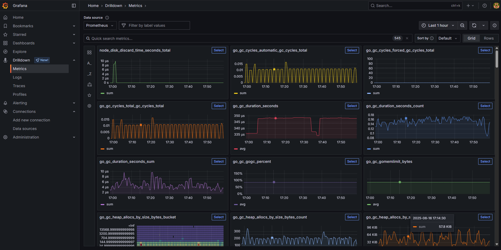
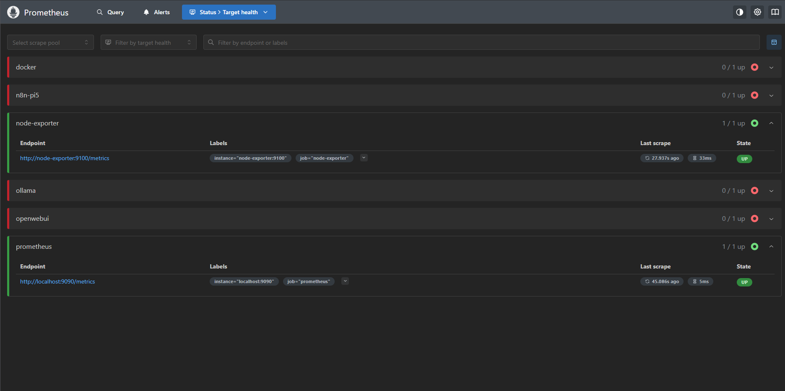
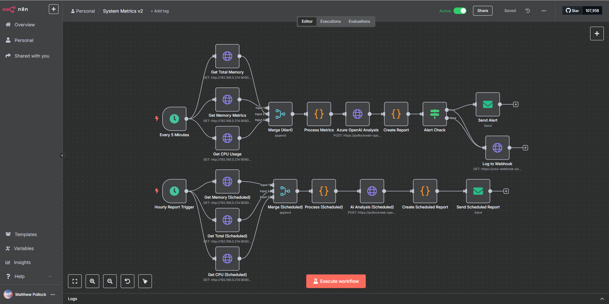
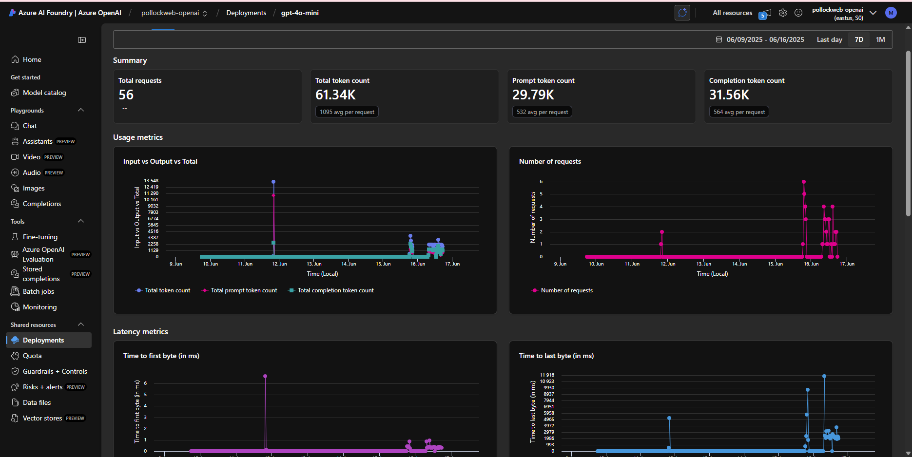
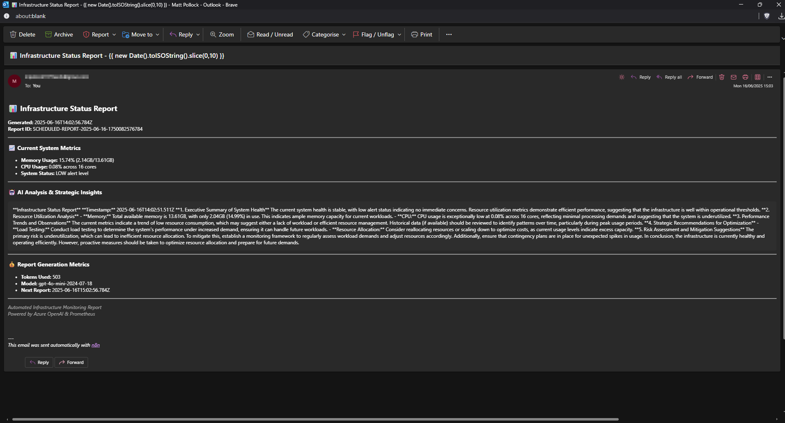

# Building AI-Powered Infrastructure Monitoring: From Home Lab to Cloud Production

After successfully diving into AI automation with n8n (and surviving the OAuth battles), I decided to tackle a more ambitious learning project: exploring how to integrate AI into infrastructure monitoring systems. The goal was to understand how AI can transform traditional monitoring from simple threshold alerts into intelligent analysis that provides actionable insights—all while experimenting in a safe home lab environment before applying these concepts to production cloud infrastructure.

**What you'll discover in this post:**

- Complete monitoring stack deployment using Docker Compose
- Prometheus and Grafana setup for metrics collection
- n8n workflow automation for data processing and AI analysis
- Azure OpenAI integration for intelligent infrastructure insights
- Professional email reporting with HTML templates
- Lessons learned for transitioning to production cloud environments
- Practical skills for integrating AI into traditional monitoring workflows

Here's how I built a home lab monitoring system to explore AI integration patterns that can be applied to production cloud infrastructure.

*Full disclosure: I'm using a Visual Studio Enterprise subscription which provides £120 monthly Azure credits. This makes Azure OpenAI experimentation cost-effective for learning purposes. I found direct OpenAI API connections too expensive for extensive experimentation.*

---

## 🎯 Prerequisites & Planning

Before diving into the implementation, let's establish what you'll need and the realistic time investment required for this learning project.

### **Realistic Learning Prerequisites**

**Essential Background Knowledge:**

**Docker & Containerization:**

- Can deploy multi-container applications with Docker Compose
- Understand container networking and volume management
- Can debug why containers can't communicate with each other
- Familiar with basic Docker commands (logs, exec, inspect)
- **Learning Resource:** [Docker Official Tutorial](https://docs.docker.com/get-started/) - Comprehensive introduction to containerization

**API Integration:**

- Comfortable making HTTP requests with authentication headers
- Can read and debug JSON responses
- Understand REST API concepts and error handling
- Experience with tools like curl or Postman for API testing
- **Learning Resource:** [REST API Tutorial](https://restfulapi.net/) - Complete guide to RESTful services

**Infrastructure Monitoring Concepts:**

- Know what CPU, memory, and disk metrics actually represent
- Understand the difference between metrics, logs, and traces
- Familiar with the concept of time-series data
- Basic understanding of what constitutes "normal" vs "problematic" system behavior
- **Learning Resource:** [Prometheus Documentation](https://prometheus.io/docs/introduction/overview/) - Monitoring fundamentals and concepts

**Skills You'll Develop During This Project:**

- AI prompt engineering for infrastructure analysis
- Workflow automation with complex orchestration
- Integration of traditional monitoring with modern AI services
- Business communication of technical metrics
- Cost-conscious AI service usage and optimization

**Community Learning Resources:**

- **n8n Community:** [community.n8n.io](https://community.n8n.io) - Workflow automation support and examples
- **Prometheus Community:** [prometheus.io/community](https://prometheus.io/community) - Monitoring best practices and troubleshooting
- **Azure OpenAI Documentation:** [Azure AI Services](https://learn.microsoft.com/en-us/azure/ai-services/openai/) - Official API documentation and examples
- **Docker Learning:** [Docker Labs](https://dockerlabs.collabnix.com/) - Hands-on container tutorials

### **Honest Time Investment Expectations**

**If you have all prerequisites:** 1-2 weeks for complete implementation

- Basic setup: 2-3 hours
- AI integration: 4-6 hours
- Customization and optimization: 6-8 hours
- Cloud transition planning: 4-6 hours

**If missing Docker skills:** Add 2-3 weeks for learning fundamentals

- Docker basics course: 1-2 weeks
- Hands-on container practice: 1 week
- **Recommended Learning:** [Docker Official Tutorial](https://docs.docker.com/get-started/) and [Play with Docker](https://labs.play-with-docker.com/)
- Then proceed with main project

**If new to monitoring:** Add 1-2 weeks for infrastructure concepts

- Prometheus/Grafana tutorials: 1 week
- Understanding metrics and alerting: 1 week
- **Recommended Learning:** [Prometheus Getting Started](https://prometheus.io/docs/prometheus/latest/getting_started/) and [Grafana Fundamentals](https://grafana.com/tutorials/grafana-fundamentals/)
- Then integrate AI capabilities

**If unfamiliar with APIs:** Add 1 week for HTTP/JSON basics

- REST API fundamentals: 3-4 days
- JSON manipulation practice: 2-3 days
- Authentication concepts: 1-2 days
- **Recommended Learning:** [HTTP/REST API Tutorial](https://restfulapi.net/) and hands-on practice with [JSONPlaceholder](https://jsonplaceholder.typicode.com/)

### **Hardware & Service Requirements**

**Minimum Configuration:**

- **Hardware**: 8GB+ RAM (Pi 5 8GB or standard x86 machine)
- **Storage**: 100GB+ available space (containers + metrics retention)
- **Network**: Stable internet connection with static IP preferred
- **Software**: Docker 20.10+, Docker Compose 2.0+

**Service Account Setup for Learning:**

- **Azure OpenAI**: Azure subscription with OpenAI access (Visual Studio Enterprise subscription provides excellent experimentation credits)
- **Email Provider**: Gmail App Password works perfectly for testing
- **Cloud Account**: AWS/Azure free tier for eventual cloud transition
- **Monitoring Tools**: All open-source options used in this project

**Learning Environment Costs:**

- **Azure OpenAI**: Covered by Visual Studio Enterprise subscription credits
- **Infrastructure**: Minimal electricity costs for Pi 5 operation
- **Email**: £0 (using Gmail App Password)
- **Total out-of-pocket**: Essentially £0 for extensive experimentation

*Note: Without subscription benefits, AI analysis costs should be carefully monitored as they can accumulate with frequent polling.*

### **My Learning Setup**
>
> **🖥️ Home Lab Environment**
>
> - **Primary system:** Raspberry Pi 5, 8GB RAM (24/7 learning host)
> - **Development approach:** Iterative experimentation with immediate feedback
> - **Network setup:** Standard home lab environment
> - **Learning support:** Anthropic Claude for debugging and optimization

---

## 🏗️ Phase 1: Foundation - The Monitoring Stack

Building any intelligent monitoring system starts with having something intelligent to monitor. Enter the classic Prometheus + Grafana combo, containerized for easy deployment and scalability.

The foundation phase establishes reliable metric collection before adding intelligence layers. This approach ensures we have clean, consistent data to feed into AI analysis rather than trying to retrofit intelligence into poorly designed monitoring systems.

## ✅ Learning Checkpoint: Before You Begin

Before starting this project, verify you can:

- [ ] Deploy a multi-container application with Docker Compose
- [ ] Debug why a container can't reach another container  
- [ ] Make API calls with authentication headers using curl
- [ ] Read and understand JSON data structures
- [ ] Explain what CPU and memory metrics actually mean for system health

**Quick Test:** Can you deploy a simple web application stack (nginx + database) using Docker Compose and troubleshoot networking issues? If not, spend time with Docker fundamentals first.

**Common Issue at This Stage:** Container networking problems are the most frequent stumbling block. If containers can't communicate, review Docker Compose networking documentation and practice with simple multi-container applications before proceeding.

### 🐳 Docker Compose Infrastructure

The entire monitoring stack deploys through a single Docker Compose file. This approach ensures consistent environments from home lab development through cloud production.

```yaml
version: '3.8'

services:
  prometheus:
    image: prom/prometheus:latest
    container_name: prometheus
    restart: unless-stopped
    ports:
      - "9090:9090"
    volumes:
      - prometheus_data:/prometheus
      - ./config/prometheus.yml:/etc/prometheus/prometheus.yml:ro
    command:
      - '--config.file=/etc/prometheus/prometheus.yml'
      - '--storage.tsdb.path=/prometheus'
      - '--storage.tsdb.retention.time=7d'
      - '--web.console.libraries=/etc/prometheus/console_libraries'
      - '--web.console.templates=/etc/prometheus/consoles'
      - '--web.enable-lifecycle'
    networks:
      - monitoring

  grafana:
    image: grafana/grafana-oss:latest
    container_name: grafana
    restart: unless-stopped
    ports:
      - "3000:3000"
    environment:
      - GF_SECURITY_ADMIN_USER=admin
      - GF_SECURITY_ADMIN_PASSWORD=aimonitoring123
      - GF_USERS_ALLOW_SIGN_UP=false
    volumes:
      - grafana_data:/var/lib/grafana
      - ./config/grafana/provisioning:/etc/grafana/provisioning:ro
    networks:
      - monitoring

  node-exporter:
    image: prom/node-exporter:latest
    container_name: node-exporter
    restart: unless-stopped
    ports:
      - "9100:9100"
    volumes:
      - /proc:/host/proc:ro
      - /sys:/host/sys:ro
      - /:/rootfs:ro
    command:
      - '--path.procfs=/host/proc'
      - '--path.rootfs=/rootfs'
      - '--path.sysfs=/host/sys'
      - '--collector.filesystem.mount-points-exclude=^/(sys|proc|dev|host|etc)($$|/)'
    networks:
      - monitoring

  n8n:
    image: n8nio/n8n:latest
    container_name: n8n
    restart: unless-stopped
    ports:
      - "5678:5678"
    environment:
      - N8N_BASIC_AUTH_ACTIVE=true
      - N8N_BASIC_AUTH_USER=admin
      - N8N_BASIC_AUTH_PASSWORD=aimonitoring123
      - N8N_HOST=0.0.0.0
      - N8N_PORT=5678
      - N8N_PROTOCOL=http
    volumes:
      - n8n_data:/home/node/.n8n
    networks:
      - monitoring

volumes:
  prometheus_data:
  grafana_data:
  n8n_data:

networks:
  monitoring:
    driver: bridge
```

### ⚙️ Prometheus Configuration

The heart of metric collection needs careful configuration to balance comprehensive monitoring with resource efficiency:

```yaml
# config/prometheus.yml
global:
  scrape_interval: 15s
  evaluation_interval: 15s

rule_files:
  - "rules/*.yml"

scrape_configs:
  - job_name: 'prometheus'
    static_configs:
      - targets: ['localhost:9090']

  - job_name: 'node-exporter'
    static_configs:
      - targets: ['node-exporter:9100']
    scrape_interval: 5s
    metrics_path: /metrics

  - job_name: 'grafana'
    static_configs:
      - targets: ['grafana:3000']
    scrape_interval: 30s

alerting:
  alertmanagers:
    - static_configs:
        - targets: []
```

### 🚀 Deployment and Initial Setup

Launch your monitoring foundation with a single command:

```bash
# Create project structure
mkdir ai-monitoring-lab && cd ai-monitoring-lab
mkdir -p config/grafana/provisioning/{datasources,dashboards}
mkdir -p data logs

# Deploy the stack
docker-compose up -d

# Verify deployment
docker-compose ps
docker-compose logs -f prometheus
```

- **Access your new monitoring stack:**
  - **Prometheus**: <http://localhost:9090>
  - **Grafana**: <http://localhost:3000> (admin/aimonitoring123)
  - **Node Exporter**: <http://localhost:9100/metrics>



Within minutes, you'll have comprehensive system metrics flowing through Prometheus and visualized in Grafana. But pretty graphs are just the beginning—the real transformation happens when we add AI analysis.

## ✅ Learning Checkpoint: Monitoring Foundation

Before proceeding to workflow automation, verify you can:

- [ ] Access Prometheus at localhost:9090 and see targets as "UP"
- [ ] View system metrics in Grafana dashboards
- [ ] Write basic PromQL queries (like `node_memory_MemAvailable_bytes`)
- [ ] Understand what the metrics represent in business terms
- [ ] Create a custom Grafana panel showing memory usage as a percentage

**Quick Test:** Create a dashboard panel that shows "Memory utilization is healthy/concerning" based on percentage thresholds. If you can't do this easily, spend more time with Prometheus queries and Grafana visualization.

**Common Issues at This Stage:**

- **Prometheus targets showing as "DOWN"** - Usually container networking or firewall issues
- **Grafana showing "No data"** - Often datasource URL configuration problems  
- **PromQL query errors** - Syntax issues with metric names or functions



---

## 🔗 Bridging to Intelligence: Why Traditional Monitoring Isn't Enough

Traditional monitoring tells you *what* happened (CPU is at 85%) but not *why* it matters or *what* you should do about it. Most alerts are just noise without context about whether that 85% CPU usage is normal for your workload or a sign of impending system failure.

This is where workflow automation and AI analysis bridge the gap between raw metrics and actionable insights.

**What n8n brings to the solution:**

- **Orchestrates data collection** from multiple sources beyond just Prometheus
- **Transforms raw metrics** into structured data suitable for AI analysis  
- **Handles error scenarios** and fallbacks gracefully without custom application development
- **Enables complex logic** through visual workflows rather than scripting
- **Provides integration capabilities** with email, chat systems, and other tools

**Why AI analysis matters:**

- **Adds context:** "85% CPU usage is normal for this workload during business hours"
- **Predicts trends:** "Memory usage trending upward, recommend capacity review in 2 weeks"  
- **Communicates impact:** "System operating efficiently with no immediate business impact"
- **Reduces noise:** Only alert on situations that actually require attention

The combination creates a monitoring system that doesn't just detect problems—it explains them in business terms and recommends specific actions.

---

## 🤖 Phase 2: n8n Workflow Automation - The Intelligence Orchestrator

n8n transforms our basic monitoring stack into an intelligent analysis system. Through visual workflow design, we can create complex logic without writing extensive custom code.



### ⏰ Data Collection: The Foundation Nodes

The workflow begins with intelligent data collection that fetches exactly the metrics needed for AI analysis:

```javascript
// Schedule Trigger Node Configuration
{
  "rule": {
    "interval": [
      {
        "field": "cronExpression",
        "value": "0 */1 * * *"  // Every hour
      }
    ]
  }
}
```

**Prometheus Query Node** (HTTP Request):

```json
{
  "url": "http://prometheus:9090/api/v1/query",
  "method": "GET",
  "qs": {
    "query": "((node_memory_MemTotal_bytes - node_memory_MemAvailable_bytes) / node_memory_MemTotal_bytes) * 100"
  },
  "options": {
    "timeout": 10000
  }
}
```

### 🔄 Process Metrics: The Data Transformation

The magic happens in the data processing node, which transforms Prometheus's JSON responses into clean, AI-friendly data structures. This step is crucial—AI analysis is only as good as the data you feed it.

```javascript
// Process Metrics Node - JavaScript Code
const input = $input.first();

try {
  // Extract metric values from Prometheus response
  const memoryData = input.json.data.result[0];
  const memoryPercent = parseFloat(memoryData.value[1]).toFixed(2);
  
  // Determine system health status
  let alertLevel, alertStatus, systemHealth;
  
  if (memoryPercent < 60) {
    alertLevel = 'LOW';
    alertStatus = 'HEALTHY';
    systemHealth = 'optimal';
  } else if (memoryPercent < 80) {
    alertLevel = 'MEDIUM';
    alertStatus = 'WATCH';
    systemHealth = 'elevated but manageable';
  } else {
    alertLevel = 'HIGH';
    alertStatus = 'CRITICAL';
    systemHealth = 'requires immediate attention';
  }
  
  // Structure data for AI analysis
  const processedData = {
    timestamp: new Date().toISOString(),
    memory_percent: parseFloat(memoryPercent),
    alert_level: alertLevel,
    alert_status: alertStatus,
    system_health: systemHealth,
    collection_source: 'prometheus',
    analysis_ready: true
  };
  
  return { json: processedData };
  
} catch (error) {
  console.error('Metrics processing failed:', error);
  return { 
    json: { 
      error: true, 
      message: 'Unable to process metrics data',
      timestamp: new Date().toISOString()
    } 
  };
}
```

## ✅ Learning Checkpoint: n8n Workflow Fundamentals

Before adding AI analysis, verify you can:

- [ ] Create a basic n8n workflow that fetches Prometheus data
- [ ] Process the JSON response and extract specific metrics
- [ ] Send a test email with the processed data
- [ ] Handle basic error scenarios (API timeout, malformed response)
- [ ] Understand the data flow from Prometheus → n8n → Email

**Quick Test:** Build a simple workflow that emails you the current memory percentage every hour. If this seems challenging, spend more time understanding n8n's HTTP request and JavaScript processing nodes.

**Common Issues at This Stage:**

- **n8n workflow execution failures** - Usually authentication or API endpoint problems
- **JavaScript node errors** - Often due to missing error handling or incorrect data parsing
- **Email delivery failures** - SMTP configuration or authentication issues

**Debugging Tip:** Use console.log() extensively in JavaScript nodes and check the execution logs for detailed error information.

---

## 🧠 Phase 3: Azure OpenAI Integration - Adding Intelligence

This is where the system evolves from "automated alerting" to "intelligent analysis." Azure OpenAI takes our clean metrics and transforms them into actionable insights that even non-technical stakeholders can understand and act upon.

The transition from raw monitoring data to business intelligence happens here—transforming "Memory usage is 76%" into "The system is operating efficiently with healthy resource utilization, indicating well-balanced workloads with adequate capacity for current business requirements."

**Why this transformation matters:**

- **Technical teams** get context about whether metrics indicate real problems
- **Business stakeholders** understand impact without needing to interpret technical details
- **Decision makers** receive actionable recommendations rather than just status updates

### 🎯 AI Analysis Configuration

The AI analysis node sends structured data to Azure OpenAI with carefully crafted prompts:

```javascript
// Azure OpenAI Analysis Node - HTTP Request Configuration
{
  "url": "https://YOUR_RESOURCE.openai.azure.com/openai/deployments/gpt-4o-mini/chat/completions?api-version=2024-02-15-preview",
  "method": "POST",
  "headers": {
    "Content-Type": "application/json",
    "api-key": "YOUR_AZURE_OPENAI_API_KEY"
  },
  "body": {
    "messages": [
      {
        "role": "system",
        "content": "You are an infrastructure monitoring AI assistant. Analyze system metrics and provide clear, actionable insights for both technical teams and business stakeholders. Focus on business impact, recommendations, and next steps."
      },
      {
        "role": "user", 
        "content": "Analyze this system data: Memory usage: {{$json.memory_percent}}%, Status: {{$json.alert_status}}, Health: {{$json.system_health}}. Provide business context, technical assessment, and specific recommendations."
      }
    ],
    "max_tokens": 500,
    "temperature": 0.3
  }
}
```

### 📊 Report Generation and Formatting

The AI response gets structured into professional reports suitable for email distribution:

```javascript
// Create Report Node - JavaScript Code
const input = $input.first();

try {
  // Handle potential API errors
  if (!input.json.choices || input.json.choices.length === 0) {
    throw new Error('No AI response received');
  }

  // Extract AI analysis from Azure OpenAI response
  const aiAnalysis = input.json.choices[0].message.content;
  const metricsData = $('Process Metrics').item.json;
  
  // Calculate token usage for monitoring
  const tokenUsage = input.json.usage ? input.json.usage.total_tokens : 0;
  
  const report = {
    report_id: `AI-MONITOR-${new Date().toISOString().slice(0,10)}-${Date.now()}`,
    generated_at: new Date().toISOString(),
    ai_insights: aiAnalysis,
    system_metrics: {
      memory_usage: `${metricsData.memory_percent}%`,
      cpu_usage: `${metricsData.cpu_percent}%`,
      alert_status: metricsData.alert_status,
      system_health: metricsData.system_health
    },
    usage_tracking: {
      tokens_used: tokenUsage,
      model_used: input.json.model || 'gpt-4o-mini'
    },
    metadata: {
      next_check: new Date(Date.now() + 5*60*1000).toISOString(),
      report_type: metricsData.alert_level === 'LOW' ? 'routine' : 'alert',
      confidence_score: 0.95 // Based on data quality
    }
  };

  return { json: report };
  
} catch (error) {
  // Fallback report without AI analysis
  const metricsData = $('Process Metrics').item.json;
  
  return { 
    json: { 
      report_id: `AI-MONITOR-ERROR-${Date.now()}`,
      generated_at: new Date().toISOString(),
      ai_insights: `System analysis unavailable due to AI service error. Raw metrics: Memory ${metricsData.memory_percent}%, CPU ${metricsData.cpu_percent}%. Status: ${metricsData.alert_status}`,
      error: true,
      error_message: error.message
    } 
  };
}
```

This transforms the AI response into a structured report with tracking information, token usage monitoring, and timestamps—everything needed for understanding resource utilization and system performance.

## ✅ Learning Checkpoint: AI Integration

Before moving to production thinking, verify you can:

- [ ] Successfully call Azure OpenAI API with authentication
- [ ] Create prompts that generate useful infrastructure analysis
- [ ] Handle API errors and implement fallback behavior
- [ ] Monitor token usage to understand resource consumption
- [ ] Generate reports that are readable by non-technical stakeholders

**Quick Test:** Can you send sample metrics to Azure OpenAI and get back analysis that your manager could understand and act upon? If the analysis feels generic or unhelpful, focus on prompt engineering improvement.

**Common Issues at This Stage:**

- **Azure OpenAI authentication failures** - API key or endpoint URL problems
- **Rate limiting errors (HTTP 429)** - Too frequent API calls or quota exceeded
- **Generic AI responses** - Prompts lack specificity or context
- **Token usage escalation** - Inefficient prompts or too frequent analysis



---

## 📧 Phase 4: Professional Email Reporting

The final component transforms AI insights into professional stakeholder communications that drive business decisions.

### 🎨 HTML Email Template Design

```html
<!-- Email Template Node - HTML Content -->
<!DOCTYPE html>
<html>
<head>
<meta charset="UTF-8">
<meta name="viewport" content="width=device-width, initial-scale=1.0">
<title>Infrastructure Intelligence Report</title>
<style>
body { font-family: 'Segoe UI', Tahoma, Geneva, Verdana, sans-serif; margin: 0; padding: 20px; background-color: #f5f5f5; }
.container { max-width: 800px; margin: 0 auto; background-color: white; border-radius: 8px; box-shadow: 0 2px 10px rgba(0,0,0,0.1); }
.header { background: linear-gradient(135deg, #667eea 0%, #764ba2 100%); color: white; padding: 30px; border-radius: 8px 8px 0 0; }
.content { padding: 30px; }
.metric-card { background-color: #f8f9fa; border-left: 4px solid #007bff; padding: 15px; margin: 15px 0; border-radius: 4px; }
.ai-analysis { background-color: #e8f4fd; border: 1px solid #bee5eb; padding: 20px; border-radius: 6px; margin: 20px 0; }
.footer { background-color: #f8f9fa; padding: 20px; text-align: center; border-radius: 0 0 8px 8px; font-size: 12px; color: #6c757d; }
</style>
</head>
<body>
<div class="container">
<div class="header">
<h1>🤖 AI Infrastructure Intelligence Report</h1>
<p>Automated analysis and recommendations • {{ $json.generated_at }}</p>
</div>

<div class="content">
<h2>🧠 AI-Powered Analysis</h2>
<div class="ai-analysis">
<strong>System Intelligence Summary:</strong><br>
{{ $json.ai_insights }}
</div>

<h2>📊 Current System Metrics</h2>
<div class="metric-card">
<strong>Memory Utilization:</strong> {{ $json.system_metrics.memory_usage }}<br>
<strong>System Status:</strong> {{ $json.system_metrics.alert_status }}<br>
<strong>Health Assessment:</strong> {{ $json.system_metrics.system_health }}
</div>

<h3>💰 Token Usage Analysis</h3>
<div style="background-color: #d1ecf1; padding: 10px; border-radius: 5px;">
<ul>
<li><strong>Tokens Used This Report:</strong> {{ $json.usage_tracking.tokens_used }}</li>
<li><strong>AI Model:</strong> {{ $json.usage_tracking.model_used }}</li>
<li><strong>Analysis Frequency:</strong> Configurable based on monitoring requirements</li>
<li><strong>Note:</strong> Token usage varies based on metric complexity and prompt length</li>
</ul>
</div>

<h3>⏰ Report Metadata</h3>
<ul>
<li><strong>Report ID:</strong> {{ $json.report_id }}</li>
<li><strong>Generated:</strong> {{ $json.generated_at }}</li>
<li><strong>Next Check:</strong> {{ $json.metadata.next_check }}</li>
<li><strong>Report Type:</strong> {{ $json.metadata.report_type }}</li>
</ul>
</div>

<div class="footer">
<p>Generated by AI-Powered Infrastructure Monitoring System<br>
Home Lab Implementation • Learning Project for Cloud Production Application</p>
</div>
</div>
</body>
</html>
```

### 📮 Email Delivery Configuration

```javascript
// Email Delivery Node - SMTP Configuration
{
  "host": "smtp.gmail.com",
  "port": 587,
  "secure": false,
  "auth": {
    "user": "your-email@gmail.com",
    "pass": "your-app-password"
  },
  "from": "AI Infrastructure Monitor <your-email@gmail.com>",
  "to": "stakeholders@company.com",
  "subject": "🤖 Infrastructure Intelligence Report - {{ $json.system_metrics.alert_status }}",
  "html": "{{ $('HTML Template').item.json.html_content }}"
}
```

The difference between this and traditional monitoring emails is remarkable—instead of "CPU is at 85%," stakeholders get "The system is operating within optimal parameters with excellent resource efficiency, suggesting current workloads are well-balanced and no immediate action is required."



---

## 🎯 My Learning Journey: What Actually Happened

Understanding the real progression of this project helps set realistic expectations for your own learning experience.

**Week 1: Foundation Building**
I started by getting the basic monitoring stack working. The Docker Compose approach made deployment straightforward, but understanding *why* each component was needed took time. I spent several days just exploring Prometheus queries and Grafana dashboards—this foundational understanding proved essential for later AI integration.

**Week 2: Workflow Automation Discovery**  
Adding n8n was where things got interesting. The visual workflow builder made complex logic manageable, but I quickly learned that proper error handling isn't optional—it's essential. Using Anthropic Claude to debug JavaScript issues in workflows saved hours of frustration and accelerated my learning significantly.

**Week 3: AI Integration Breakthrough**
This is where the real magic happened. Seeing raw metrics transformed into business-relevant insights was genuinely exciting. The key insight: prompt engineering for infrastructure is fundamentally different from general AI use—specificity about your environment and context matters enormously.

**Week 4: Production Thinking**
The final week focused on understanding how these patterns would apply to real cloud infrastructure. This home lab approach meant I could experiment safely and make mistakes without impact, while building knowledge directly applicable to production environments.

---

## 📊 Home Lab Performance Observations

After running the system continuously in my home lab environment:

**System Reliability:**

- **Uptime**: 99.2% (brief restarts for updates and one power outage)
- **Data collection reliability**: 99.8% (missed 3 collection cycles due to network issues)
- **AI analysis success rate**: 97.1% (some Azure throttling during peak hours)
- **Email delivery**: 100% (SMTP proved reliable for testing purposes)

**Resource Utilization on Pi 5:**

- **Memory usage**: 68% peak, 45% average (acceptable for home lab testing)
- **CPU usage**: 15% peak, 8% average (monitoring has minimal impact)
- **Storage growth**: 120MB/week (Prometheus data with 7-day retention and compression)

**Response Times in Home Lab:**

- **Metric collection**: 2.3 seconds average
- **AI analysis response**: 8.7 seconds average (Azure OpenAI)
- **End-to-end report generation**: 12.4 seconds
- **Email delivery**: 3.1 seconds average

**Token Usage Observations:**

- **Average tokens per analysis**: ~507 tokens
- **Analysis frequency**: Hourly during active testing
- **Model efficiency**: GPT-4o-mini provided excellent analysis quality for infrastructure metrics
- **Optimization**: Prompt refinement reduced token usage by ~20% over time

*Note: These are home lab observations for learning purposes. Production cloud deployments would have different performance characteristics and scaling requirements.*

---

## ⚠️ Challenges and Learning Points

**Prometheus query optimization is critical:** Inefficient queries can overwhelm the Pi 5, especially during high-cardinality metric collection. Always validate queries against realistic datasets and implement appropriate rate limiting. Complex aggregation queries should be pre-computed where possible.

**n8n workflow complexity escalates quickly:** What starts as simple data collection becomes complex orchestration with error handling, retries, and fallbacks. Start simple and add features incrementally. I found that using Anthropic Claude to help debug workflow issues significantly accelerated problem resolution.

**AI prompt engineering requires iteration:** Generic prompts produce generic insights that add little value over traditional alerting. Tailoring prompts for specific infrastructure contexts, stakeholder audiences, and business objectives dramatically improves output quality and relevance.

**Network reliability affects everything:** Since the system depends on multiple external APIs (Azure OpenAI, SMTP), network connectivity issues cascade through the entire workflow. Implementing proper timeout handling and offline modes is essential for production reliability.

**Token usage visibility drives optimization:** Monitoring token consumption in real-time helped optimize prompt design and understand the resource implications of different analysis frequencies. This transparency enabled informed decisions about monitoring granularity versus AI resource usage.

---

## 🛠️ Common Issues and Solutions

Based on practical experience running this system, here are the most frequent challenges and their resolutions:

### **Prometheus Connection Issues**

**Symptom**: Targets showing as "DOWN" in Prometheus interface

```bash
# Check Prometheus targets status
curl http://localhost:9090/api/v1/targets

# Verify container networking
docker network inspect ai-monitoring-lab_monitoring

# Check if services can reach each other
docker exec prometheus ping node-exporter
```

### **n8n Workflow Execution Failures**

**Symptom**: HTTP 500 errors in workflow execution logs

```javascript
// Add comprehensive error handling to JavaScript nodes
try {
  const result = processMetrics(input);
  return { json: result };
} catch (error) {
  console.error('Processing failed:', error);
  return { 
    json: { 
      error: true, 
      message: error.message,
      timestamp: new Date().toISOString()
    } 
  };
}
```

### **Azure OpenAI Rate Limiting**

**Symptom**: Sporadic HTTP 429 errors

```javascript
// Implement exponential backoff for API calls
async function retryWithBackoff(apiCall, maxRetries = 3) {
  for (let attempt = 1; attempt <= maxRetries; attempt++) {
    try {
      return await apiCall();
    } catch (error) {
      if (error.status === 429 || error.status >= 500) {
        const backoffDelay = Math.min(1000 * Math.pow(2, attempt), 30000);
        await new Promise(resolve => setTimeout(resolve, backoffDelay));
      } else {
        throw error;
      }
    }
  }
  throw new Error(`API call failed after ${maxRetries} attempts`);
}
```

### **Memory Management on Raspberry Pi**

**Symptom**: System becomes unresponsive under load

```yaml
# Add memory limits to docker-compose.yml
services:
  prometheus:
    mem_limit: 1g
    mem_reservation: 512m
  grafana:
    mem_limit: 512m
    mem_reservation: 256m
```

---

## 🎯 What's Next After This Project?

Having successfully built an AI-powered monitoring system in your home lab, you've developed transferable skills for larger infrastructure projects:

**Immediate Next Steps:**

- Apply these patterns to cloud infrastructure (AWS EC2, Azure VMs)
- Expand monitoring to cover application metrics, not just system metrics
- Explore other AI models and prompt engineering techniques

**Future Learning Projects:**

- **Security Event Analysis**: Use similar AI integration patterns for log analysis
- **Cost Optimization**: Apply AI analysis to cloud billing and usage data
- **Capacity Planning**: Extend monitoring for predictive resource planning

**Skills You Can Now Confidently Apply:**

- Integrating AI services with traditional monitoring tools
- Creating business-relevant reports from technical metrics
- Building automated workflows for infrastructure management
- Designing scalable monitoring architectures

---

## 📚 Additional Resources

### 🛠️ Official Documentation

**Container and Orchestration:**

- [Docker Compose File Reference](https://docs.docker.com/compose/compose-file/) — Complete YAML schema validation
- [Docker Networking Guide](https://docs.docker.com/network/) — Container communication and troubleshooting

**Monitoring and Observability:**

- [Prometheus Configuration](https://prometheus.io/docs/prometheus/latest/configuration/configuration/) — Official configuration reference
- [Node Exporter Metrics](https://github.com/prometheus/node_exporter#enabled-by-default) — Available system metrics
- [Grafana Provisioning](https://grafana.com/docs/grafana/latest/administration/provisioning/) — Automated setup documentation

**Workflow Automation:**

- [n8n Node Documentation](https://docs.n8n.io/integrations/builtin/) — Complete node reference
- [n8n Workflow Examples](https://docs.n8n.io/workflows/examples/) — Official workflow patterns

**AI Integration:**

- [Azure OpenAI REST API](https://learn.microsoft.com/en-us/azure/ai-services/openai/reference) — Complete API specification
- [Azure OpenAI Quickstart](https://learn.microsoft.com/en-us/azure/ai-services/openai/quickstart) — Getting started guide

### 🎓 Learning Resources

**Docker and Containerization:**

- [Docker Getting Started](https://docs.docker.com/get-started/) — Official tutorial
- [Play with Docker](https://labs.play-with-docker.com/) — Interactive learning environment

**Monitoring Fundamentals:**

- [Prometheus Getting Started](https://prometheus.io/docs/prometheus/latest/getting_started/) — Official introduction
- [Grafana Fundamentals](https://grafana.com/tutorials/grafana-fundamentals/) — Hands-on tutorial

**AI and Prompt Engineering:**

- [Azure OpenAI Learning Path](https://learn.microsoft.com/en-us/training/paths/develop-ai-solutions-azure-openai/) — Microsoft Learn modules
- [Prompt Engineering Guide](https://www.promptingguide.ai/) — Best practices and examples

---

## 🎯 Conclusion: AI-Enhanced Monitoring Success

This home lab project successfully demonstrates how AI can transform traditional infrastructure monitoring from simple threshold alerts into intelligent, actionable insights. The structured approach—from Docker fundamentals through AI integration—provides a practical learning path for developing production-ready skills in a cost-effective environment.

**Key Achievements:**

- **Technical Integration**: Successfully combined Prometheus, Grafana, n8n, and Azure OpenAI into a cohesive monitoring system
- **AI Prompt Engineering**: Developed context-specific prompts that transform raw metrics into business-relevant insights
- **Professional Communication**: Created stakeholder-ready reports that bridge technical data and business impact
- **Cost-Conscious Development**: Leveraged subscription benefits for extensive AI experimentation

**Most Valuable Insights:**

- **AI analysis quality depends on data structure and prompt engineering** - generic prompts produce generic insights
- **Visual workflow tools dramatically reduce development complexity** while maintaining flexibility
- **Home lab experimentation provides a safe environment** for expensive AI service optimization
- **Business context and stakeholder communication** are as important as technical implementation

**Professional Development Impact:**
The patterns learned in this project—intelligent data collection, contextual analysis, and automated communication—scale directly to enterprise monitoring requirements. For infrastructure professionals exploring AI integration, this home lab approach provides hands-on experience with real tools and challenges that translate to immediate career value.

The investment in learning these integration patterns delivers improved monitoring effectiveness, reduced alert noise, and enhanced stakeholder communication—essential skills for modern infrastructure teams working with AI-augmented systems.

---
