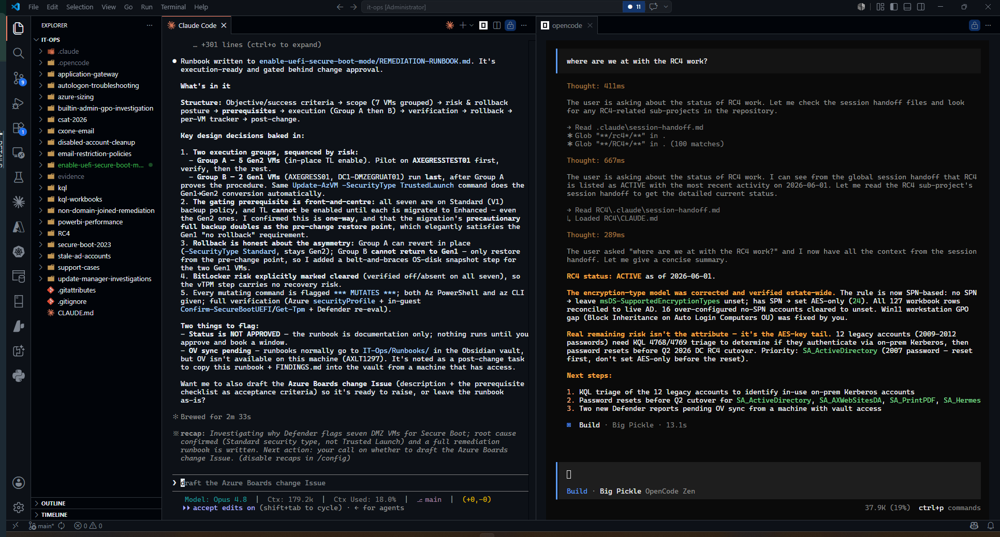

# 🧭 Where I'm At With AI in IT-Ops: A 2026 Snapshot

I've read plenty from devs about how they've wired up Claude Code, OpenCode and the rest into their workflows. Folder conventions, custom agents, shell hooks, the lot. Almost nothing from the IT-Ops side.

<!-- more -->

There are probably good posts out there from ops people — they just aren't crossing my feed. And I get why the dev write-ups don't quite map. Wide-scale automation for code and infrastructure doesn't really fit an org like ours: we're not shipping vast amounts of code through pipelines, click-ops is still very much a thing, and reducing manual portal work is an ongoing effort rather than a solved problem. The environment is user-focused, not code-focused, and my day can cover identity in the morning, a mailbox oddity at lunch, and, by mid-afternoon, working out what Microsoft has renamed this week.

That's the context this all runs in. So this is my take after a few years of serious use — just where I've actually landed in 2026.

---

## 💬 The thing I keep seeing

I'll start here, because it's the context everything else sits in.

There's a pattern I see on repeat at work. A dev hits an issue they can't explain. They ask infra to check the usual suspects — resource exhaustion, blocked traffic. We check; clean bill of health. They go away to dig further. And here's the modern twist: they come back armed with a Copilot transcript. "Look, this is what the issue is with X."

The transcript is always missing the same thing: context. The question that produced it was "I have an issue with X, here are the symptoms, what is the fix" — asked by someone who doesn't know how the cloud environment hangs together, to a model that has never seen it. What the situation actually needed was "here are the symptoms, here's how the environment is set up, here are the logs, here's what we've ruled out so far." Nine times out of ten I have to put them right.

> The difference was never the tool. It's how hard you question what comes back.

AI hands you back a version of what you bring to it. Run Microsoft estates long enough and you get a nose for a wrong answer — usually because you've had to clean up after a few. Without that, the confident nonsense travels — into a Teams chat today, into production eventually.

That's not a criticism of the people doing it. It's just the thing that's becoming visible in 2026: the gap between people using AI seriously and people using it superficially is starting to show in the work. It'll keep widening.

I don't need AI to be brilliant. I need it reliable on the boring stuff so I can spend my own attention on things that actually need it. An extra pair of hands, not a genius in a box. But it only works that way if you already know what you're doing.

---

## 🚪 The boundary that moved

It's worth being precise about what actually changed, because it wasn't the models.

The old workflow — and it ran for years — was VS Code as an editor with a chat window open beside it. Claude or ChatGPT helped draft PowerShell for the hybrid AD and Entra estate; I copy-pasted it into a terminal and ran it myself. I never thought of that copy-paste step as a security control, but it was exactly that: the AI wrote text, and a human decided what got executed, every single time.

Moving to Claude Code and OpenCode — over a year ago now — erased that step. The assistant got a terminal, real credentials, and the ability to act inside a live production tenant — Azure, Entra ID, Exchange Online, on-prem AD. That's the boundary that moved. Everything else in this post — the identity model, the hooks, the way the agents are built — exists because it did.

---

## 🧰 My setup

### Two CLIs, on purpose

VSCode on the left, two terminal panes on the right. Claude Code in one, OpenCode in the other, both pointed at the same repo. They're not split by task type — they're two entry points into the same workspace. I run both deliberately: I don't want to depend on a single vendor's tool, and I want first-hand experience of how other agentic platforms behave rather than taking other people's write-ups on faith. There's a practical payoff too — when Claude Code hits a session limit mid-task, the same repo, agents and conventions are already loaded in OpenCode, and the work carries on against a different model instead of stopping.

### One agent, every surface

The specialised agents — an IT-Ops investigator, a document auditor, a brutal-critic reviewer, and thirty-odd more — live as templates in a single directory: YAML frontmatter, a system prompt, per-CLI override blocks. A deploy script projects each template into the shape each CLI expects, and Syncthing carries the directory between machines. Two hooks keep it self-healing: edit a template and it redeploys within seconds; start a session and it reconciles the local copies against whatever arrived from the other machines overnight. There's even a back-port step for drift — create an agent outside the template system and the next hook fire detects the orphan, generates a template from it, and folds it back into the source of truth rather than fighting it.

### Scaffolding over sessions

Projects sit under `~/ai-terminal/projects/`, split by work and personal. Each gets its own `CLAUDE.md` — project-specific context that loads automatically and tells the agent what it's working in.

And each keeps a `session-handoff.md` — written at the end of every session, alongside a global one for cross-project state: what changed, what's pending, the exact next step. That's deliberate insurance. I never rely on `/resume` in Claude Code or `/sessions` in OpenCode to dig the right chat out of history. A new session, pointed at the project folder, opens with "bring me up to speed with what happened last session" — and it carries on from the file, not from a transcript.

I spent too long early on over-engineering prompts — tweaking the wording, trying to write the perfect instruction. The scaffolding is what actually made things consistent and portable. The prompts matter less than I thought; the infrastructure around them matters more.

### Verification on tap

One of the biggest wins has been wiring verification into the tooling itself. The Microsoft Learn MCP server gives the agents live access to official documentation for research and cross-checking. More recently I built an m365-docs skill — a small RAG tool run against the Microsoft 365 for IT Pros ebook series, which covers the real-world behaviour the official docs gloss over. Between the two, an agent's claim about how something works gets checked against an authoritative source in the same session it's made. The agents don't get to cite themselves.

---

## 🐑 Not assistant, shepherd

Most people I see are using AI as an assistant. They have a task, they ask for help, they get an answer, they move on. I've mostly stopped doing that. What's actually cleared work from my queue is putting agents on long-running jobs while I shepherd — and shepherd is the right word, because they need it.

Concrete example: we have over a hundred legacy service accounts in AD — years of accumulation, the kind of backlog that sits there because nobody has time to audit it properly. Each account needs looking at from multiple angles: is there a security posture concern with how it's authenticating? Where is it actually used — a scheduled task, a local service, environment variables baked into a VM? Does it have a mailbox? When did it last authenticate? Is it safe to disable, and if so who needs to know?

Manually, that's a substantial scripting and research project, done account by account. Instead, I built a runbook — a structured investigation workflow — and a custom agent to execute it. The agent works through the list, pulling the relevant data for each account and flagging what needs a decision.

Here's why the shepherding is not optional. The agents don't know the estate the way an engineer does. Cross-referencing that many accounts — statuses, attributes, logon history — and compiling the findings into reports is a lot to ask an agent and its spawned subagents to get perfect, especially across long sessions where the early context has been pushed out of memory. So every report gets eyeballed. That's how I caught a disabled account, no logon data recorded, classed by the agent as a stale account — which actually belonged to a live shared mailbox, very much in use.

> Every attribute the agent could see said dead. The estate knowledge said otherwise.

It cuts the other way too. One mailbox investigation ended with a confident, plausible "root cause: Microsoft" conclusion. I pushed back — this has not been confirmed, has it? It hadn't. The investigation had proven that token issuance succeeded, but never actually exercised the downstream API call that was failing. Re-run with the real credentials, the conclusion changed materially. The workflow doesn't get credit for sounding right; findings get held to the same standard I'd hold my own, and they have been wrong before.

Each catch goes back into the runbook and the prompts, and the next pass comes back cleaner. It's still a lot of work on my part — anyone who says this kind of project runs itself hasn't tried anything complex. But the nature of the work changed. I stopped doing the repetitive, scriptable parts and stayed focused on the parts that need someone who knows what they're looking at. These things take time.

---

## 📋 What the work actually looks like

This isn't a lab exercise. The ops repo holds seventy-odd sub-projects, live and archived — real operational work, every one run through the same loop: triage, evidence, hypotheses, remediation, verification, documentation. A representative spread:

- A multi-month privileged-access programme, moving every admin identity off always-on accounts and onto just-in-time elevation — cohort by cohort, live user onboarding, support tickets and all, including a mid-build mistake (a group created with the wrong eligibility model) caught by comparing against a known-good reference rather than trusting the first pass
- A golden-image VM fleet build — sysprep, Compute Gallery, domain join, hybrid Entra join, Intune enrolment — that surfaced a chain of real platform bugs: a PowerShell 7 cmdlet that silently doesn't exist, a Conditional Access policy quietly blocking MDM auto-enrolment with an error code documented in exactly one place
- A live Entra Connect sync outage, root-caused mid-session to a sync wizard left open for eighteen hours (documented behaviour, obscure as anything) — found while working on something unrelated and handled as a same-session pivot
- A certificate deployment end to end — CSR, Key Vault, Application Gateway, DNS cutover — including a small reusable verification tool written after hitting a real bug in a .NET certificate API

None of these are AI demos. It's just the day job — the AI mostly means the documentation actually gets written.

---

## 🛡️ The guardrails, because the access is real

The workhorse agent is an Azure and M365 operations specialist — the one I reach for when investigating a sign-in failure, triaging a Defender alert, chasing a licensing oddity, or pulling performance data off a VM. What makes it ops-shaped rather than dev-shaped is the discipline baked in, and the discipline got tighter as trust in the pattern grew — not looser.

Identity first. The admin identity this work runs under now has zero standing privilege — no permanent Reader, no permanent anything. Every role is PIM-eligible only: justification required, MFA at activation, time-boxed. At any moment it isn't actively mid-task, its default state is no access. I removed the standing Reader baseline deliberately partway through, once the pattern had proved out.

Execution second. A hook intercepts every shell command before it runs and forces a confirmation on anything matching destructive patterns — I don't trust a model's own judgement about which of its actions are reversible. A parallel hook logs every tool call unconditionally. Subagents were the hard lesson: the hook-based gate silently doesn't bind inside them, so the real control there is a deny list and a restricted tools allowlist baked into each subagent's own template — discovered and hardened after finding out the quiet way. Subagents also refuse high-risk writes on the strength of another agent claiming the human approved; approval comes from me, directly, to the agent that runs the command. That's deadlocked real work more than once. It's the guardrail doing its job.

Has any of it saved me from disaster? The closest thing I have to a war story isn't damage — it's the safety net firing on legitimate work. An automated account-rename task needed interactive sign-in and generated three device codes in a row for me to enter — a sequence structurally identical to a device-code phishing pattern, even though this instance was legitimate. The platform's own security classifier flagged it, the coordinating session halted the agent, confirmed nothing had landed, and tore the sessions down. I did the task by hand. It's a standing rule now: agents never relay device codes, full stop — browser auth, or report the blocker.

None of it is clever. Just habits a careful ops engineer builds over years of near-misses, encoded so I stop re-deciding them every session. And the habits predate the AI: anything potentially destructive gets a `-WhatIf` dry run where the cmdlet supports one, and a manual live test against a single test object where it doesn't. The AI writes more of the scripts now; the school of caution they get tested in hasn't changed.

Each agent also keeps a `MEMORY.md` — the durable stuff that should survive across sessions: naming conventions, queries that proved useful, the shape of a particular workspace. The session file is short-term. The memory file is institutional, and it outlives any single conversation. The same template system manages the lot — the agent that drafted most of this post and the one that tore it apart afterwards are two more entries in the same directory.

---

## 🎛️ Right model for the right job

Token cost was the surprise. The same task can cost pennies or pounds depending on which model you point at it, and it adds up fast when you're running agents all day. So the routing that now exists in my head looks like this:

| The job | What runs it | Why |
|---------|--------------|-----|
| "Fetch me this from X" — lookups, log pulls, quick checks | Claude Sonnet | Fast, and cheap enough that I don't think about it |
| "Investigate this, verify your findings, report back with evidence" | Claude Opus — or Fable for the hairiest work | Multi-step investigation is where frontier prices earn their keep |
| Claude session limits hit | OpenCode with ChatGPT 5.5, or a free cloud model — Minimax M2 has held up better than I'd have guessed | The work doesn't stop because the meter does |
| Repetitive PowerShell loops against Azure and AD | Smaller models in OpenCode | Not paying frontier prices to format a CSV |

None of that routing existed a year ago.

---

## 🏗️ Building things from scratch

The other use is actual development, and that's where it genuinely surprised me.

I've taken two proofs of concept from nothing to working, end to end, through Azure DevOps. Repo structure, Bicep for the infrastructure, CI/CD pipelines, tests, all driven through conversation rather than written by hand.

One is a near-real-time operational data pipeline — pulling live data from an external platform API, normalising the payloads, and surfacing current numbers through a BI dashboard. The other is a document analysis pipeline: an AI model processing structured records and pulling out useful insight in a form the operations side can actually use.

These are proofs of concept, not production systems. An infrastructure engineer with no formal dev background can take a full solution — functions, IaC, a data pipeline, a dashboard — from a blank repo to something that demonstrably works, alone. A few years ago that wasn't on the table for someone in my seat.

The boilerplate and first-pass Bicep are fast, and mostly right. What it doesn't carry is the judgement: knowing when "it works" isn't the same as "it's production-ready", catching the architectural decision that'll bite in six months. That's still mine to do.

---

## 📍 Where I actually am

It crept up gradually — no eureka moment, just a pattern that emerged over hundreds of hours of use. The interaction is still chat, routed through a terminal instead of a browser. What changed is the posture.

And here's the part I rarely see anyone admit: I have no idea whether the way I'm working is "correct". I'm a non-coder working in a development environment designed for coders, running AI agents that interact with — and sometimes build — cloud infrastructure. There is no course for this. If one exists, I haven't found it. I'm making it up as I go and bending the tools and platforms to my own purposes.

Maybe I'm just a regular user. The only difference I can point to is this:

> I don't take the output as gospel. I shepherd, challenge, and orchestrate the moving parts until the outcome is how I envisioned it.

What months of this against a production tenant has settled: a human stays in the loop on every material action, and that isn't loosening over time. Partly because the experience is still inconsistent day to day — same task, different model behind the session, different result. Partly because the guardrails cost something, and the cost is the point: every privileged action is an activation, a justification, a confirmation. That friction is the price of running this against production, and I've raised it on purpose as the pattern proved out.

The open edges are real too. The subagent gating is a hand-built compensating control, not a platform guarantee. The two-CLI setup is a hedge against any one vendor's limits — which is itself a bet that could look wrong in a year, in either direction.

The challenge from here isn't deciding whether this is worth doing. It's keeping the workflow efficient as the ground moves underneath it — what worked well in March might have a better answer by June, and keeping on top of that without it becoming its own full-time job is the real ongoing work.

That's where I am in 2026. Ask me again in six months and the details will all have moved.
