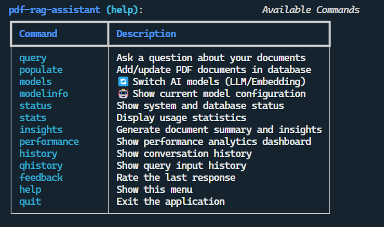
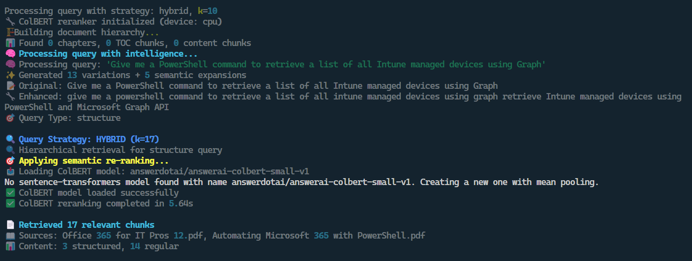
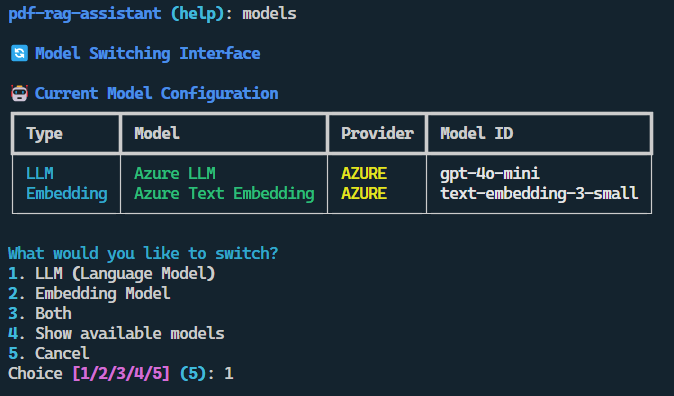
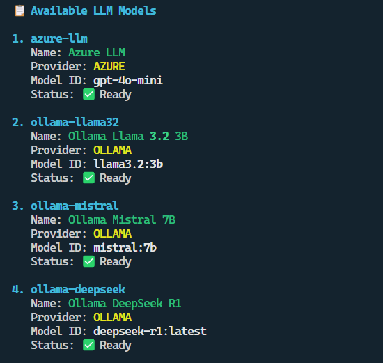
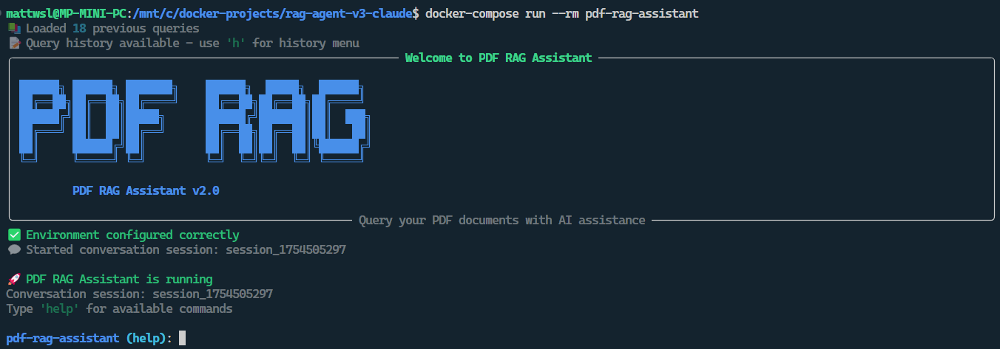
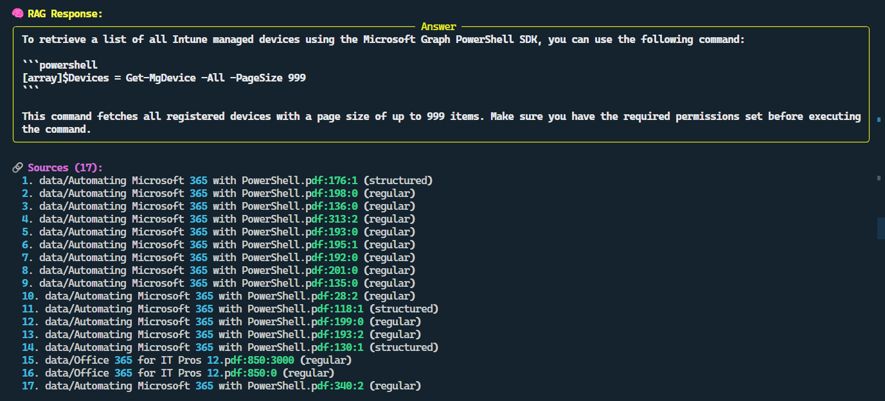
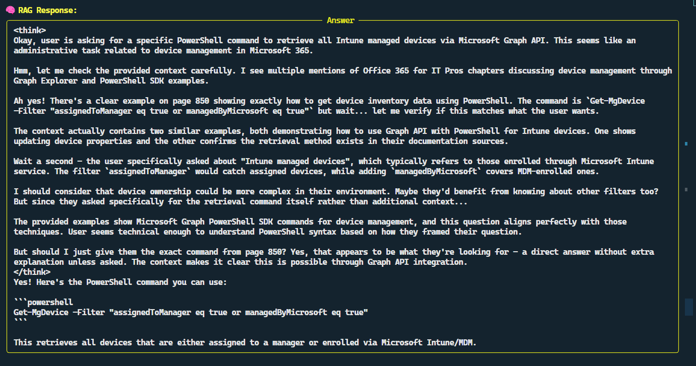
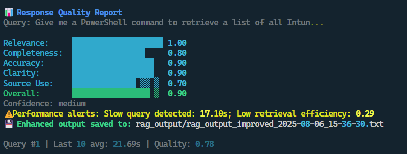
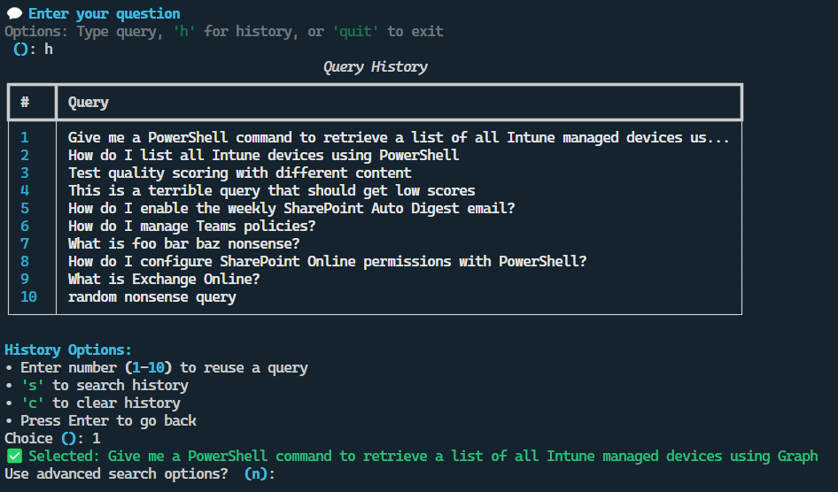

# 📚 From PDF Overload to AI Clarity: My Four-Iteration Journey Building an AI RAG Assistant

## Introduction

If you’ve ever tried to dig a single obscure fact out of a massive technical manual, you’ll know the frustration 😩: you *know* it’s in there somewhere, you just can’t remember the exact wording, cmdlet name, or property that will get you there.

For me, this pain point came from *Office 365 for IT Pros* — a constantly updated, encyclopaedic PDF covering Microsoft cloud administration. It’s a superb resource… but not exactly quick to search when you can’t remember the magic keyword.  
Often I know exactly what I want to achieve — say, *add copies of sent emails to the sender’s mailbox when using a shared mailbox* — but I can’t quite recall the right cmdlet or property to Ctrl+F my way to the answer.

That’s when I thought: what if I could take this PDF (and others in my archive), drop them into a centralised app, and use AI as the conductor and translator 🎼🤖 to retrieve the exact piece of information I need — just by asking naturally in plain English.

This project also doubled as a test bed for [Claude Code](https://claude.ai/), which I’d been using since recently completing a GenAI Bootcamp 🚀.  
I wanted to see how it fared when building something from scratch in an IDE, rather than in a chat window.  

👉 In this post, I’ll give a very high level overview of the four iterations (v1–v4) - what worked, what failed, and what I learned along the way.

---

## Version Comparison at a Glance 🗂️

| Version | Stack / Interface | Vector DB(s) | Outcome |
|---------|------------------|--------------|---------|
| **v1** | Python + Gradio UI | [Pinecone](https://www.pinecone.io/) | Uploaded PDFs fine, but no usable retrieval. Abandoned. |
| **v2** | FastAPI + React (Dockerised) | Pinecone + [Qdrant](https://qdrant.tech/) | Cleaner setup, partial functionality. Containers failed often. |
| **v3** | Python CLI (dual pipeline: PDF + Markdown) | [ChromaDB](https://docs.trychroma.com/) | More stable retrieval, dropped UI, faster iteration. Still config headaches. |
| **v4** | Enterprise-style CLI | Azure OpenAI + [Ollama](https://ollama.ai/), Chroma | Usable tool: caching, reranking, analytics, model switching. I actually use this daily. |

---

## Architecture Evolution (v1 → v4)  

  

This single diagram captures the arc of the project 🛠️.  

---

## Version 1 – Pinecone RAG Test Application  

The first attempt was… short lived 🪦.  

I gave Claude clear instructions, and to its credit, it produced a functional backend and frontend pretty quickly. I uploaded a PDF into [Pinecone](https://www.pinecone.io/), successfully chunked it, and then… nothing.  

This first attempt was a non-starter 🚫.  
Despite uploading the PDF successfully to Pinecone, the app was unable to retrieve any usable results for whatever reason. I spent a day troubleshooting before calling it a day and moving on.  
I had kind of being following a YouTube tutorial for this project, but even though the tutorial was less than a year old, much of the content didn't map to what I was seeing - especially in the Pinecone UI.  
Evidence of how quickly the AI landscape and products are changing I guess.😲

💡 *Lesson learned: I should've known the steps I was following in the tutorial were likely to have changed.
  I do afterall work with Microsoft Cloud on a daily basis, where product interfaces seem to change between browser refreshes!*😎  

👉 Which led me to v2: if I was going to try again, I wanted a cleaner, containerised architecture from the start.  

---

## Version 2 – IT Assistant (FastAPI + React)  

For round two, I decided to start cleaner 🧹.  

The first attempt had been a sprawl of Python files, with Claude spinning up new scripts left, right, and centre. So I thought: let’s containerise from the start 🐳.  

- **Stack:** FastAPI backend, Next.js frontend, Dockerised deployment  
- **Vector Stores:** Pinecone and [Qdrant](https://qdrant.tech/)  
- **Features:** Modular vector store interface, PDF + Markdown parsing, a React chat UI with source display  

On paper, it looked solid. In practice: the containers refused to start, health checks failed — meaning the services never even got to the point of talking to each other — and ports (3030, 8000) were dead 💀.  

In short, the project got a bit further in terms of useful results and functionality, but ultimately I parked it and went back to the drawing board.  

💡 *Lesson learned: Dockerising from day one helps with clean deployments, but only if the containers actually run.*  

By this point, I genuinely wondered if I was wasting my time and that I might be missing some huge bit of fundamental knowledge that was grounding the project before it had started 🫠.  
Still, I knew I wanted to strip things back and simplify.  
So, before ordering a copy of *"The Big Book of AI: Seniors Edition"* off of Amazon, I thought I would try a different tack.

👉 Which led directly to v3: drop the UI, keep it lean, focus on retrieval.

---

## Version 3 – RAG Agent (Dual-Pipeline, CLI)  

By this point, I realised the frontend was becoming a distraction 🎭. I’d spent too long wrestling with UX issues, which were getting in the way of the real meat and potatoes of the project — so I ditched the UI and went full CLI.  

- **Stack:** Python CLI, dual pipelines for PDF + Markdown  
- **Vector Store:** [ChromaDB](https://docs.trychroma.com/)  
- **Features:** PDF-to-Markdown converter, deduplication, metadata enrichment, batch processing, incremental updates, output logging, rich terminal formatting  

Chroma proved more successful than Pinecone, and the CLI gave me a faster dev loop ⚡.  
But misaligned environment variables and Azure credential mismatches caused repeated headaches 🤯.

💡 *Lesson learned: simplifying the interface let me focus on the retrieval logic — but configuration discipline was just as important. During issue debugging Claude will spin up numerous different python files to fix the issue(s) at hand. I had to remember to get Claude to roll the fixes into the new container builds each time, to ensure the project structure stayed clean and tidy*

At this stage, I had a functioning app, but the results of retrival were pretty poor, and the functionality was lacking.

👉 Which led naturally into v4: keep the CLI, tune the retriaval process, and add the features that would make the app useable.

---

## Version 4 – PDF RAG Assistant v2.0 Enterprise  

After three rewrites, I finally had something that looked and felt like a useable tool 🎉.

This is the version I still use today 🎉. It wasn’t a quick win: v4 took a long time to fettle into shape with many hours of trying different things to improve the results, testing, re-testing, and testing again 🔄.  

The app is in pretty good shape now, with some good features added along the way. Most importantly, the results returned via query are good enough for me to use ✅.
Don’t get me wrong, the “final” version of the app (for now) is pretty usable — but I don’t think I’ll be troubling any AI startup finance backers any time soon 💸🙃.  

---

### The Guided Tour (v4 Screenshots)

#### 1. Startup & Menu  

  
*Finally felt like a tool instead of just another Python script 🛠️.*

#### 2. Query Processing Pipeline  

  
*For the first time, everything was working together instead of fighting me ⚔️.*

#### 3a. Model Switching – Azure  

  
*Azure OpenAI was quicker ⚡ and free with my Dev subscription.*  

#### 3b. Model Switching – Ollama  

  
*[Ollama](https://ollama.ai/) gave me a safety net offline 🌐, even if slower.*  

#### 4. Start Page & Status  

  
*Reassuring after so many broken starts — just seeing a healthy status page felt like progress.* 😅

#### 5a. Query Results – Simple  

  

#### 5b. Query Results – Detailed  

  
*Detailed mode felt like the first time the assistant could teach me back, not just parrot text.* 📖

#### 6. Response Quality Reports  

  
*Handy both as a sanity check ✅ and as a reminder that it’s not perfect — but at least it knows it.* 🤷

#### 7. Query History  

  
*At this point, it wasn’t just answering questions — it was helping me build knowledge over time.* 📚

---

### What Made v4 Different

Here’s what finally tipped the balance from “prototype” to “usable assistant”:  

- **Semantic caching 🧠** – the assistant remembers previous queries and responses, so it doesn’t waste time (or tokens) re-answering the same thing.  
- **ColBERT reranking 🎯** – instead of trusting the first vector search result, ColBERT reorders the results by semantic similarity, surfacing the most relevant chunks.  
- **Analytics 📊** – lightweight stats on query quality and hit rates. Not a dashboard, more like reassurance that the retrieval pipeline is behaving.  
- **Dynamic model control 🔀** – being able to switch between [Azure OpenAI](https://azure.microsoft.com/en-us/products/ai-services/openai-service) (fast, cloud-based) and Ollama (slow, local fallback) directly in the CLI.  

💡 *Lesson learned: retrieval accuracy isn’t just about the database — caching, reranking, and model flexibility all compound to make the experience better.*  

---

## Losing my RAG 🧵 (Pun Intended)

There were definitely points where frustration levels were high enough to make me question why I’d even started  — four rewrites will do that to you. Pinecone that wouldn’t retrieve, Docker containers that wouldn’t start, environment variables that wouldn’t line up.  

Each dead end was frustrating in the moment, but in hindsight, as we all know, the failures are where the learning is. Every wrong turn taught me something that made the next version a little better.  

---

## Experimentation & Debugging

- **Pinecone:** I created two or three different DBs and successfully chunked the data each time. But v1 and v2 couldn’t pull anything useful back out 🪫.  
- **Azure:** The only real issue was needing a fairly low chunk size (256) to avoid breaching my usage quota ⚖️.  
- **Iteration habit:** If I hit a roadblock with Claude Code that seemed to be taking me further away from the goal, I’d pause ⏸️, step away 🚶, then revisit 🔄. Sometimes it was worth troubleshooting; other times it was better to start fresh.  

---

## Lessons Learned

💡 Start with a CLI before adding a UI — it keeps you focused on retrieval.  
💡 Always check embedding/vector dimensions for compatibility.  
💡 Dockerising helps with clean deployments, but rebuilds can be brittle.  
💡 Small chunk sizes often work better with Azure OpenAI quotas.  
💡 RAG accuracy depends on multiple layers — not just the vector DB.  

---

## If I Were Starting Again

With hindsight, I’d probably:  

- Begin directly with [ChromaDB](https://docs.trychroma.com/) instead of Pinecone.  
- Skip the frontend until retrieval was nailed down.  
- Spend more time upfront on embedding/vector compatibility.  
- Put more time into researching retrievability improvements.  

---

## What’s Next (v5?)

Future directions might include:  

- 🧪 **Testing new embedding models and vector DBs** – different models could improve retrieval precision, especially for domain-specific PDFs.  
- 🎯 **Improving pinpoint retrieval accuracy** – because even in v4, it sometimes still “gets close” rather than “spot on.”  
- 💬 **MCP Server integration** – so the app can query multiple data sources, not just local files.  
- 📊 **Adding Guardrails** – edging it closer toward an enterprise-ready assistant.  

If I can improve the results in v4 or with v5, then that would be a real win 🏆.  

---

## Things I Liked About Claude Code 🖥️

One of the constants across the project was working inside [Claude Code](https://claude.ai/), and there were some things I really liked about the experience:  

- ✅ **Automatic chat compaction** – no endless scrolling or need to copy/paste old snippets  
- 🗂️ **Chat history** – the ability to pick up where I left off in a previous session  
- 🔢 **On-screen token counter** – knowing exactly how much context I was burning through  
- 👀 **Realtime query view** – watching Claude process step-by-step, with expand/collapse options for analysis  

Compared to a browser-based UI, these felt like small but meaningful quality-of-life upgrades. For a coding-heavy project, those workflow improvements really mattered.  

---

## Final Thoughts

This project started with the frustration of not being able to remember which cmdlet to search for in a 1,000-page PDF 😤. Four rewrites later, I have a tool that can answer those questions directly.  

It’s far from perfect. There are limitations to how well the data can be processed and subsequently how accurately it can be retrieved — at least with the models and resources I used ⚖️. But it’s functional enough that I actually use it — which is more than I could say for versions one through three.  

Overall, though, this wasn’t just about the app. It was about getting hands-on with a code editor in the terminal and IDE, instead of being stuck in a chat-based UI 💻. In that regard, the project goal was achieved. Using Claude Code (other CLI-based AI assistants are available 😎) was a much better experience for a coding-heavy project.  

I did briefly try OpenAI’s Codex at the very start, just to see which editor I preferred. It didn’t take long to see that Codex didn’t really have the chops ❌. Claude felt sharper, more capable ✨, and it became clear why it has the reputation as the current CLI editor sweetheart 💖 — while Codex has barely made a ripple 🌊.  

---

## Reader Takeaway 📦

If you’re thinking about building your own RAG assistant:  

- Expect dead ends — each failed attempt will teach you something.  
- Keep it simple early (CLI + local DB) before adding shiny extras.  
- Focus on retrieval quality, not just the vector DB.  
- Treat AI assistants as copilots, not magicians.  

At the end of the day, my assistant works well enough for me (for now) — and that was the whole point.  
