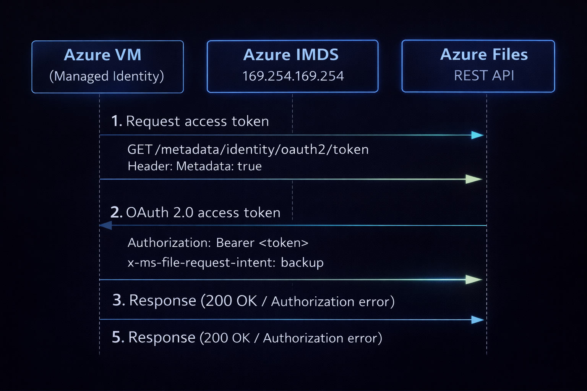

# 🔐 Ditching Storage Account Keys: OAuth and Managed Identity for Azure Files REST API

## TL;DR

- ✅ **Managed identities can authenticate to Azure Files via REST API** using OAuth tokens — no storage account keys required
- ⚠️ **The `x-ms-file-request-intent: backup` header is mandatory** — without it, all OAuth requests return HTTP 400
- 🎯 **For OAuth-based access over the Azure Files REST API**, assign the Storage File Data Privileged Reader or Storage File Data Privileged Contributor role, scoped appropriately (for example, at the file share level).
For SMB access, use the dedicated Storage File Data SMB Share roles instead.
- 🕐 **OAuth tokens expire after ~1 hour** — implement caching and proactive refresh
- 📦 **No additional SMB OAuth configuration** is required on the storage account when using OAuth authentication over the REST API.

OAuth-based REST access can be introduced alongside existing Shared Key or SAS usage during migration.

---

## The Problem: Storage Account Keys Are a Liability 🔑

If you're accessing Azure Files from VMs using storage account keys, you've probably felt the pain:

- 🔄 **Key rotation overhead** — someone has to rotate them, update configs, and pray nothing breaks
- 🔓 **Security risk** — keys in config files are secrets waiting to be compromised
- 🕵️ **Limited auditability** — logs show "AccessKey" but not *which* VM or identity made the request
- 📋 **Compliance headaches** — auditors love asking about secret management

The goal: replace storage account key authentication with **managed identity OAuth tokens**. No secrets to manage. No keys to rotate. Full identity attribution in logs.

> 📖 *This post is part of my **Managed Identity Series** — replacing secrets with identity-based authentication across Azure services:*
>
> - **Blob Storage + AzCopy:** [Replacing SAS Tokens with UAMI in AzCopy for Blob Uploads](../uami-storage/uami-storage.md)
> - **SQL Managed Instance:** [Replacing SQL Credentials with UAMI in Azure SQL Managed Instance](../uami-sql/uami-sql.md)
> - **Azure Files + REST API:** You're reading it.

Sounds straightforward, right? 😅

---

## Key Concepts 📚

### Managed Identity & IMDS

**Managed Identity** is an Azure-managed identity attached to your VM. No credentials to store — Azure handles the lifecycle automatically.

**IMDS (Instance Metadata Service)** is a REST endpoint available only from within Azure VMs at `169.254.169.254`. Your VM can request OAuth tokens from IMDS without any pre-configured secrets.

### OAuth vs Storage Account Keys

| Aspect | Storage Account Key | Managed Identity OAuth |
|--------|---------------------|------------------------|
| **Authentication** | SharedKey signature | OAuth Bearer token |
| **Authorization** | Full admin access + RBAC | RBAC only |
| **Logging** | Shows "AccessKey" | Shows specific VM identity |
| **Key Management** | Manual rotation required | Automatic (Azure-managed) |
| **Security** | Keys can be compromised | No secrets to manage |
| **Auditing** | Limited identity tracking | Full identity attribution |

### The Backup Intent Header — The Missing Piece 🧩

Here's where I lost a day of my life.

**The `x-ms-file-request-intent: backup` header is mandatory for OAuth REST API access to Azure Files.**

Without it:

```
HTTP 400 Bad Request
(No helpful error message)
```

With it:

```
HTTP 200 OK
Operations succeed
```

This header tells Azure Files to use **backup semantic permissions**, which:

- When using the privileged backup semantics actions, file and directory-level permissions (such as NTFS ACLs) are bypassed, allowing access regardless of existing ACLs
- Grants admin-level read/write access to all files
- Is specifically designed for backup, restore, and auditing scenarios

Microsoft documentation mentions this header but doesn't emphasise just how non-negotiable it is. Every OAuth request will fail without it.

---

## How It Works: Authentication Flow 🔄



Azure Files validates:

1. Token signature and expiration
2. Token audience (`https://storage.azure.com/`)
3. RBAC role assignment for the identity
4. Presence of the backup intent header

---

## Prerequisites ✅

Before you start, ensure:

1. **System-assigned managed identity** enabled on each VM
2. **RBAC Role:** "Storage File Data Privileged Contributor" assigned at **share level**
3. **Network connectivity:** Port 443 (HTTPS) accessible to storage account
4. **Azure IMDS:** Accessible from VMs (169.254.169.254)
5. **API Version:** 2022-11-02 or later (2023-11-03 recommended)

💡 **Note:** RBAC propagation can take 5-30 minutes after assignment. Testing immediately after assigning a role may fail — give it time.

---

## Implementation Deep Dive 🛠️

### Step 1 — Token Acquisition from IMDS

Request an OAuth token from the Instance Metadata Service:

**Endpoint:**

```
GET http://169.254.169.254/metadata/identity/oauth2/token
```

**Query Parameters:**

- `api-version=2018-02-01` (or later)
- `resource=https://storage.azure.com/` (note the trailing slash)

**Required Header:**

- `Metadata: true`

**Example Response:**

```json
{
  "access_token": "eyJ0eXAi...",
  "expires_on": "1737475200",
  "resource": "https://storage.azure.com/",
  "token_type": "Bearer"
}
```

**PowerShell Example:**

```powershell
$tokenResponse = Invoke-RestMethod -Uri "http://169.254.169.254/metadata/identity/oauth2/token?api-version=2018-02-01&resource=https://storage.azure.com/" -Headers @{Metadata="true"}
$token = $tokenResponse.access_token
```

### Step 2 — Required REST API Headers

Every REST API call to Azure Files **must** include these three headers:

| Header | Value | Notes |
|--------|-------|-------|
| `Authorization` | `Bearer <access_token>` | The token from IMDS |
| `x-ms-version` | `2023-11-03` | API version 2022-11-02 or later required |
| `x-ms-file-request-intent` | `backup` | **MANDATORY** — requests fail without this |

**PowerShell Example:**

```powershell
$headers = @{
    "Authorization" = "Bearer $token"
    "x-ms-version" = "2023-11-03"
    "x-ms-file-request-intent" = "backup"
}
```

### Step 3 — Token Lifecycle Management

OAuth tokens expire after approximately **1 hour**. Your application must handle this.

**Token Refresh Strategy:**

- Cache the token and its `expires_on` timestamp
- Refresh proactively (e.g., 5 minutes before expiration)
- Ensure thread-safe access to cached token if multi-threaded

**Pseudocode:**

```
function getToken():
    if cachedToken is null OR cachedToken.expiresOn < (now + 5 minutes):
        cachedToken = fetchTokenFromIMDS()
    return cachedToken.accessToken
```

### Step 4 — Error Handling

| HTTP Code | Meaning | Action |
|-----------|---------|--------|
| **400 Bad Request** | Missing `x-ms-file-request-intent: backup` header | Add the header to all requests |
| **401 Unauthorized** | Expired or invalid token | Refresh token from IMDS, retry once |
| **403 Forbidden** | Valid token but insufficient RBAC permissions | Do not retry — this is a permissions issue |

**Critical:** If you get HTTP 401, invalidate your cached token, acquire a fresh one, and retry the request **once**. If it fails again, treat it as an authorization failure.

---

## Worked Example: PowerShell Test Script 💻

Here's a complete test script that validates managed identity access:

```powershell
<#
.SYNOPSIS
    Test managed identity REST API access to Azure Files
.DESCRIPTION
    Tests system-assigned MI can access file share via REST API with OAuth
.EXAMPLE
    .\Test-MIAccess.ps1 -StorageAccountName "yourstorageaccount" -ShareName "yourfileshare"
#>

param(
    [Parameter(Mandatory=$true)]
    [string]$StorageAccountName,

    [Parameter(Mandatory=$true)]
    [string]$ShareName
)

Write-Host "`n=== Testing Managed Identity Access ===" -ForegroundColor Cyan
Write-Host "VM: $env:COMPUTERNAME"
Write-Host "Storage: $StorageAccountName"
Write-Host "Share: $ShareName`n"

# Get Token
Write-Host "[1/3] Getting token..." -NoNewline
try {
    $token = (Invoke-RestMethod -Uri "http://169.254.169.254/metadata/identity/oauth2/token?api-version=2018-02-01&resource=https://storage.azure.com/" -Headers @{Metadata="true"} -TimeoutSec 10).access_token
    Write-Host " OK" -ForegroundColor Green
} catch {
    Write-Host " FAILED" -ForegroundColor Red
    Write-Host "Error: $($_.Exception.Message)" -ForegroundColor Red
    exit 1
}

# Headers with backup intent (CRITICAL)
$headers = @{
    "Authorization" = "Bearer $token"
    "x-ms-version" = "2023-11-03"
    "x-ms-file-request-intent" = "backup"
}

# Test: Create directory
Write-Host "[2/3] Creating test directory..." -NoNewline
try {
    Invoke-RestMethod -Uri "https://$StorageAccountName.file.core.windows.net/$ShareName/mi-test?restype=directory" -Headers $headers -Method PUT | Out-Null
    Write-Host " OK" -ForegroundColor Green
} catch {
    if ($_.Exception.Response.StatusCode.value__ -eq 409) {
        Write-Host " EXISTS" -ForegroundColor Yellow
    } else {
        Write-Host " FAILED" -ForegroundColor Red
        Write-Host "Error: HTTP $($_.Exception.Response.StatusCode.value__)" -ForegroundColor Red
        exit 1
    }
}

# Test: Write file
Write-Host "[3/3] Writing test file..." -NoNewline
try {
    $testFile = "test-$env:COMPUTERNAME.txt"
    $testContent = "Test from $env:COMPUTERNAME at $(Get-Date)"
    $bytes = [System.Text.Encoding]::UTF8.GetBytes($testContent)

    # Create file
    $createHeaders = $headers.Clone()
    $createHeaders["x-ms-content-length"] = $bytes.Length
    $createHeaders["x-ms-type"] = "file"
    Invoke-RestMethod -Uri "https://$StorageAccountName.file.core.windows.net/$ShareName/mi-test/$testFile" -Headers $createHeaders -Method PUT | Out-Null

    # Write content
    $writeHeaders = $headers.Clone()
    $writeHeaders["x-ms-range"] = "bytes=0-$($bytes.Length - 1)"
    $writeHeaders["x-ms-write"] = "update"
    Invoke-RestMethod -Uri "https://$StorageAccountName.file.core.windows.net/$ShareName/mi-test/$testFile`?comp=range" -Headers $writeHeaders -Method PUT -Body $bytes | Out-Null

    Write-Host " OK" -ForegroundColor Green
    Write-Host "`nFile created: mi-test/$testFile" -ForegroundColor Gray
} catch {
    Write-Host " FAILED" -ForegroundColor Red
    Write-Host "Error: HTTP $($_.Exception.Response.StatusCode.value__)" -ForegroundColor Red
    exit 1
}

Write-Host "`n=== SUCCESS ===" -ForegroundColor Green
Write-Host "Managed identity can access the file share via REST API.`n"
exit 0
```

**Expected Output:**

```
=== Testing Managed Identity Access ===
VM: YOURVM01
Storage: yourstorageaccount
Share: yourshare

[1/3] Getting token... OK
[2/3] Creating test directory... OK
[3/3] Writing test file... OK

File created: mi-test/test-YOURVM01.txt

=== SUCCESS ===
Managed identity can access the file share via REST API.
```

---

## Common Pitfalls and How to Avoid Them 🚧

### 1. HTTP 400 Bad Request (No Error Details)

**Cause:** Missing `x-ms-file-request-intent: backup` header

**Solution:** Add the header to every REST API call. This is non-negotiable for OAuth.

💡 *This is the most common issue and the least helpful error message. If you're getting 400s with OAuth tokens, check this header first.*

### 2. HTTP 403 Forbidden

**Cause:** RBAC role not assigned or not yet propagated

**Solution:**

- Verify role assignment exists at the correct scope (share level)
- Wait 5-30 minutes after new role assignments
- Check the managed identity's Object ID matches the assignment

### 3. SMB OAuth vs REST API OAuth Confusion

**SMB OAuth** (`EnableSmbOAuth`) is for mounting shares via SMB protocol (UNC paths like `\\storage.file.core.windows.net\share`).

**REST API OAuth** is for HTTPS endpoints (`https://storage.file.core.windows.net/share/...`).

These are **completely separate features**. If you're using REST API calls, you don't need `EnableSmbOAuth` on the storage account.

💡 *Side note:* I actually enabled `EnableSmbOAuth` on the same storage account during this investigation, thinking it might be required. It wasn't — and I couldn't get SMB OAuth working regardless. The SMB OAuth feature requires additional prerequisites (non-domain-joined VMs, the `AzFilesSMBMIClient` PowerShell module, etc.) that didn't apply to my use case. That's a separate rabbit hole for another day. 🐇

### 4. Token Acquisition Fails

**Cause:** Managed identity not enabled on VM, or IMDS not accessible

**Solution:**

- Verify system-assigned managed identity is enabled in Azure Portal
- Test IMDS access: `Invoke-RestMethod -Uri "http://169.254.169.254/metadata/instance?api-version=2021-02-01" -Headers @{Metadata="true"}`

### 5. Testing Immediately After RBAC Assignment

**Cause:** RBAC changes take time to propagate

**Solution:** Wait 5-30 minutes before testing. Azure's control plane needs time to replicate permissions.

---

## Checklist: What to Do Next ✅

### Infrastructure Setup

- [ ] Enable system-assigned managed identity on each VM
- [ ] Assign "Storage File Data Privileged Contributor" role at share level
- [ ] Wait 5-30 minutes for RBAC propagation
- [ ] Test with PowerShell script above

### Application Code Changes

- [ ] Implement IMDS token acquisition
- [ ] Add all three required headers to REST calls
- [ ] Implement token caching with proactive refresh
- [ ] Add HTTP 401 retry logic (refresh token, retry once)
- [ ] Remove storage account keys from configuration

### Rollout

- [ ] Test on one VM first
- [ ] Monitor StorageFileLogs for OAuth authentication
- [ ] Deploy to remaining VMs (staged rollout)
- [ ] After all VMs migrated, disable storage account key access:

  ```powershell
  Set-AzStorageAccount -ResourceGroupName "your-rg" `
      -Name "yourstorageaccount" `
      -AllowSharedKeyAccess $false
  ```

---

## References 📚

- [OAuth over REST for Azure Files](https://learn.microsoft.com/en-us/azure/storage/files/authorize-oauth-rest) — Primary reference for backup intent header and API requirements
- [Authorize with Microsoft Entra ID (REST API)](https://learn.microsoft.com/en-us/rest/api/storageservices/authorize-with-azure-active-directory) — OAuth token format and authorization header
- [How to use managed identities to acquire access tokens](https://learn.microsoft.com/en-us/entra/identity/managed-identities-azure-resources/how-to-use-vm-token) — IMDS endpoint and token request format
- [Azure Files REST API Overview](https://learn.microsoft.com/en-us/rest/api/storageservices/file-service-rest-api) — File and directory operations reference
- [msandbu.org - Authenticating to Azure Files with Entra ID and REST API](https://msandbu.org/authenticating-to-an-azure-files-share-with-entra-id-and-rest-api/) — Community article with real-world examples

---

## Final Thoughts 💭

This should have been straightforward. Microsoft's documentation covers all the pieces — managed identities, OAuth tokens, Azure Files REST API. But the critical detail (that `x-ms-file-request-intent: backup` header) is easy to miss, and the error messages don't help.

Once you know the trick, the implementation is clean:

1. Get token from IMDS
2. Add three headers to your requests
3. Cache and refresh tokens

No more keys in config files. No more rotation schedules. Full identity attribution in your logs.

If you're still using storage account keys for REST API access to Azure Files — now you don't have to.

---

📌 *Published on:* `2026-01-23`
⏳ *Read time:* 8 min
