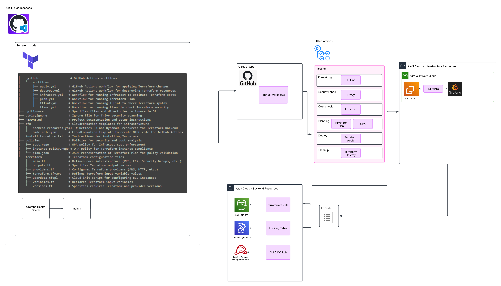
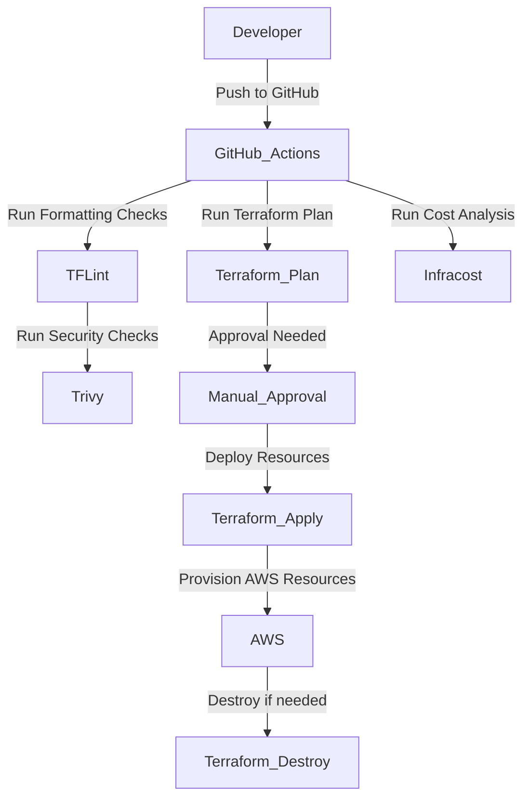

## Overview

As infrastructure becomes more complex, ensuring automation, security, and compliance is crucial. This blog post walks through setting up a GitOps pipeline that simplifies AWS infrastructure management using Terraform and GitHub Actions. Whether you're an engineer looking to automate deployments or a security-conscious DevOps professional, this guide provides a structured approach to implementing Infrastructure as Code (IaC) best practices.

This blog post documents my experience with the [MoreThanCertified GitOps Minicamp](https://morethancertified.com/course/gitops-for-terraform-minicamp), where students set up a fully automated GitOps pipeline to manage AWS infrastructure using Terraform and GitHub Actions. The goal is to implement Infrastructure as Code (IaC) best practices, enforce security policies, and automate infrastructure deployment.

This tutorial is meant as an overview "at-a-glance" summary of the steps I took to implement the pipeline from project start, to resource deployment.
The [MoreThanCertified GitOps Minicamp](https://morethancertified.com/course/gitops-for-terraform-minicamp)
goes into a lot more detail and covers all the topics in this post in more depth. I would highly recommend checking the course out if you haven't already.

In this tutorial, I will guide you through:

- Setting up GitHub Codespaces for development

- Configuring a Terraform backend in AWS with CloudFormation

- Deploying AWS resources with Terraform

- Running security, cost, and policy checks using GitHub Actions

- Implementing a CI/CD pipeline with GitHub Actions

### Visualizing the Pipeline Architecture

The diagram below illustrates the **end-to-end GitOps workflow**:  

- GitHub Actions automates security scans, cost checks, and Terraform execution.  
- Terraform manages AWS infrastructure, storing state in an S3 backend.  
- OpenID Connect (OIDC) ensures secure authentication to AWS.



## Setting Up GitHub Codespaces for Development

Prerequisites

- Previous knowledge and use of Github is assumed.

- A GitHub repository needs to be created where the Terraform code will be stored.

- GitHub Codespaces enabled in your repository settings.

### Enable Codespaces in GitHub

1. Navigate to `Settings > Codespaces` in your repository.

2. Ensure that Codespaces is enabled for your repository.

3. Create a new Codespace and open it.

4. The Codespace should open the browser based IDE, in the root of the repo you chose.

### Configure Development Environment

Install Terraform in Codespaces

- Copy, paste, and then run the following in your terminal.

```sh title="Terraform install script"
# Update package list and install dependencies
sudo apt-get update && sudo apt-get install -y gnupg software-properties-common

# Add HashiCorp’s GPG key
wget -O- https://apt.releases.hashicorp.com/gpg | sudo gpg --dearmor -o /usr/share/keyrings/hashicorp-archive-keyring.gpg

# Add the Terraform repository
echo "deb [signed-by=/usr/share/keyrings/hashicorp-archive-keyring.gpg] https://apt.releases.hashicorp.com $(lsb_release -cs) main" | sudo tee /etc/apt/sources.list.d/hashicorp.list

# Update and install Terraform
sudo apt-get update && sudo apt-get install -y terraform

# Verify installation
terraform version
```

Verify Terraform Installation

```sh
terraform -version
```

### Configuring a Terraform Backend in AWS Using CloudFormation

Deploying an OIDC Role for GitHub Actions

>To allow GitHub Actions to authenticate securely with AWS, we use an OIDC (OpenID Connect) role. This CloudFormation template sets up the necessary IAM role and OIDC provider.

Add the following code to a new template file `cfn > oidc-role.yaml`

```yaml title="oidc-role.yaml"
Parameters:
  Repo:
    Description: The GitHub organization/repo for which the OIDC provider is set up
    Type: String 
Resources:
  MyOIDCProvider:
    Type: 'AWS::IAM::OIDCProvider'
    Properties:
      Url: 'https://token.actions.githubusercontent.com'
      ClientIdList:
        - sts.amazonaws.com
      ThumbprintList:
        - 6938fd4d98bab03faadb97b34396831e3780aea1
        - 1c58a3a8518e8759bf075b76b750d4f2df264fcd
  gitops2024Role:
    Type: 'AWS::IAM::Role'
    Properties:
      AssumeRolePolicyDocument:
        Version: 2012-10-17
        Statement:
          - Effect: Allow
            Principal:
              Federated: !Sub >-
                arn:aws:iam::${AWS::AccountId}:oidc-provider/token.actions.githubusercontent.com
            Action: 'sts:AssumeRoleWithWebIdentity'
            Condition:
              StringLike:
                'token.actions.githubusercontent.com:sub': !Sub 'repo:${Repo}:*'
              StringEquals:
                'token.actions.githubusercontent.com:aud': sts.amazonaws.com
      ManagedPolicyArns:
        - 'arn:aws:iam::aws:policy/PowerUserAccess'
Outputs:
  RoleName:
    Description: 'The name of the IAM role for GitHub Actions'
    Value:
      Ref: gitops2024Role
    Export:
      Name:
        Fn::Sub: '${AWS::StackName}-RoleName'
```

### Prerequisites

- You must have an AWS account set up in advance.

- An IAM user with sufficient permissions to create S3 buckets, DynamoDB tables, and IAM roles.

- A remote Terraform backend ensures state consistency and allows multiple users to collaborate.

### Why CloudFormation?

> CloudFormation is used to create the backend infrastructure as a best practice. This ensures automation and easy re-deployment.

**Steps (CodeSpaces)**

Add the following code to a new template file `cfn > backend-resources.yaml`

```yaml title="backend-resources.yml"
AWSTemplateFormatVersion: '2010-09-09'
Description: CloudFormation template to create S3 and DynamoDB for Terraform Backend

Parameters:
  S3BucketName:
    Type: String
    Description: The name of the S3 bucket to be created for storing Terraform state files.
    Default: gitops-tf-backend

  DynamoDBTableName:
    Type: String
    Description: The name of the DynamoDB table to be created for Terraform state locking.
    Default: GitopsTerraformLocks

Resources:
  TerraformBackendBucket:
    Type: 'AWS::S3::Bucket'
    Properties:
      BucketName: !Ref S3BucketName
      VersioningConfiguration:
        Status: Enabled

  TerraformBackendDynamoDBTable:
    Type: 'AWS::DynamoDB::Table'
    Properties:
      TableName: !Ref DynamoDBTableName
      AttributeDefinitions:
        - AttributeName: LockID
          AttributeType: S
      KeySchema:
        - AttributeName: LockID
          KeyType: HASH
      ProvisionedThroughput:
        ReadCapacityUnits: 5
        WriteCapacityUnits: 5
      SSESpecification:
        SSEEnabled: true

Outputs:
  TerraformBackendBucketName:
    Description: "S3 bucket name for the Terraform backend."
    Value: !Ref TerraformBackendBucket
    Export:
      Name: !Sub "${AWS::StackName}-TerraformBackendBucketName"

  TerraformBackendDynamoDBTableName:
    Description: "DynamoDB table name for the Terraform backend."
    Value: !Ref TerraformBackendDynamoDBTable
    Export:
      Name: !Sub "${AWS::StackName}-TerraformBackendDynamoDBTableName"
```

**Steps (AWS Console)**

1. Log in to the AWS Management Console and navigate to the CloudFormation service.

2. Click on Create Stack and select With new resources (standard).

3. In the Specify template section, select Upload a template file and upload the backend-resources.yml file.

4. Click Next, enter a Stack name (e.g., `TerraformBackend`), and proceed.

5. Click Next through the stack options, ensuring the correct IAM permissions are set.

6. Click Create stack and wait for the deployment to complete.

>Once the stack is successfully created, go to Resources in the CloudFormation console to confirm that the S3 bucket and DynamoDB table have been provisioned.

>Once the stack is deployed, navigate to the AWS CloudFormation console (<https://console.aws.amazon.com/cloudformation>) and check that:

- Navigate to the AWS IAM Console.

- The S3 bucket is listed under AWS S3.

- The DynamoDB table is available in AWS DynamoDB.

- Check that a new IAM Role (gitops2024Role) has been created.

- Confirm that an OIDC Provider exists under IAM.

### GitHub Actions Workflows: Automating CI/CD for Terraform

#### **Example Mermaid Diagram:**



📌 **GitHub Actions Workflow Execution Order:**

1️⃣ **TFLint & Trivy Security Scan** – Ensures best practices & security compliance  
2️⃣ **Terraform Plan** – Generates a preview of infrastructure changes  
3️⃣ **OPA Policy Checks & Infracost Analysis** – Ensures compliance & cost awareness  
4️⃣ **Terraform Apply (manual trigger)** – Deploys the infrastructure  
5️⃣ **Terraform Destroy (manual trigger)** – Cleans up resources when no longer needed  

Trivy Security Scan

- This workflow scans the Terraform configuration for security vulnerabilities using Trivy.

TFLint Code Linter

- Lints Terraform code for syntax errors and best practices.

Terraform Plan

- Generates a Terraform execution plan and performs OPA policy checks.

Infracost Cost Analysis

- Estimates the cost impact of Terraform changes.

Terraform Apply

- Deploys infrastructure changes to AWS.

Terraform Destroy

- Destroys all infrastructure deployed by Terraform.

>Each of these workflows is triggered based on specific events and plays a key role in the CI/CD pipeline. Below is a breakdown of each workflow file, its purpose, how it works, and how it is triggered:

### Trivy Security Scan

```yaml
name: Trivy Security Scan

on:
  push:
    branches:
      - main
  pull_request:
    branches:
      - main
      - feature
  workflow_dispatch:

permissions:
  contents: read
  pull-requests: write

jobs:
  security-scan:
    runs-on: ubuntu-latest
    steps:
      - name: Checkout repository
        uses: actions/checkout@v4
      - name: Install Trivy
        uses: aquasecurity/setup-trivy@v0.2.2
      - name: Run Trivy Terraform Security Scan
        run: |
          trivy fs --scanners misconfig --severity HIGH,CRITICAL --format table --exit-code 1 --ignorefile .trivyignore ./terraform | tee trivy-report.txt
      - name: Display Scan Report
        if: always()
        run: cat trivy-report.txt
      - name: Upload Scan Report
        if: always()
        uses: actions/upload-artifact@v4
        with:
          name: tfsec-report
          path: trivy-report.txt
      - name: Post Scan Results as PR Comment
        if: always()
        uses: mshick/add-pr-comment@v2
        with:
          message: "🚨 **Terraform Security Scan Results** 🚨

``
$(cat trivy-report.txt)
``

📌 **Severity Levels:** `HIGH`, `CRITICAL`
🔍 **Ignored Findings:** Defined in `.trivyignore`
📄 **Full Report:** Check [tfsec-report](https://github.com/${{ github.repository }}/actions/runs/${{ github.run_id }})"
          repo-token: ${{ secrets.GITHUB_TOKEN }}
```

**Purpose**: Scans Terraform configuration for security vulnerabilities.

**Triggers**: Runs on push to main, pull_request to main or feature branches, and can be triggered manually via workflow_dispatch.

**Key Steps**:

- Checks out the repository.

- Installs Trivy security scanner.

- Runs a scan for HIGH and CRITICAL misconfigurations.

- Uploads scan results as an artifact and comments on PRs if issues are found.

### TFLint Code Linter

```yaml
name: Lint
on:
  push:
    branches: [ main ]
  pull_request:

jobs:
  tflint:
    runs-on: ${{ matrix.os }}
    defaults:
        run:
            working-directory: ./terraform

    strategy:
      matrix:
        os: [ubuntu-latest]

    steps:
    - uses: actions/checkout@v4
      name: Checkout source code

    - uses: actions/cache@v4
      name: Cache plugin dir
      with:
        path: ~/.tflint.d/plugins
        key: ${{ matrix.os }}-tflint-${{ hashFiles('.tflint.hcl') }}

    - uses: terraform-linters/setup-tflint@v4
      name: Setup TFLint
      with:
        tflint_version: v0.52.0
    - name: Show version
      run: tflint --version

    - name: Init TFLint
      run: tflint --init
      env:
        # https://github.com/terraform-linters/tflint/blob/master/docs/user-guide/plugins.md#avoiding-rate-limiting
        GITHUB_TOKEN: ${{ github.token }}

    - name: Run TFLint
      run: tflint -f compact
```

**Purpose**: Ensures Terraform code follows best practices and is formatted correctly.

**Triggers**: Runs on push to main and all pull_request events.

**Key Steps**:

- Checks out the repository.

- Caches TFLint plugins to optimize runs.

- Initializes and runs TFLint to detect formatting and best-practice issues.

### Terraform Plan

```yaml
name: 'Plan'

on:
  push:
    branches: [ 'main' ]
  pull_request:
  workflow_dispatch:

permissions:
  contents: read
  id-token: write

jobs:

  terraform:
    name: 'Terraform'
    runs-on: ubuntu-latest
    environment: production
    defaults:
      run:
        shell: bash
        working-directory: ./terraform
    env:
      GH_TOKEN: ${{ secrets.GITHUB_TOKEN }}
    

    steps:
    # Checkout the repository to the GitHub Actions runner
    - name: Checkout
      uses: actions/checkout@v4

    - name: Configure AWS Credentials
      uses: aws-actions/configure-aws-credentials@v4
      with:
        role-to-assume: ${{ secrets.ROLE_TO_ASSUME }}
        aws-region: eu-west-2

    # Install the latest version of Terraform CLI and configure the Terraform CLI configuration file with a Terraform Cloud user API token
    - name: Setup Terraform
      uses: hashicorp/setup-terraform@v3
      
    # Initialize a new or existing Terraform working directory by creating initial files, loading any remote state, downloading modules, etc.
    - name: Terraform Init
      run: terraform init

    # Checks that all Terraform configuration files adhere to a canonical format
    - name: Terraform Format
      run: terraform fmt -check

    # Terraform Plan
    - name: Terraform Plan
      id: plan
      run: |
        terraform plan -out=plan.tfplan
        terraform show -json plan.tfplan > /tmp/plan.json
        cat /tmp/plan.json

    - name: Setup OPA
      uses: open-policy-agent/setup-opa@v2
      with:
        version: latest

    - name: Run OPA Tests
      run: |
        opaout=$(opa eval --data ../policies/instance-policy.rego --input /tmp/plan.json "data.terraform.deny" | jq -r '.result[].expressions[].value[]')
        [ -z "$opaout" ] && exit 0 || echo "$opaout" && gh pr comment ${{ github.event.pull_request.number }} --body "### $opaout" && exit 1
```

**Purpose**: Generates and evaluates a Terraform execution plan before applying changes.

**Triggers**: Runs on push to main, pull_request, and manually via workflow_dispatch.

**Key Steps**:

- Checks out the repository.

- Configures AWS credentials using OIDC.

- Initializes Terraform and runs terraform plan, storing the output for later review.

- Runs OPA (Open Policy Agent) tests against the Terraform plan to enforce security policies.

### Infracost Cost Analysis

```yaml
name: 'Run Infracost'
on:
  pull_request:
    types: [opened, synchronize, closed]
jobs:
  infracost-pull-request-checks:
    name: Infracost Pull Request Checks
    if: github.event_name == 'pull_request' && (github.event.action == 'opened' || github.event.action == 'synchronize')
    runs-on: ubuntu-latest
    environment: production
    permissions:
      contents: read
      pull-requests: write # Required to post comments
    steps:
      - name: Setup Infracost
        uses: infracost/actions/setup@v3
        with:
          api-key: ${{ secrets.INFRACOST_API_KEY }}
      - name: Checkout base branch
        uses: actions/checkout@v4
        with:
          ref: '${{ github.event.pull_request.base.ref }}'
      - name: Generate Infracost cost estimate baseline
        run: |
          infracost breakdown --path=. \
                              --format=json \
                              --out-file=/tmp/infracost-base.json
      - name: Checkout PR branch
        uses: actions/checkout@v4
      - name: Generate Infracost diff
        run: |
          infracost diff --path=. \
                          --format=json \
                          --compare-to=/tmp/infracost-base.json \
                          --out-file=/tmp/infracost.json
      - name: Post Infracost comment
        run: |
            infracost comment github --path=/tmp/infracost.json \
                                     --repo=$GITHUB_REPOSITORY \
                                     --github-token=${{ github.token }} \
                                     --pull-request=${{ github.event.pull_request.number }} \
                                     --behavior=update \
                                     --policy-path ./policies/cost.rego
```

**Purpose**: Estimates the cost impact of Terraform changes before they are applied.

**Triggers**: Runs on pull_request when a PR is opened, updated, or closed.

**Key Steps**:

- Sets up Infracost with an API key.

- Runs cost analysis for the current branch and compares it with the base branch.

- Posts a cost breakdown as a comment on the PR.

#### **Example Output:**

| Name                        | Quantity | Unit Cost | Monthly Cost |
|-----------------------------|----------|-----------|--------------|
| aws_instance.grafana        | 1        | $8.32     | $8.32        |
| aws_s3_bucket.gitops-tf     | 1        | $0.03     | $0.03        |

### Terraform Apply

```yaml
name: 'Apply'

on: workflow_dispatch

permissions:
  contents: read
  id-token: write

jobs:

  terraform:
    name: 'Terraform'
    runs-on: ubuntu-latest

    defaults:
      run:
        shell: bash
    
    environment: production

    steps:
    # Checkout the repository to the GitHub Actions runner
    - name: Configure AWS Credentials
      uses: aws-actions/configure-aws-credentials@v4
      with:
        role-to-assume: ${{ secrets.ROLE_TO_ASSUME }}
        aws-region: eu-west-2
    - name: Checkout
      uses: actions/checkout@v4

    # Install the latest version of Terraform CLI and configure the Terraform CLI configuration file with a Terraform Cloud user API token
    - name: Setup Terraform
      uses: hashicorp/setup-terraform@v3
      
    # Initialize a new or existing Terraform working directory by creating initial files, loading any remote state, downloading modules, etc.
    - name: Terraform Init
      run: terraform -chdir="./terraform" init

    # Checks that all Terraform configuration files adhere to a canonical format
    - name: Terraform Format
      run: terraform -chdir="./terraform" fmt -check

    # Generates an execution plan for Terraform
    - name: Terraform Plan
      run: terraform -chdir="./terraform" plan -input=false
    
    # Apply the Configuration
    - name: Terraform Apply
      run: terraform -chdir="./terraform" apply -input=false -auto-approve
```

**Purpose**: Applies Terraform changes to deploy the infrastructure.

**Triggers**: Runs only when manually triggered via workflow_dispatch.

**Key Steps**:

- Checks out the repository.

- Configures AWS credentials.

- Initializes Terraform.

- Runs terraform apply to deploy resources.

### Terraform Destroy

```yaml
name: 'Destroy'

on: workflow_dispatch

permissions:
  contents: read
  id-token: write

jobs:

  terraform:
    name: 'Terraform'
    runs-on: ubuntu-latest

    defaults:
      run:
        shell: bash
    
    environment: production

    steps:
    # Checkout the repository to the GitHub Actions runner
    - name: Configure AWS Credentials
      uses: aws-actions/configure-aws-credentials@v4
      with:
        role-to-assume: ${{ secrets.ROLE_TO_ASSUME }}
        aws-region: eu-west-2
    - name: Checkout
      uses: actions/checkout@v4

    # Install the latest version of Terraform CLI and configure the Terraform CLI configuration file with a Terraform Cloud user API token
    - name: Setup Terraform
      uses: hashicorp/setup-terraform@v3
      
    # Initialize a new or existing Terraform working directory by creating initial files, loading any remote state, downloading modules, etc.
    - name: Terraform Init
      run: terraform -chdir="./terraform" init

    # Checks that all Terraform configuration files adhere to a canonical format
    - name: Terraform Format
      run: terraform -chdir="./terraform" fmt -check

    # Generates an execution plan for Terraform
    - name: Terraform Plan
      run: terraform -chdir="./terraform" plan -input=false
    
    # Apply the Configuration
    - name: Terraform Destroy
      run: terraform -chdir="./terraform" destroy -input=false -auto-approve
```

**Purpose**: Destroys deployed infrastructure when it's no longer needed.

**Triggers**: Runs only when manually triggered via workflow_dispatch.

**Key Steps**:

- Checks out the repository.

- Configures AWS credentials.

- Initializes Terraform.

- Runs terraform destroy to remove all resources.

#### **Push Changes to a Feature Branch (in GitHub Codespaces)**

Run the following commands inside **your cloned GitHub repository**:

```sh
# Create and switch to a new feature branch
git checkout -b feature-branch 

# Stage all modified files
git add . 

# Commit the changes with a meaningful message
git commit -m "Testing CI/CD"

# Push the feature branch to GitHub
git push origin feature-branch
```

### Deploying AWS Resources with Terraform

Terraform Configuration Breakdown

>The following Terraform files define the infrastructure to be deployed. Below, we explain each file and its role in the deployment process.

### versions.tf

Defines the required Terraform version and provider constraints to ensure compatibility.

```sh
terraform {
  required_version = ">= 1.3.0"

  backend "s3" {
    bucket         = "gitops-tf-backend-mpcloudlab"
    key            = "terraform.tfstate"
    region         = "eu-west-2"
    dynamodb_table = "GitopsTerraformLocks"
  }
}
```

### providers.tf

Configures the AWS provider and region settings.

```sh
terraform {
  required_providers {
    aws = {
      source  = "hashicorp/aws"
      version = "5.69.0"
    }
    http = {
      source  = "hashicorp/http"
      version = "3.4.5"
    }
  }
}

provider "aws" {
  region = var.region
}
```

### variables.tf

Declares input variables used throughout the Terraform configuration.

```sh
variable "region" {
  description = "AWS region where resources will be deployed"
  type        = string
  default     = "eu-west-2"
}

variable "instance_type" {
  description = "EC2 instance type"
  type        = string
  default     = "t3.micro"
}
```

### terraform.tfvars

Defines default values for input variables.

```sh
region        = "eu-west-2"
instance_type = "t3.micro"
```

### main.tf

Defines the main infrastructure resources to be deployed.

```sh
data "aws_ami" "ubuntu" {
  most_recent = true

  filter {
    name   = "name"
    values = ["ubuntu/images/hvm-ssd/ubuntu-jammy-22.04-amd64-server-*"]
  }

  filter {
    name   = "virtualization-type"
    values = ["hvm"]
  }

  owners = ["099720109477"] # Canonical
}

resource "aws_vpc" "gitops_vpc" {
  cidr_block           = "10.0.0.0/16"
  enable_dns_support   = true
  enable_dns_hostnames = true

  tags = {
    Name = "gitops-vpc"
  }
}

resource "aws_internet_gateway" "gitops_igw" {
  vpc_id = aws_vpc.gitops_vpc.id

  tags = {
    Name = "gitops-igw"
  }
}

resource "aws_route_table" "gitops_rt" {
  vpc_id = aws_vpc.gitops_vpc.id

  route {
    cidr_block = "0.0.0.0/0"
    gateway_id = aws_internet_gateway.gitops_igw.id
  }

  tags = {
    Name = "gitops-rt"
  }
}

resource "aws_subnet" "gitops_subnet" {
  vpc_id                  = aws_vpc.gitops_vpc.id
  cidr_block              = "10.0.1.0/24"
  map_public_ip_on_launch = true

  tags = {
    Name = "gitops-subnet"
  }
}

resource "aws_route_table_association" "gitops_rta" {
  subnet_id      = aws_subnet.gitops_subnet.id
  route_table_id = aws_route_table.gitops_rt.id
}

resource "aws_security_group" "gitops_sg" {
  name        = "gitops_sg"
  description = "Allow port 3000"
  vpc_id      = aws_vpc.gitops_vpc.id

  ingress {
    from_port   = 3000
    to_port     = 3000
    protocol    = "tcp"
    cidr_blocks = ["0.0.0.0/0"]
  }

  egress {
    from_port   = 0
    to_port     = 0
    protocol    = "-1"
    cidr_blocks = ["0.0.0.0/0"]
  }

  tags = {
    Name = "gitops-sg"
  }
}

resource "aws_instance" "grafana_server" {
  ami                    = data.aws_ami.ubuntu.id
  instance_type          = var.instance_type
  subnet_id              = aws_subnet.gitops_subnet.id
  vpc_security_group_ids = [aws_security_group.gitops_sg.id]
  user_data              = file("userdata.tftpl")

  root_block_device {
    encrypted = true
  }

  metadata_options {
    http_tokens = "required"
  }

  tags = {
    Name = "grafana-server"
  }
}

check "grafana_health_check" {
  data "http" "test" {
    url = "http://${aws_instance.grafana_server.public_ip}:3000"
    retry {
      attempts = 10
    }
  }
  assert {
    condition     = data.http.test.status_code == 200
    error_message = "Grafana is inaccessible on port 3000."
  }
}
```

### userdata.tftpl

Contains startup scripts that run when the EC2 instance is launched.

```sh
#!/bin/bash
sudo apt-get install -y apt-transport-https software-properties-common wget &&
sudo mkdir -p /etc/apt/keyrings/ &&
wget -q -O - https://apt.grafana.com/gpg.key | gpg --dearmor | sudo tee /etc/apt/keyrings/grafana.gpg > /dev/null &&
echo "deb [signed-by=/etc/apt/keyrings/grafana.gpg] https://apt.grafana.com stable main" | sudo tee -a /etc/apt/sources.list.d/grafana.list &&
sudo apt-get update &&
sudo apt-get install -y grafana &&
sudo systemctl start grafana-server &&
sudo systemctl enable grafana-server
```

### outputs.tf

Defines output values to retrieve important details after deployment.

```sh
output "grafana_ip" {
  value = "http://${aws_instance.grafana_server.public_ip}:3000"
}
```

### Steps to Deploy Terraform Resources

Initialize Terraform

```sh
terraform init
```

Validate the configuration

```sh
terraform validate
```

Generate an execution plan

```sh
terraform plan
```

Apply the configuration

```sh
terraform apply -auto-approve
```

Retrieve outputs

```sh
terraform output
```

### Verifying the Deployment

- Check the AWS Console to confirm that resources have been created.

- Use SSH or a browser to access the deployed EC2 instance.

### Destroying the Infrastructure

When no longer needed, remove all resources:

```sh
terraform destroy -auto-approve
```

or use the `Destroy` GitHub Actions workflow

### Running and Testing the Pipeline

How to Trigger Workflows

#### Automatic Triggers

- Pushes and pull requests to main trigger the Plan, Security Scan, and Linter.

- Pull requests trigger Infracost Cost Analysis.

#### Manual Triggers

- `terraform apply` and `terraform destroy` require workflow_dispatch (manual execution via GitHub UI).

- Manually trigger `Apply` workflow to deploy

- Manually trigger `Destroy` workflow to clean up resources

### Step-by-Step Execution

#### Push Changes to a New Feature Branch

```sh
git checkout -b feature-branch
git add .
git commit -m "Testing CI/CD"
git push origin feature-branch
```

#### Open a Pull Request

- This will trigger security scans, cost analysis, and Terraform plan.

- Review GitHub Actions Results

- Check logs for security, cost, and linting errors.

- Merge to branch when approved

### Project Folder Structure

```sh
├── .github                  # GitHub Actions workflows
│   └── workflows
│       ├── apply.yml       # GitHub Actions workflow for applying Terraform changes
│       ├── destroy.yml     # GitHub Actions workflow for destroying Terraform resources
│       ├── infracost.yml   # Workflow for running Infracost to estimate Terraform costs
│       ├── plan.yml        # Workflow for running Terraform Plan
│       ├── tflint.yml      # Workflow for running TFLint to check Terraform syntax
│       └── tfsec.yml       # Workflow for running tfsec to check Terraform security
├── .gitignore              # Specifies files and directories to ignore in Git
├── .trivyignore            # Ignore file for Trivy security scanning
├── README.md               # Project documentation and setup instructions
├── cfn                     # CloudFormation templates for infrastructure
│   ├── backend-resources.yaml  # Defines S3 and DynamoDB resources for Terraform backend
│   └── oidc-role.yaml      # CloudFormation template to create OIDC role for GitHub Actions
├── install terraform.txt   # Instructions for installing Terraform
├── policies                # Policies for security and cost analysis
│   ├── cost.rego           # OPA policy for Infracost cost enforcement
│   ├── instance-policy.rego # OPA policy for Terraform instance compliance
│   └── plan.json           # JSON representation of Terraform Plan for policy validation
└── terraform               # Terraform configuration files
    ├── main.tf             # Defines core infrastructure (VPC, EC2, Security Groups, etc.)
    ├── outputs.tf          # Specifies Terraform output values
    ├── providers.tf        # Configures Terraform providers (AWS, HTTP, etc.)
    ├── terraform.tfvars    # Defines Terraform input variable values
    ├── userdata.tftpl      # Cloud-init script for configuring EC2 instances
    ├── variables.tf        # Declares Terraform input variables
    └── versions.tf         # Specifies required Terraform and provider versions
```

### Conclusion

By implementing this GitOps pipeline, we achieve:

🚀 Automation – Eliminates manual deployments
🔒 Security – Enforces compliance using OPA & Trivy
💰 Cost Awareness – Monitors infrastructure costs via Infracost

This approach provides scalability, consistency, and security for managing AWS infrastructure.

If you have questions, feedback, or suggestions, feel free to reach out!
