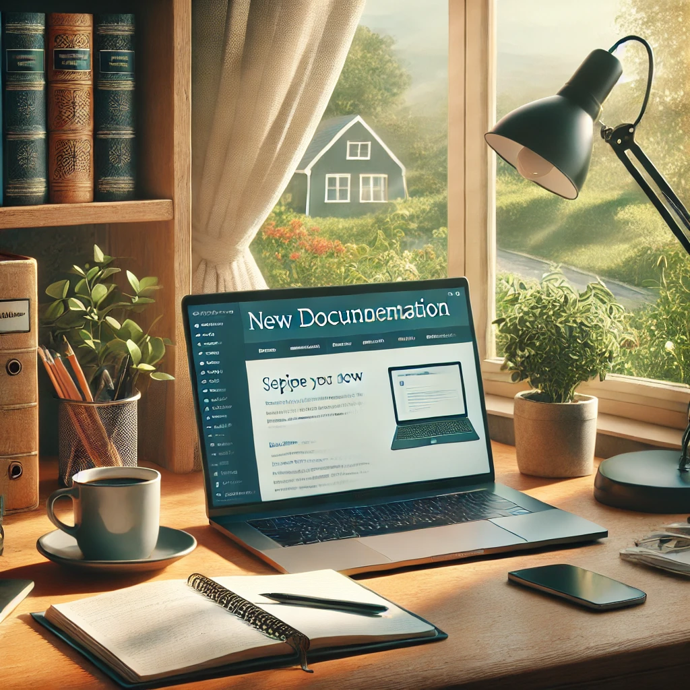
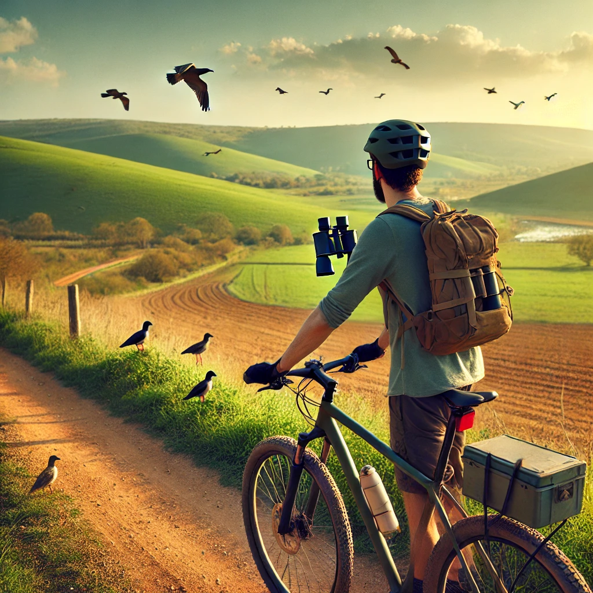

# 📌 Life Update: Projects, Learning, and the Usual Balancing Act  

📷 **

Life has been ticking along — work, learning, personal projects. Nothing dramatic, but I thought I’d put down some thoughts on what I’ve been up to. Mostly for my own benefit, but if anyone else finds it useful, all the better.  

---

## ✍️ Documenting Projects Properly (Finally)  

For a while now, I’ve been meaning to get better at documenting my work. Not in an overly polished or performative way, just something structured enough to be useful. I finally set up this **MkDocs blog** to keep track of things.  

It’s already proving helpful. Writing things down forces me to clarify my thinking, and it’s nice to have a reference point when revisiting old work. If someone else stumbles across it and finds it useful, that’s fine too.  

---

## ⚙️ Work, Learning, and Trying to Keep Up  

Keeping up with work and continuous learning at the same time is an ongoing challenge. There’s always more to read, more to test, more to refine. Lately, I’ve been focused on:  

🔹 **Automation** – making things run themselves where possible.  
🔹 **Security** – because the landscape never stops shifting.  
🔹 **Cloud optimization** – getting the most out of what’s already in place.  

I also need to push myself to do more **hands-on** work in areas I haven’t explored as much. It’s easy to keep circling around familiar topics, but I want to force some variety into my learning.  

---

## 🚴‍♂️ Getting Outside (Because Screens Aren’t Everything)  

📷 **  

I spend enough time at a desk as it is, so I’ve been continuing to prioritise getting outside. **Cycling**, **running**, **gardening** and **birdwatching** have been good ways to clear my head.  

It’s a reminder that productivity isn’t just about doing more—it’s about doing things *well*, which is harder when you’re constantly in work mode. Some distance helps.

---

## 🔮 Next Steps  

No major changes on the horizon, but things I want to focus on:  

✅ Expanding this blog with more useful content.  
✅ Continuing to refine workflows and knowledge-sharing.  
✅ Dedicating time to learning and experimenting with new tech.  

That’s about it. Nothing groundbreaking, just a steady progression of projects and ideas. If you’re also juggling work, learning, and trying to maintain some kind of balance, I’d be interested to hear how you manage it.  

---
