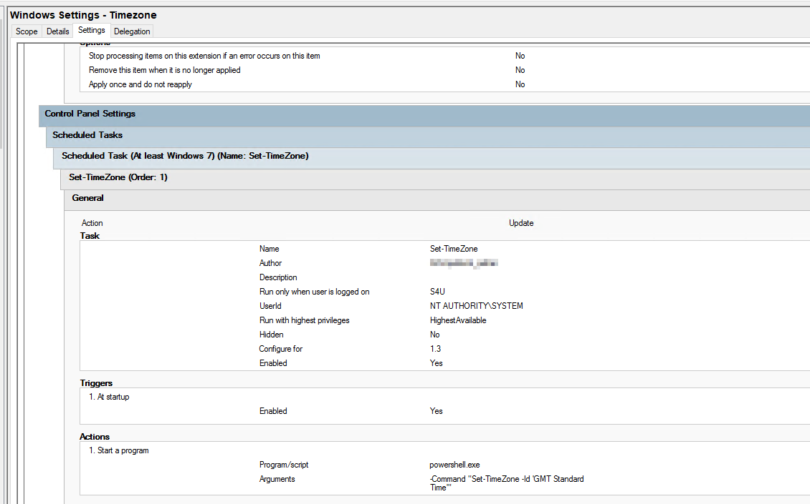

# Enforcing Time Zone and DST Compliance on Windows Servers Using GPO and Scheduled Tasks

---

## 🛠️ Why This Matters

Time zone misconfigurations — especially those affecting Daylight Saving Time (DST) — can cause:

- Scheduled tasks to run early or late
- Timestamp mismatches in logs
- Errors in time-sensitive integrations

Windows doesn’t always honour DST automatically, particularly in **Azure VMs**, **automated deployments**, or **custom images**.

---

## 🔁 What’s Changed in 2025?

As of **April 2025**, we revised our approach to enforce time zone compliance in a cleaner, more manageable way:

- 🧹 **Removed all registry-based enforcement** from existing GPOs
- ⚙️ **Executed a one-time PowerShell script** to correct servers incorrectly set to `UTC` (excluding domain controllers)
- ⏲️ **Updated the GPO** to use a **Scheduled Task** that sets the correct time zone at startup (`GMT Standard Time`)

---

## 📋 Audit Process: Time Zone and NTP Source Check

Before remediation, an audit was performed across the server estate to confirm the current time zone and time sync source for each host.

### 🔎 Time Zone Audit Script

```powershell
# Set your target OU
$OU = "OU=Servers,DC=yourdomain,DC=local"

# Prompt for credentials once
$cred = Get-Credential

# Optional: output to file
$OutputCsv = "C:\Temp\TimeZoneAudit.csv"
$results = @()

# Get all enabled computer objects in the OU
$servers = Get-ADComputer -Filter {Enabled -eq $true} -SearchBase $OU -Properties Name | Select-Object -ExpandProperty Name

foreach ($server in $servers) {
    Write-Host "`nConnecting to $server..." -ForegroundColor Cyan
    try {
        $tzInfo = Invoke-Command -ComputerName $server -Credential $cred -ScriptBlock {
            $tz = Get-TimeZone
            $source = (w32tm /query /source) -join ''
            $status = (w32tm /query /status | Out-String).Trim()
            [PSCustomObject]@{
                ComputerName     = $env:COMPUTERNAME
                TimeZoneId       = $tz.Id
                TimeZoneDisplay  = $tz.DisplayName
                CurrentTime      = (Get-Date).ToString("yyyy-MM-dd HH:mm:ss")
                TimeSource       = $source
                SyncStatus       = $status
            }
        } -ErrorAction Stop

        $results += $tzInfo
    }
    catch {
        Write-Warning "Failed to connect to ${server}: $_"
        $results += [PSCustomObject]@{
            ComputerName     = $server
            TimeZoneId       = "ERROR"
            TimeZoneDisplay  = "ERROR"
            CurrentTime      = "N/A"
            TimeSource       = "N/A"
            SyncStatus       = "N/A"
        }
    }
}

# Output results
$results | Format-Table -AutoSize

# Save to CSV
$results | Export-Csv -NoTypeInformation -Path $OutputCsv
Write-Host "`nAudit complete. Results saved to $OutputCsv" -ForegroundColor Green
```

---

## 🧰 GPO-Based Scheduled Task (Preferred Solution)

Instead of relying on registry modifications, we now use a **Scheduled Task deployed via Group Policy**.

### ✅ Task Overview:

- **Trigger:** At Startup
- **Action:** Run `powershell.exe`
- **Arguments:**

  ```bash
  -Command "Set-TimeZone -Id 'GMT Standard Time'"
  ```

> 💡 The GPO targets all domain-joined servers. Servers in isolated environments (e.g. DMZ) or not joined to the domain are excluded.

---

### 📸 Scheduled Task Screenshots

  
*Fig 1: Scheduled Task created via GPO Preferences*

  
*Fig 2: PowerShell command configuring the time zone*

---

## 🛠️ One-Off Remediation Script: Setting the Time Zone

For servers identified as incorrect in the audit, the following script was used to apply the fix:

```powershell
# List of servers to correct (e.g., from your audit results)
$servers = @(
    "server1",
    "server2",
    "server3"
)

# Prompt for credentials if needed
$cred = Get-Credential

foreach ($server in $servers) {
    Write-Host "Setting time zone on $server..." -ForegroundColor Cyan
    try {
        Invoke-Command -ComputerName $server -Credential $cred -ScriptBlock {
            Set-TimeZone -Id "GMT Standard Time"
        } -ErrorAction Stop

        Write-Host "✔ $server: Time zone set to GMT Standard Time" -ForegroundColor Green
    }
    catch {
        Write-Warning "✖ Failed to set time zone on ${server}: $_"
    }
}
```

---

## 🔍 How to Verify Time Zone + DST Compliance

Use these PowerShell commands to verify:

```powershell
Get-TimeZone
(Get-TimeZone).SupportsDaylightSavingTime
```

And for registry inspection (read-only):

```powershell
Get-ItemProperty "HKLM:\SYSTEM\CurrentControlSet\Control\TimeZoneInformation" |
  Select-Object TimeZoneKeyName, DisableAutoDaylightTimeSet, DynamicDaylightTimeDisabled
```

Expected values:

- `TimeZoneKeyName`: `"GMT Standard Time"`
- `DisableAutoDaylightTimeSet`: `0`
- `DynamicDaylightTimeDisabled`: `0`

---

## 🧼 Summary

To ensure consistent time zone configuration and DST compliance:

- Use a **GPO-based Scheduled Task** to set `GMT Standard Time` at startup
- Run a **one-time audit and remediation** script to fix legacy misconfigurations
- Avoid registry edits — they’re no longer required
- Validate using `Get-TimeZone` and confirm time sync via `w32tm`

---

## 📘 Next Steps

- [ ] Extend to Azure Arc or Intune-managed servers  
- [ ] Monitor for changes in Windows DST behaviour in future builds  
- [ ] Automate reporting to maintain compliance across environments

---

## 🧠 Final Thoughts

This GPO+script approach delivers a clean, scalable way to enforce time zone standards and DST logic — without relying on brittle registry changes.

Let me know if you'd like help adapting this for cloud-native or hybrid environments!

---
