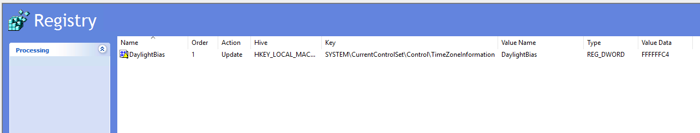

# Ensuring Daylight Saving Time (DST) is Properly Configured on Windows Servers

> 🧾 **TL;DR:**  
> If your Windows Server isn’t adjusting for British Summer Time (BST), even though it's set to GMT Standard Time, you likely need to explicitly enable DST via the registry. This post walks through how to fix that via PowerShell and Group Policy.

---

When configuring UK regional settings on Windows Server, you might assume that selecting **"GMT Standard Time"** is enough to cover everything — but that's not always the case.

Some environments have reported that even with the time zone correctly set to the UK, the server fails to adjust for **British Summer Time (BST)**. This can wreak havoc on:

- Scheduled tasks (running one hour early/late)
- Time-sensitive scripts
- Logs and timestamps across systems
- Automation runbooks tied to wall clock time

---

## 🔍 What Causes the Problem?

Even when the time zone is set correctly, Windows may not automatically adjust for DST if certain registry values are misconfigured.

There are two common flags that influence this behavior:

- `DisableAutoDaylightTimeSet`: Disables auto DST adjustment when set to `1`
- `DynamicDaylightTimeDisabled`: Prevents use of dynamic DST rules when set to `1`

---

## 🧪 How to Check DST Settings via PowerShell

Run this to inspect the registry configuration:

```powershell
Get-ItemProperty "HKLM:\SYSTEM\CurrentControlSet\Control\TimeZoneInformation"
```

You’re looking for these two values:

- `DisableAutoDaylightTimeSet` — should be `0`
- `DynamicDaylightTimeDisabled` — should be `0`

Also verify your time zone:

```powershell
Get-TimeZone
```

Look for:

```text
Id                             : GMT Standard Time
SupportsDaylightSavingTime     : True
```

---

## 🖥️ Visual Verification (Optional)

You can also confirm DST is enabled by navigating to:

> **Control Panel** → **Date and Time** → **Change time zone**  
> ✅ Ensure **“Automatically adjust clock for Daylight Saving Time”** is ticked.


---

## 🔧 Option 1: PowerShell Fix for Standalone Servers

If you want to fix this manually or via automation:

```powershell
# Set correct time zone
Set-TimeZone -Id "GMT Standard Time"

# Enable DST auto-adjustment flags
Set-ItemProperty -Path "HKLM:\SYSTEM\CurrentControlSet\Control\TimeZoneInformation" -Name "DisableAutoDaylightTimeSet" -Value 0
Set-ItemProperty -Path "HKLM:\SYSTEM\CurrentControlSet\Control\TimeZoneInformation" -Name "DynamicDaylightTimeDisabled" -Value 0

Write-Host "DST auto-adjustment enabled. A reboot may be required."
```

Validate with:

```powershell
Get-ItemProperty -Path "HKLM:\SYSTEM\CurrentControlSet\Control\TimeZoneInformation" |
  Select-Object DisableAutoDaylightTimeSet, DynamicDaylightTimeDisabled
```

You can also check your time zone using:

```powershell
tzutil /g
tzutil /s "GMT Standard Time"
```

---

## 🛠️ Option 2: Using Group Policy to Configure DST

For environments managing many servers, you can enforce the settings using **Group Policy Preferences**.

---

### 📋 What the GPO Does

The GPO updates several registry values:

| Value Name                  | Type        | Purpose |
|----------------------------|-------------|---------|
| `TimeZoneKeyName`          | REG_SZ      | Specifies the named Windows Time Zone (e.g. "GMT Standard Time") |
| `Bias`                     | REG_DWORD   | Offset from UTC in minutes (0 for GMT) |
| `StandardBias`             | REG_DWORD   | Typically 0 |
| `DaylightBias`             | REG_DWORD   | Usually `0xFFFFFFFF` (minus 60 minutes) |
| `DynamicDaylightTimeDisabled` | REG_DWORD | Set to `0` to allow dynamic DST |
| `DisableAutoDaylightTimeSet` | REG_DWORD | Set to `0` to enable auto DST |
| `RealTimeIsUniversal`      | REG_DWORD   | Set to `1` if your hardware clock is UTC-based (optional) |

---

### 🧭 Steps to Create the GPO

1. Open **Group Policy Management Console** (`gpmc.msc`)
2. Create and name a new GPO (e.g., `Enable DST - UK Servers`)
3. Edit the GPO and go to:  
   `Computer Configuration > Preferences > Windows Settings > Registry`
4. Add a **New > Registry Item** for each key listed above  
   - Set **Action = Update**
   - Define the correct **Hive**, **Key Path**, **Value Name**, **Type**, and **Value Data**
5. Close and apply the GPO to your target OU

---

### 📸 GPO Screenshot

Here’s how your GPO Registry Items might look:



---

### 🔄 Apply and Reboot (Recommended)

```powershell
gpupdate /force
shutdown /r /t 0
```

Then confirm:

```powershell
Get-ItemProperty "HKLM:\SYSTEM\CurrentControlSet\Control\TimeZoneInformation"
Get-TimeZone
```

You should see `SupportsDaylightSavingTime = True` and correct local time.

---

## 🛠️ Common Issues

**“Server still not shifting into DST?”**

- Make sure no other GPO is overriding these registry settings
- Check if you're using a custom image that disables DST
- Verify time sync tools (e.g. VMware Tools or Hyper-V integration) aren’t forcing UTC
- Run `tzutil /g` to verify current time zone

---

## 📅 When to Use This

- Your server doesn’t shift into BST automatically in March
- You’re seeing a 1-hour offset in scheduled tasks or logs
- You’re deploying servers in headless/automated fashion
- You want consistent DST behaviour across environments

---

## 🧼 Final Thoughts

This is one of those silent configuration issues that can cause a real headache later on.

By explicitly enabling DST via PowerShell or Group Policy, you eliminate ambiguity and ensure consistent time behaviour across all your environments.

Let me know if you'd like this wrapped into a broader Windows regional settings module — or want a version built for Intune or Azure Automation.

---
