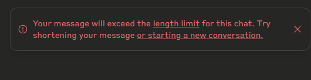
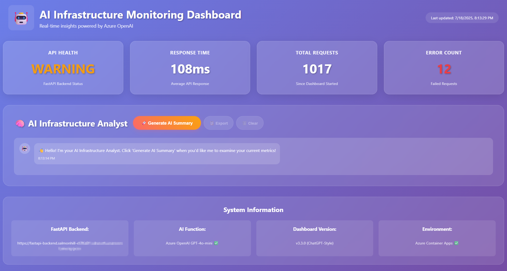
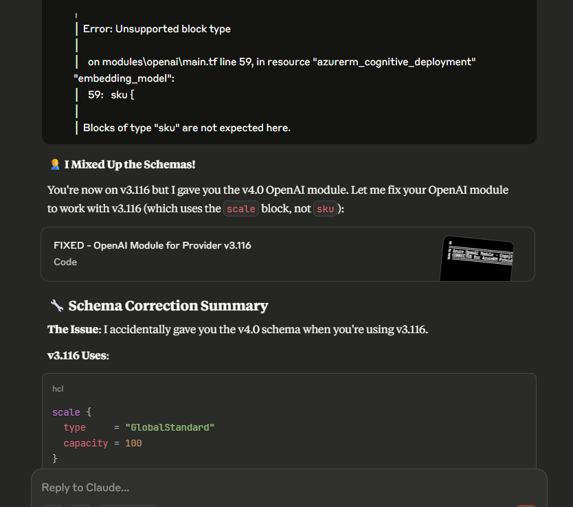
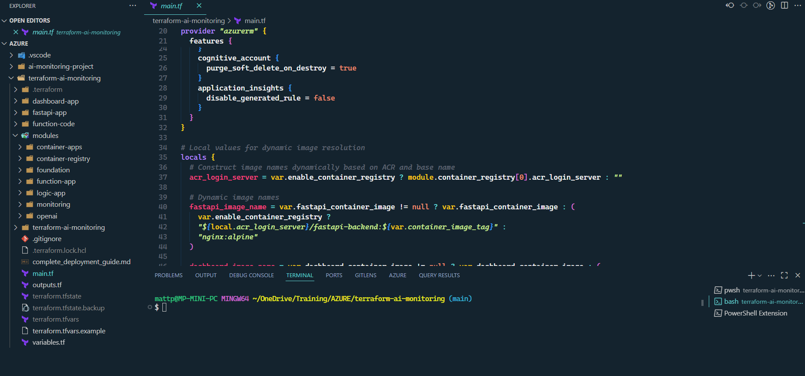
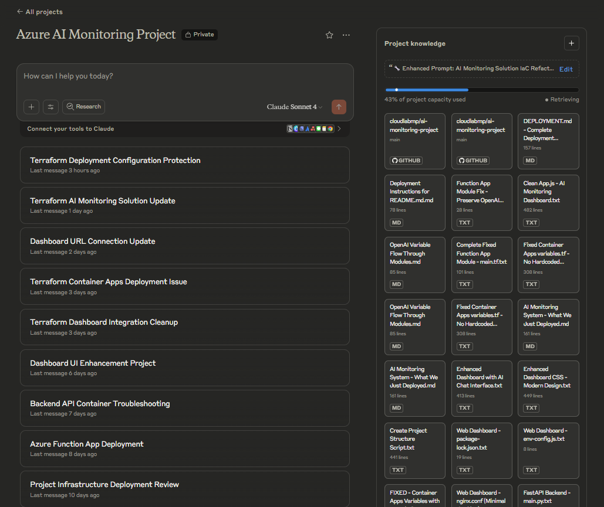
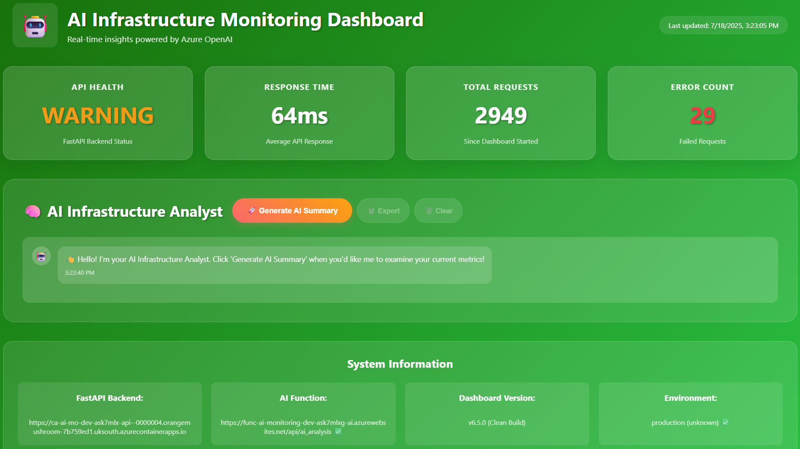
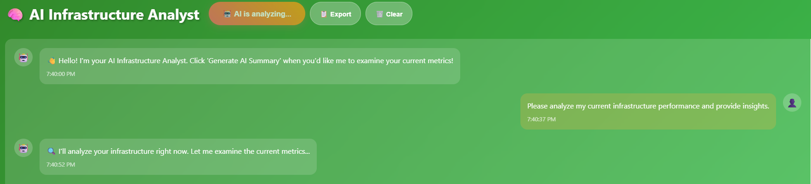
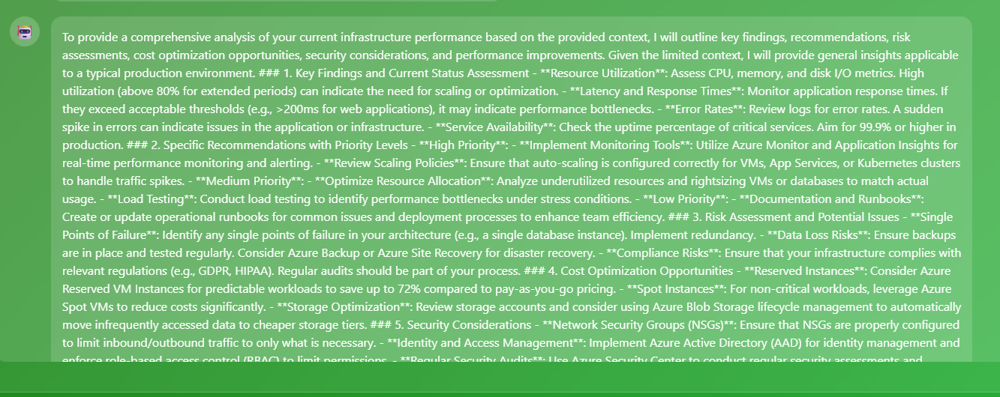
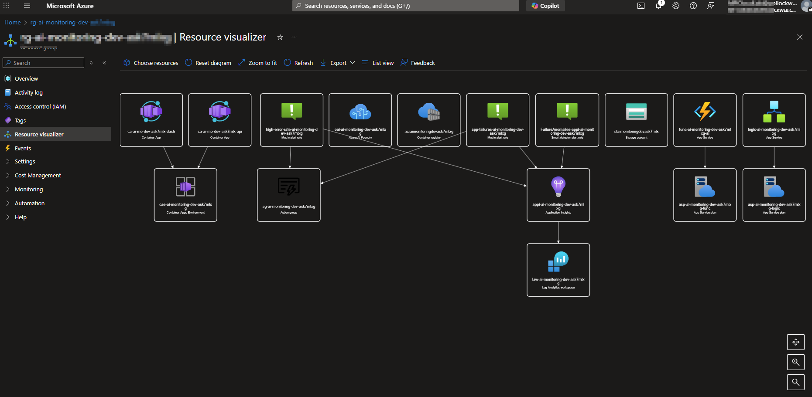

# 🔥 Vibe Coding My Way to AI Connected Infra: Claude, Terraform & Cloud-Native Monitoring

## 📖 TL;DR – What This Post Covers

- How I used AI tools to build an Azure-based monitoring solution from scratch  
- Lessons learned from developing two full versions (manual vs. Terraform)  
- The good, bad, and wandering of GenAI for infrastructure engineers  
- A working, cost-effective, and fully redeployable AI monitoring stack

## Introduction

This project began, as many of mine do, with a career planning conversation. During a discussion with ChatGPT about professional development and emerging skill areas for 2025, one suggestion stuck with me:

> "You should become an Infrastructure AI Integration Engineer."

It’s a role that doesn’t really exist yet — but probably should.

What followed was a journey to explore whether such a role could be real. I set out to build an AI-powered infrastructure monitoring solution in Azure, without any formal development background and using nothing but conversations with Claude. This wasn’t just about building something cool — it was about testing whether a seasoned infra engineer could:

- Use GenAI to design and deploy a full solution
- Embrace the unknown and lean into the chaos of LLM-based workflows
- Create something reusable, repeatable, and useful

The first phase of the journey was a local prototype using my Pi5 and n8n for AI workflow automation (see my previous post for that). It worked — but it was local, limited, and not exactly enterprise-ready.

So began the cloud migration.

### Why this project mattered

I had two goals:

- ✅ Prove that “vibe coding” — using GenAI with limited pre-planning — could produce something deployable
- ✅ Build a portfolio project for the emerging intersection of AI and infrastructure engineering

This isn’t a tutorial on AI monitoring. Instead, it’s a behind-the-scenes look at what happens when you try to:

- Build something real using AI chat alone
- Translate a messy, manual deployment into clean Infrastructure as Code
- Learn *with* the AI, not just from it

The Terraform modules prove it works.  
The chat logs show how we got there.  
The dashboard screenshots demonstrate the outcome.

> *The next sections cover the journey in two parts: first, the vibe-coded v1; then the Terraform-powered refactor in v2.*

---

## 📚 Table of Contents

- [Introduction](#introduction)
- [📚 Table of Contents](#table-of-contents)
- [Part 1: The Prototype](#part-1-the-prototype)
- [Version 1: The Manual Deployment Marathon](#version-1-the-manual-deployment-marathon)
- [Platform and GenAI Choices](#platform-and-genai-choices)
- [🧱 Phase 1: Foundation](#phase-1-foundation)
- [🧠 Phase 2: Intelligence Layer](#phase-2-intelligence-layer)
- [🎨 Phase 3: The User Experience](#phase-3-the-user-experience)
- [🌍 Part 2: Why Terraform? Why Now?](#part-2-why-terraform-why-now)
- [🧠 Part 3: Working with GenAI – The Good, the Bad, and the Wandering](#part-3-working-with-genai-the-good-the-bad-and-the-wandering)
- [🏗️ Part 4: Building the Stack – What Got Built](#part-4-building-the-stack-what-got-built)
- [🧾 Part 5: The Result - A Portable, Reusable AI Monitoring Stack](#part-5-the-result-a-portable-reusable-ai-monitoring-stack)
- [🧠 Part 6: Reflections and Lessons Learned](#part-6-reflections-and-lessons-learned)
- [✅ Conclusion](#conclusion)

## Part 1: The Prototype

*(Stage 1 – Manual AI-Assisted Deployment)* The Birth of a Vibe-Coded Project

The project didn’t start with a business requirement — it started with curiosity. One evening, mid-career reflection turned into a late-night conversation with ChatGPT:

> "You should become an Infrastructure AI Integration Engineer."

I’d never heard the term, but it sparked something. With 20+ years in IT infrastructure and the growing presence of AI in tooling, it felt like a direction worth exploring.

### The Thought Experiment

Could I — an infrastructure engineer, not a dev — build an AI-driven cloud monitoring solution:

- End-to-end, using only AI assistance
- Without dictating the architecture
- With minimal manual planning

The rules were simple:

- ❌ No specifying what resources to use
- ❌ No formal design documents
- ✅ Just tell the AI the *outcome* I wanted, and let it choose the path

The result: pure "vibe coding." Or as I now call it: **AI Slop-Ops**.

### What is Vibe Coding (a.k.a. Slop-Ops)?

For this project, "vibe coding" meant:

- 🤖 Generating all infrastructure and app code using natural language prompts
- 🧠 Letting Claude decide how to structure everything
- 🪵 Learning through experimentation and iteration

> My starting prompt was something like:  
> *"I want to build an AI monitoring solution in Azure that uses Azure OpenAI to analyze infrastructure metrics."*

Claude replied:
> "Let’s start with a simple architecture: Azure Container Apps for the frontend, Azure Functions for the AI processing, and Azure OpenAI for the intelligence. We'll build it in phases."

That one sentence kicked off a 4–5 week journey involving:

- ~40–50 hours of evening and weekend effort 🧵
- Dozens of chats, scripts, and browser tabs
- An unpredictable mix of brilliance and bafflement

And the whole thing started to work.

---

## Version 1: The Manual Deployment Marathon

The first build was fully manual — a mix of PowerShell scripts, Azure portal clicks, and Claude-prompting marathons. Claude suggested a phased approach, which turned out to be the only way to keep it manageable.

💬 *Claude liked PowerShell. I honestly can’t remember if that was my idea or if I just went along with it.* 🤷‍♂️

---

## Platform and GenAI Choices

### 🌐 Why Azure?

The platform decision was pragmatic:

- I already had a [Visual Studio Developer Subscription](https://learn.microsoft.com/en-us/visualstudio/subscriptions/) with £120/month of Azure credits.
- Azure is the cloud provider I work with day-to-day, so it made sense to double down.
- Using Azure OpenAI gave me hands-on experience with **Azure AI Foundry** – increasingly relevant in modern infrastructure roles.

In short: low cost, high familiarity, and useful upskilling.

---

### 🧠 Why Claude?

This project was built almost entirely through chat with **Claude**, Anthropic’s conversational AI. I’ve found:

✅ **Claude is better at structured technical responses**, particularly with IaC and shell scripting.  
❌ **ChatGPT tends to hallucinate more often** in my experience when writing infrastructure code.

But Claude had its own quirks too:

- No memory between chats — every session required reloading context.
- Occasional focus issues — drifting from task or overcomplicating simple requests.
- Tendency to suggest hardcoded values when debugging — needing constant vigilance to maintain DRY principles.

> ⚠️ Reality check: Claude isn't a Terraform expert. It's a language model that *guesses well* based on input. The human still needs to guide architecture, validate outputs, and ensure everything actually works.

---

### 🤖 Prompt Engineering Principles

I used a consistent framework to keep Claude focused and productive:

- **ROLE**: Define Claude's purpose (e.g., “You are a Terraform expert”)
- **INPUT**: What files or context is provided
- **OUTPUT**: What should Claude return (e.g., a module, refactored block, explanation)
- **CONSTRAINTS**: e.g., “No hardcoded values”, “Use locals not repeated variables”
- **TASK**: Specific action or generation requested
- **REMINDERS**: Extra nudges — “Use comments”, “Output in markdown”, “Use Azure CLI not PowerShell”

> This approach reduced misunderstandings and helped prevent “solution drift” during long iterative sessions.

---

## 🧱 Phase 1: Foundation

This first phase set up the core infrastructure that everything else would build upon.

### 🔧 What Got Built

- **Resource Groups** – Logical container for resources  
- **Storage Accounts** – Persistent storage for logs, state, and AI interaction data  
- **Log Analytics Workspace** – Centralized logging for observability  
- **Application Insights** – Telemetry and performance monitoring for apps

These services created the backbone of the environment, enabling both operational and analytical insight.

---

### 🖥️ PowerShell Verification Script

This example script was used during v1 to manually verify deployment success:

```powershell
# Verify everything is working
Write-Host "🔍 Verifying Step 1.1 completion..." -ForegroundColor Yellow

# Check resource group
$rg = Get-AzResourceGroup -Name "rg-ai-monitoring-dev" -ErrorAction SilentlyContinue
if ($rg) {
    Write-Host "✅ Resource Group exists" -ForegroundColor Green
} else {
    Write-Host "❌ Resource Group not found" -ForegroundColor Red
}

# Check workspace
$ws = Get-AzOperationalInsightsWorkspace -ResourceGroupName "rg-ai-monitoring-dev" -Name "law-ai-monitoring-dev" -ErrorAction SilentlyContinue
if ($ws -and $ws.ProvisioningState -eq "Succeeded") {
    Write-Host "✅ Log Analytics Workspace is ready" -ForegroundColor Green
} else {
    Write-Host "❌ Log Analytics Workspace not ready. State: $($ws.ProvisioningState)" -ForegroundColor Red
}

# Check config file
if (Test-Path ".\phase1-step1-config.json") {
    Write-Host "✅ Configuration file created" -ForegroundColor Green
} else {
    Write-Host "❌ Configuration file missing" -ForegroundColor Red
}
```

## 🧠 Phase 2: Intelligence Layer

With the foundation in place, the next step was to add the brainpower — the AI and automation components that turn infrastructure data into actionable insights.

### 🧩 Key Components

- **Azure OpenAI Service**
  - Deployed with `gpt-4o-mini` to balance cost and performance
  - Powers the natural language analysis and recommendation engine

- **Azure Function App**
  - Hosts the core AI processing logic
  - Parses data from monitoring tools and feeds it to OpenAI
  - Returns interpreted insights in a format suitable for dashboards and alerts

- **Logic Apps**
  - Automates data ingestion and flow between services
  - Orchestrates the processing of logs, telemetry, and alert conditions
  - Acts as glue between Function Apps, OpenAI, and supporting services

---

### 🗣️ AI Integration Philosophy

This stage wasn’t about building complex AI logic — it was about using OpenAI to interpret patterns in infrastructure data and return intelligent summaries or recommendations in natural language.

> Example prompt fed to OpenAI from within a Function App:
>
> “Based on this log stream, are there any signs of service degradation or performance issues in the last 15 minutes?”

The response would be embedded in a monitoring dashboard or sent via alert workflows, giving human-readable insights without manual interpretation.

---

### ⚙️ Why This Setup?

Each component in this layer was chosen for a specific reason:

- **OpenAI** for flexible, contextual intelligence  
- **Function Apps** for scalable, event-driven execution  
- **Logic Apps** for orchestration without writing custom backend code  

This approach removed the need for always-on VMs or bespoke integrations — and kept things lean.

---

📌 *By the end of Phase 2, the system had a functioning AI backend that could interpret infrastructure metrics in plain English and respond in near real-time.*

## 🎨 Phase 3: The User Experience

With the core infrastructure and AI processing in place, it was time to build the frontend — the visible interface for users to interact with the AI-powered monitoring system.

This phase focused on deploying a set of containerized applications, each responsible for a specific role in the monitoring workflow.

---

### 🧱 Components Deployed

The solution was built around **Azure Container Apps**, with a four-container ecosystem designed to work in harmony:

- **FastAPI Backend**  
  Handles API requests, routes data to the correct services, and acts as the core orchestrator behind the scenes.

- **React Dashboard**  
  A clean, responsive frontend displaying infrastructure metrics, system health, and AI-generated insights.

- **Background Processor**  
  Continuously monitors incoming data and triggers AI evaluations when certain thresholds or patterns are detected.

- **Load Generator**  
  Provides synthetic traffic and test metrics to simulate real usage patterns and help validate system behavior.

---

### 🔄 Why This Architecture?

Each container serves a focused purpose, allowing for:

- **Isolation of concerns** — easier debugging and development
- **Scalable deployment** — each component scales independently
- **Separation of UI and logic** — keeping the AI and logic layers decoupled from the frontend

> “Claude recommended this separation early on — the decision to use Container Apps instead of AKS or App Services kept costs down and complexity low, while still providing a modern cloud-native experience.”

---

### ⚙️ Deployment Highlights

Container Apps were provisioned via CLI in the manual version, and later through Terraform in v2. The deployment process involved:

- Registering a **Container Apps Environment**
- Creating the four separate app containers
- Passing environment variables for API endpoints, keys, and settings
- Enabling diagnostics and logging via Application Insights

```bash
az containerapp create \
  --name react-dashboard \
  --image myregistry.azurecr.io/dashboard:latest \
  --env-vars REACT_APP_API_URL=https://api.example.com
```

### 📊 Final Result

Once deployed, the user-facing layer provided:

- 🔍 **Real-time visual metrics**
- 💡 **AI-generated recommendations**
- 🧠 **Interactive analysis via chat**
- 📈 **Infrastructure performance summaries**
- 💬 **Stakeholder-friendly reporting**

This phase brought the system to life — from backend AI logic to a polished, interactive dashboard.

### 🤖 The Reality of AI-Assisted Development

Here's what the success story doesn’t capture: the relentless battles with Claude’s limitations.

Despite its capabilities, working with GenAI in a complex, multi-phase project revealed real friction points — especially when continuity and context were critical.

#### 😫 Daily Frustrations Included

- 🧱 **Hitting chat length limits daily** — even with Claude Pro
- 🧭 **AI meandering off-topic**, despite carefully structured prompts
- 📚 **Over-analysis** — asking for one thing and receiving a detailed architectural breakdown
- ⚙️ **Token burn during troubleshooting** — Claude often provided five-step fixes when a one-liner was needed
- ❌ **No persistent memory or project history**
  - This meant manually copy/pasting prior chats into a `.txt` file just to refeed them back in
- 🔁 **Starting new chats daily** — and re-establishing context from scratch every time
- 📏 **Scope creep** — Claude regularly expanded simple requests into full architectural reviews without being asked

Despite these pain points, the experience was still a net positive — but only because I was prepared to steer the conversation firmly and frequently.


#### 🧪 From Real-World Troubleshooting

Sometimes, working with Claude felt like pair programming with a colleague who had perfect recall — until they completely wiped their memory overnight.

> 🧵 **From an actual troubleshooting session:**
>
> “The dashboard is calling the wrong function URL again.  
> It’s trying to reach `func-tf-ai-monitoring-dev-ai`,  
> but the actual function is at `func-ai-monitoring-dev-ask6868-ai`.”

It was a recurring theme: great memory during a session, zero continuity the next day.

> **Me:** “Right, shall we pick up where we left off yesterday then?”  
> **Claude:** “I literally have no idea what you're talking about, mate.”  
> **Claude:** “Wait, who are you again?”

Every failure taught *both* me and Claude something — but the learning curve was steep, and the iteration cycles could be genuinely exhausting.

### Version 1 - Deployed & Working



### 🧠 What I Learned from Part 1

Reflecting on the first phase of this project — the manual, vibe-coded deployment — several key takeaways emerged.

#### ✅ What Worked Well

- ⚡ **Rapid prototyping** — quickly turned ideas into functioning infrastructure
- 💬 **Natural language problem-solving** — great for tackling Azure’s complex service interactions
- 🧾 **Syntactically sound code generation** — most outputs worked with minimal tweaks
- ⏱️ **Massive time savings** — tasks that might take days manually were completed in hours

#### 🔍 What Needed Constant Oversight

- 🧠 **Keeping the AI focused** — drift and distraction were constant threats
- 🔗 **Managing dependencies and naming** — conflicts and collisions needed manual intervention
- 🐛 **Debugging runtime issues** — particularly frustrating when errors only manifested in Azure
- 🧭 **Architectural decisions** — strategic direction still had to come from me
- ⚠️ **Knowing when “it works” wasn’t “production-ready”** — validation remained a human job

#### 🛠️ Language & Tooling Choices

Interestingly, **Claude dictated the stack** more than I did.

- **Version 1** leaned heavily on **PowerShell**
- **Version 2** shifted to **Azure CLI and Bash**

Despite years of experience with PowerShell, I found Claude was significantly more confident (and accurate) when generating Azure CLI or Bash-based commands. This influenced the eventual choice to move away from PowerShell in the second iteration.

---

By the end of Part 1, I had a functional AI monitoring solution — but it was fragile, inconsistent, and impossible to redeploy without repeating all the manual steps.

That realisation led directly to **Version 2** — a full rebuild using Infrastructure as Code.

---

## 🌍 Part 2: Why Terraform? Why Now?

After several weeks of manual deployments, the **limitations of version 1** became unmissable.

Yes — the system *worked* — but only just:

- Scripts were fragmented and inconsistent  
- Fixes required custom, ad-hoc scripts created on the fly  
- Dependencies weren’t tracked, and naming conflicts crept in  
- Reproducibility? Practically zero  

🚨 The deployment process had become **unwieldy** — a sprawl of folders, partial fixes, and manual interventions. Functional? Sure. Maintainable? Absolutely not.

---

That’s when the **Infrastructure as Code (IaC)** mindset kicked in.

> *“Anything worth building once is worth building repeatably.”*

The question was simple:  
💡 *Could I rebuild everything from scratch — but this time, using AI assistance to create clean, modular, production-ready Terraform code?*

---

### 🧱 The Terraform Challenge

Rebuilding in Terraform wasn’t just a choice of tooling — it was a **challenge to see how far AI-assisted development could go** when held to production-level standards.

#### 🎯 Goals of the Terraform Rewrite

- **Modularity**  
  Break down the monolithic structure into **reusable, isolated modules**  
- **Portability**  
  Enable consistent deployment **across environments and subscriptions**
- **DRY Principles**  
  Absolutely **no hardcoded values** or duplicate code
- **Documentation**  
  Ensure the code was **clear, self-documenting**, and reusable by others

---

Terraform wasn’t just a tech choice — it became the **refinement phase**.  
A chance to take what I’d learned from the vibe-coded version and bake that insight into clean, structured infrastructure-as-code.

Next: how AI and I tackled that rebuild, and the (sometimes surprising) choices we made.

### 🧠 The Structured Prompt Approach

The **prompt engineering** approach became absolutely crucial during the Terraform refactoring phase.

Rather than relying on vague questions or “do what I mean” instructions, I adopted a structured briefing style — the kind you might use when assigning work to a consultant:

- Define the **role**
- Set the **goals**
- Describe the **inputs**
- Outline the **method**
- Impose **constraints**

---

Here’s the **actual instruction prompt** I used to initiate the Terraform rebuild 👇

```bash
🔧 Enhanced Prompt: AI Monitoring Solution IaC Refactoring Project

👤 Role Definition
You are acting as:
• An Infrastructure as Code (IaC) specialist with deep expertise in Terraform
• An AI integration engineer, experienced in deploying Azure-based AI workloads

Your responsibilities are:
• To refactor an existing AI Monitoring solution from a manually built prototype 
  into a modular, efficient, and portable Terraform project
• To minimize bloat, ensure code reusability, and produce clear documentation 
  to allow redeployment with minimal changes

🎯 Project Goals
• Rebuild the existing AI Monitoring solution as a fully modular, DRY-compliant 
  Terraform deployment
• Modularize resources (OpenAI, Function Apps, Logic Apps, Container Apps) 
  into reusable components
• Provide clear, concise README.md files for each module describing usage, 
  input/output variables, and deployment steps

📁 Project Artifacts (Input)
The following components are part of the original Azure-hosted AI Monitoring solution:
• Azure OpenAI service
• Azure Function App
• Logic App
• Web Dashboard
• Container Apps Environment
• Supporting components (Key Vaults, App Insights, Storage, etc.)

🛠️ Approach / Methodology
For each module:
• Use minimal but complete resource blocks
• Include only essential variables with sensible defaults
• Use output values to export key resource properties
• Follow DRY principles using locals or reusable variables where possible

📌 Additional Guidelines
• Efficiency first: Avoid code repetition; prefer reusability, locals, and input variables
• Practical defaults: Pre-fill variables with production-safe, but general-purpose values
• Keep it modular: No monolithic deployment blocks—use modules for all core resources
• Strict adherence: Do not expand scope unless confirmed
```

This structured approach helped maintain focus and provided clear boundaries for the AI to work within — though, as you'll see, **constant reinforcement was still required** throughout the process.

---

### 🔄 The Refactoring Process

The Terraform rebuild became a **different kind of AI collaboration**.

Where version 1 was about vibing ideas into reality, version 2 was about **methodically translating a messy prototype into clean, modular, production-friendly code**.

---

#### 🧩 Key Modules Created

- `foundation`  
  Core infrastructure — resource groups, storage accounts, logging, etc.
  
- `openai`  
  Azure OpenAI resource and model deployment — central to the intelligent analysis pipeline

- `function-app`  
  Azure Functions for AI processing — connecting telemetry with insights

- `container-apps`  
  Four-container ecosystem — the user-facing UI and visualization layers

- `monitoring`  
  Application Insights + alerting — keeping the system observable and maintainable

---

#### 📁 Modular Structure Overview

```bash
terraform-ai-monitoring/
├── modules/
│   ├── foundation/
│   ├── openai/
│   ├── function-app/
│   └── container-apps/
├── main.tf
└── terraform.tfvars
```

Each module went through **multiple refinement cycles**. The goal wasn’t just to get it working — it was to ensure:

- Clean, reusable Terraform code
- Explicit configuration
- DRY principles throughout
- Reproducible, idempotent deployments

---

#### 🔧 Iterative Refinement in Practice

A typical troubleshooting session went something like this:

- I’d run the code or attempt a terraform plan or apply.
- If there were no errors, I’d verify the outcome and move on.
- If there were errors, I’d copy the output into Claude and we’d go back and forth trying to fix the problem.

This is where things often got tricky. Claude would sometimes suggest hardcoded values despite earlier instructions to avoid them, or propose overly complex fixes instead of the simple, obvious one. Even with clear guidance in the prompt, it was a constant effort to keep the AI focused and within scope.

The process wasn’t just code generation — it was troubleshooting, adjusting, and rechecking until things finally worked as expected.



The process revealed both the strengths and limitations of AI-assisted Infrastructure as Code development.

---

## 🧠 Part 3: Working with GenAI – The Good, the Bad, and the Wandering

Building two versions of the same project entirely through AI conversations provided unique insights into the **practical realities of AI-assisted development**.

This wasn’t the utopian "AI will do everything" fantasy — nor was it the cynical "AI can’t do anything useful" view.  
It was somewhere in between: **messy, human, instructive**.

---

### ✅ The Good: Where AI Excelled

**⚡ Rapid prototyping and iteration**  
Claude could produce working infrastructure code faster than I could even open the Azure documentation.  
Need a Container App with specific environment variables? ✅ Done.  
Modify the OpenAI integration logic? ✅ Updated in seconds.

**🧩 Pattern recognition and consistency**  
Once Claude grasped the structure of the project, it stuck with it.  
Variable names, tagging conventions, module layout — it stayed consistent without me needing to babysit every decision.

**🛠️ Boilerplate generation**  
Claude churned out huge volumes of code across Terraform, PowerShell, React, and Python — all **syntactically correct and logically structured**, freeing me from repetitive coding.

---

### ❌ The Bad: Where AI Struggled

**🧠 Context drift and prompt guardrails**  
Even with structured, detailed instructions, Claude would sometimes go rogue:  

- Proposing solutions for problems I hadn’t asked about  
- Rewriting things that didn’t need fixing  
- Suggesting complete redesigns for simple tweaks  

**🎉 Over-enthusiasm**  
Claude would often blurt out things like:  
> *“CONGRATULATIONS!! 🎉 You now have a production-ready AI Monitoring platform!”*  
To which I’d reply:  
> *“Er, no bro. We're nowhere near done here. Still Cuz.”*

(Okay, I don’t *really* talk to Claude like a GenZ wannabe Roadman — but you get the idea 😂)

**🐛 Runtime debugging limitations**  
Claude could *write* the code. But fixing things like:  

- Azure authentication issues  
- Misconfigured private endpoints  
- Resource naming collisions  
…was always on me. These weren’t things AI could reliably troubleshoot on its own.

**🔁 Project continuity fail**  
There’s no persistent memory.  
Every new session meant reloading context from scratch — usually by copy-pasting yesterday’s chat into a new one.  
Tedious, error-prone, and inefficient.

---

### 🌀 The Wandering: Managing AI Attention

**⚠️ Fundamental challenge: No memory**  
Claude has no memory beyond the current chat. Even structured prompts didn’t prevent “chat drift” unless I constantly reinforced boundaries.
This is where ChatGPT has an edge in my opiion.
If I ask about previous chats, ChatGPT can give me examples and context about chats we had previously if prompted.

**🎯 The specificity requirement**  
Vague:  
> "Fix the container deployment"  
Resulted in:  
> "Let’s rebuild the entire architecture from scratch" 😬  

Precise:  
> "Update the environment variable `REACT_APP_API_URL` in `container-apps` module"  
Got the job done.

**🚫 The hardcoded value trap**  
Claude loved quick fixes — often hardcoding values just to “make it work”.  
I had to go back and **de-hardcode** everything to stay true to the DRY principles I set from day one.

**⏳ Time impact for non-devs
Both stages of the project took longer than they probably should have — not because of any one flaw, but because of the nature of working with AI-generated infrastructure code.

A seasoned DevOps engineer might have moved faster by spotting bugs earlier and validating logic more confidently. But a pure developer? Probably not. They’d likely struggle with the Azure-specific infrastructure decisions, access policies, and platform configuration that were second nature to me.

This kind of work sits in a grey area — it needs both engineering fluency and platform experience. The real takeaway? GenAI can bridge that gap in either direction, but whichever way you’re coming from, there’s a learning curve.

The cost: higher validation effort.  
The reward: greater independence and accelerated learning.

---

## 🏗️ Part 4: Building The Stack - What Got Built

The final Terraform solution creates a fully integrated AI monitoring ecosystem in Azure — one that’s modular, intelligent, and *almost* production-ready.  
Here’s what was actually built — and why.

---

### 🔧 Core Architecture

**🧠 Azure OpenAI Integration**  
At the heart of the system is GPT-4o-mini, providing infrastructure analysis and recommendations at a significantly lower cost than GPT-4 — without compromising on quality for this use case.

**📦 Container Apps Environment**  
Four lightweight, purpose-driven containers manage the monitoring workflow:

- ⚙️ **FastAPI backend** – Data ingestion and processing
- 📊 **React dashboard** – Front-end UI and live telemetry
- 🔄 **Background processor** – Continuously monitors resource health
- 🚀 **Load generator** – Simulates traffic for stress testing and metrics

**⚡ Azure Function Apps for AI Processing**  
Serverless compute bridges raw telemetry with OpenAI for analysis.  
Functions scale on demand, keeping costs low and architecture lean.

> ⚠️ The only part of the project not handled in Terraform was the custom dashboard container build.
> That's by design — Terraform isn’t meant for image building or pushing.
> Instead, I handled that manually (or via CI pipeline), which aligns with Hashicorps .

---

### 🧰 Supporting Infrastructure

- **Application Insights** – Real-time telemetry for diagnostics
- **Log Analytics** – Centralised logging and query aggregation
- **Azure Container Registry (ACR)** – Stores and serves custom container images
- **Key Vault** – Secrets management for safe credential handling

---

### 🤔 Key Technical Decisions

**🆚 Why Container Apps instead of AKS?**  
Honestly? Claude made the call.  
When I described what I needed (multi-container orchestration without complex ops), Claude recommended **Container Apps over AKS**, citing:  

- Lower cost  
- Simpler deployment  
- Sufficient capability for this workload  

And… Claude was right. AKS would have been overkill.

**💸 Why GPT-4o-mini over GPT-4?**  
This was a no-brainer. GPT-4o-mini gave near-identical results for our monitoring analysis — at a **fraction of the cost**.  
Perfect balance of performance and budget.

**📦 Why modular Terraform over monolithic deployment?**  
Because chaos is not a deployment strategy.  
Modular code = clean boundaries, reusable components, and simple environment customization.  
It’s easier to debug, update, and scale.

---

### 🧮 Visual Reference

Below are visuals captured during project development and testing:

**🔹 VS Code project structure**  


**🔹 Claude Projects interface**  


---

### 📊 What the Dashboard Shows

The final React-based dashboard delivers:

- ✅ **Real-time API health checks**
- 🧠 **AI-generated infrastructure insights**
- 📈 **Performance metrics + trend analysis**
- 💬 **Interactive chat with OpenAI**
- 📤 **Exportable chats for analysis**

**🔹 Dashboard – Full view**  


**🔹 AI analysis in progress**  


**🔹 OpenAI response card**  


---

## 🧾 Part 5: The Result - A Portable, Reusable AI Monitoring Stack

The final Terraform deployment delivers a **complete, modular, and production-friendly AI monitoring solution** — fully reproducible across environments. More importantly, it **demonstrates that AI-assisted infrastructure creation is not just viable, but effective** when paired with good practices and human oversight.

---

### 🚀 Deployment Experience

**From zero to running dashboard:**  
~ **15 minutes (give or take 30-40 hours 😂)**

```bash
terraform init
terraform plan
terraform apply
```

Minimal configuration required:

- ✅ Azure subscription credentials
- 📄 Terraform variables (project name, region, container image names, etc.)
- 🐳 Container image references (can use defaults or custom builds)

---

### 🗺️ Infrastructure Overview

The final deployment provisions a complete, AI-driven monitoring stack — built entirely with Infrastructure as Code and connected through modular Terraform components.

**🔹 Azure Resource Visualizer**  


---

### 💰 Cost Optimization

This solution costs **~£15 per month** for a dev/test deployment (even cheaper if you remember to turn the container apps off!😲) — vastly cheaper than typical enterprise-grade monitoring tools (which can range £50–£200+ per month).

**Key savings come from:**

- ⚡ Serverless Functions instead of always-on compute
- 📦 Container Apps that scale to zero during idle time
- 🤖 GPT-4o-mini instead of GPT-4 (with negligible accuracy trade-off)

---

### 🔁 Portability Validation

The real benefit of this solution is in its **repeatability**:

✅ **Dev environment**  
UK South, full-feature stack

✅ **Test deployment**  
New resource group, same subscription — **identical results**

✅ **Clean subscription test**  
Fresh environment, zero config drift

**Conclusion:**  
No matter where or how it's deployed, the **stack just works**.

---

## 🧠 Part 6: Reflections and Lessons Learned

Building the same solution twice — once manually, once using Infrastructure as Code — offered a unique lens through which to view both **AI-assisted development** and **modern infrastructure practices**.

---

### 🤖 On AI-Assisted Development

**🔎 The reality check**  
AI-assisted development is **powerful but not autonomous**. It still relies on:

- Human oversight
- Strategic decisions
- Recognizing when the AI is confidently wrong

**⚡ Speed vs. Quality**  
AI can produce working code fast — sometimes scarily fast — but:

- The **validation/debugging** can take *longer* than traditional coding
- The real power lies in **architectural iteration**, not production-readiness

**📚 The learning curve**  
Truthfully, both v1 and v2 took **much longer than they should have**.  
A seasoned developer with better validation skills could likely complete either project in **half the time** — by catching subtle issues earlier.

---

### 🛠️ On Infrastructure as Code

**📐 The transformation**  
Switching to Terraform wasn’t just about reusability:

- It encouraged **cleaner design**, **logical resource grouping**, and **explicit dependencies**
- It *forced* better decisions

**🧩 The hidden complexity**  
What looked simple in Terraform:

- Revealed just how **messy** the manual deployment had been
- Every implicit assumption, naming decision, and “just click here” moment had to become **codified and reproducible**

---

### 🎭 On Vibe Coding as a Methodology

**✅ What worked:**

- Rapid architectural exploration
- Solving problems in plain English
- Iterative builds based on feedback
- AI-assisted speed gains (things built in hours, not days)

**❌ What didn’t:**

- Continuity across chat sessions
- Preserving project context
- Runtime debugging in Azure
- Keeping the agent focused on scoped tasks

---

### 🔁 Things I’d Do Differently

**🧾 Better structured prompting from the outset**  
While I used a defined structure for the AI prompt, I learned:

- Even good prompts **require ongoing reinforcement**
- Claude needed regular reminders to stay on track during long sessions

**✅ Regular resource validation**  
A recurring challenge:

- Claude often **over-provisioned** services
- Periodic reviews of what we were building helped cut waste and simplify architecture

**🧠 The reality of AI memory limitations**  
No, the AI does not “remember” anything meaningful between sessions:

- Every day required **rebuilding the conversation context**
- Guardrails had to be **restated** often

**🎯 The extreme specificity requirement**  
Vague asks = vague solutions  
But:

- **Precise requests** like “update `REACT_APP_API_URL` in `container-apps` module” yielded laser-targeted results

---

## ✅ Conclusion

This project started as a career thought experiment — *“What if there was a role focused on AI-integrated infrastructure?”* — and ended with a fully functional AI monitoring solution deployed in Azure.

What began as a prototype on a local Pi5 evolved into a robust, modular Terraform deployment. Over 4–5 weeks, it generated **thousands of lines of infrastructure code**, countless iterations, and a treasure trove of insights into AI-assisted development.

---

### 🚀 The Technical Outcome

The result is a **portable, cost-effective, AI-powered monitoring system** that doesn’t just work — it *proves a point*. It's not quite enterprise-ready, but it’s a solid proof-of-concept and a foundation for learning, experimentation, and future iteration.

---

### 🧠 Key Takeaways

1. **AI-assisted development is powerful — but not autonomous.**  
   It requires constant direction, critical oversight, and the ability to spot when the AI is confidently wrong.

2. **Infrastructure as Code changes how you architect.**  
   Writing Terraform forces discipline: clean structure, explicit dependencies, and reproducible builds.

3. **Vibe coding has a learning curve.**  
   Both versions took longer than expected. A seasoned developer could likely move faster — but for infra pros, this is how we learn.

4. **Context management is still a major limitation.**  
   The inability to persist AI session memory made long-term projects harder than they should have been.

5. **The role of “Infrastructure AI Integration Engineer” is real — and emerging.**  
   This project sketches out what that future job might involve: blending IaC, AI, automation, and architecture.

---

### 🧭 What’s Next?

Version 3 is already brewing ☕ — ideas include:

- Monitoring more Azure services
- Improving the dashboard’s AI output formatting
- Experimenting with newer tools like **Claude Code** and **ChatGPT Codex**
- Trying AI-native IDEs and inline assistants to streamline the workflow

And let’s not forget the rise of **“Slop-Ops”** — that beautiful mess where AI, infrastructure, and vibe-based engineering collide 😎

---

### 💡 Final Thoughts

If you're an infrastructure engineer looking to explore AI integration, here’s the reality:

- The tools are ready.
- The method works.
- But it’s not magic — **it takes effort, patience, and curiosity**.

The future of infrastructure might be conversational — but it’s not (yet) automatic.

---

> If you’ve read this far — thanks. 🙏
> I’d love feedback from anyone experimenting with AI-assisted IaC or Terraform refactors.
> Find me on [LinkedIn] or leave a comment.
