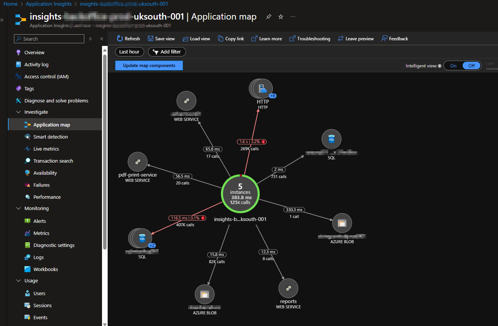
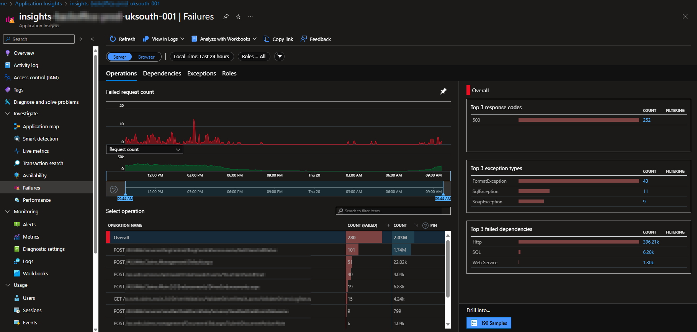

# 📊 Monitoring an IIS-Based Web Farm with Azure Application Insights

In this guide, you'll learn how to:

✅ Set up **Application Insights** on an IIS-based web farm.  
✅ Configure **Log Analytics**, **Data Collection Rules**, and **Data Collection Endpoints**.  
✅ Use **PowerShell** to install the Application Insights agent.  
✅ Monitor **live metrics, failures, performance, and logs** in real-time.  

By the end, you'll have a **fully monitored** IIS-based web farm using Azure! 🎯

---

## 🏗️ **Step 1: Enabling Application Insights on IIS Servers**

To effectively monitor your IIS-based application, you need to configure Azure Application Insights and ensure all required components are installed on your Azure VMs.

### 🛠️ **Prerequisites**

Before proceeding, ensure you have:

- 🔹 **An active Azure Subscription** with permissions to create and manage resources.
- 🔹 **A Log Analytics Workspace (LAW)** to store collected telemetry data.
- 🔹 **Azure Monitor Agent (AMA)** installed on your IIS VMs.
- 🔹 **Necessary permissions** to create Data Collection Rules (DCRs) and Data Collection Endpoints (DCEs).

### **Create a Log Analytics Workspace**

1. Go to **Azure Portal** → **Search for "Log Analytics Workspaces"** → **Create**.
2. Provide the following details:
   - **Subscription**: Select your Azure subscription.
   - **Resource Group**: Choose or create a new one.
   - **Name**: Enter a unique name (e.g., `log-corpapp-prod-uksouth`).
   - **Region**: Same as your IIS VMs.
3. **Click "Review + Create"** and deploy the workspace.

🔗 [Microsoft Learn: Log Analytics Workspace](https://learn.microsoft.com/en-us/azure/azure-monitor/logs/log-analytics-workspace-overview)

### **Create a Data Collection Endpoint (DCE)**

1. Navigate to **Monitor** → **Data Collection Endpoints**.
2. Click **"+ Create"** and provide:
   - **Name**: e.g., `dce-corpapp-prod-uksouth`.
   - **Subscription & Resource Group**: Same as your IIS VMs.
   - **Region**: Same as Log Analytics Workspace.
3. **Review & create the endpoint**.

🔗 [Microsoft Learn: Data Collection Endpoints](https://learn.microsoft.com/en-us/azure/azure-monitor/essentials/data-collection-endpoint-overview)

### **Create a Data Collection Rule (DCR)**

1. Go to **Monitor** → **Data Collection Rules** → **+ Create**.
2. Configure:
   - **Name**: `dcr-corpapp-iis-prod-uksouth`
   - **Subscription & Resource Group**: Same as above.
   - **Region**: Same as DCE & LAW.
3. **Define data sources**:
   - **Windows Event Logs**: Add `System`, `Application`, etc.
   - **Log Levels**: Select relevant levels (Error, Warning, Information).
4. **Set Destination**:
   - Choose **"Log Analytics Workspace"** → Select the previously created workspace.
5. **Associate with IIS VMs** (`WEB01` - `WEB05`).
6. **Review & Create the rule**.

🔗 [Microsoft Learn: Data Collection Rules](https://learn.microsoft.com/en-us/azure/azure-monitor/agents/data-collection-rule-overview)

### **Install the Azure Monitor Agent (AMA)**

1. Navigate to each IIS VM.
2. Under **"Monitoring"**, select **"Extensions"**.
3. Click **"+ Add"** → **AzureMonitorWindowsAgent** → Install.
4. Repeat for all IIS VMs.

🔗 [Microsoft Learn: Azure Monitor Agent](https://learn.microsoft.com/en-us/azure/azure-monitor/agents/azure-monitor-agent-overview)

### **Enable Application Insights**

1. Navigate to **Azure Portal** → **Search for "Application Insights"**.
2. Click **"+ Create"** → Provide:
   - **Subscription & Resource Group**: Same as VMs.
   - **Name**: `insights-corpapp-prod-uksouth-001`.
   - **Region**: Same as your IIS VMs.
   - **Application Type**: **ASP.NET Web Application**.
3. **Click "Review + Create"** and deploy.

🔗 [Microsoft Learn: Enable Application Insights](https://learn.microsoft.com/en-us/azure/azure-monitor/app/asp-net)

### **Install the Application Insights Agent**

Use the following **PowerShell script** to install the agent on all of the IIS servers:

```powershell
# Install the Application Insights Agent
$instrumentationKey = "YOUR-INSTRUMENTATION-KEY"
Install-PackageProvider -Name NuGet -Force
Install-Module -Name ApplicationInsightsWebTracking -Force
Enable-ApplicationInsightsMonitoring -InstrumentationKey $instrumentationKey
Restart-Service W3SVC
```

---

## 📊 **Step 2: Using Application Insights for Monitoring**

With everything set up, it's time to **monitor and analyze** application performance! 🔍

### **📌 Overview Dashboard**

- Displays high-level **health metrics**, failed requests, and response times.
📸 ****

### **📌 Application Map**

- Shows **dependencies and interactions** between components.
📸 ****

### **📌 Live Metrics**

- Monitor **real-time requests, server performance, and failures**.
📸 ****

### **📌 Failures & Exceptions**

- Identify and diagnose **failed requests & top exceptions**.
📸 ****

### **📌 Performance Monitoring**

- Analyze **response times, dependencies & bottlenecks**.
📸 ****

### **📌 Logs & Queries**

- Run **Kusto Query Language (KQL)** queries for deep insights.

Example query to find failed requests:

```kusto
requests
| where timestamp > ago(24h)
| where success == false
| project timestamp, name, resultCode, url
| order by timestamp desc
```

📸 ****

---

### ✅ **Next Steps**

🎯 Continue monitoring logs & alerts for trends.  
🎯 Optimize Application Insights sampling to reduce telemetry costs.  
🎯 Automate reporting for key performance metrics.  

By following this guide, you'll have a **robust, real-time monitoring setup** for your IIS web farm, ensuring optimal performance and quick issue resolution! 🚀
