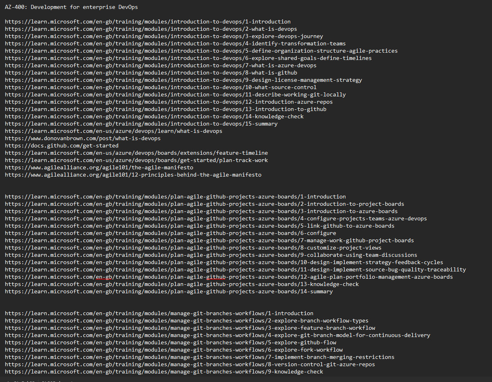

# How I Used ChatGPT to Create AZ-400 Exam Prep Notes from MSLearn

## 🚀 TL;DR - Results First

Using the method detailed in this post, I successfully **passed the AZ-400 exam** while creating a reusable study system. This approach helped me transform **34+ hours of MSLearn content** into structured, searchable revision notes that I could quickly reference during my exam preparation.

Let me walk you through how I developed this system and how you can apply it to your own certification journey.

## The Challenge

Studying for Microsoft certification exams like **AZ-400** can be overwhelming due to the vast amount of content available. Microsoft Learn alone provides **over 34 hours of recommended reading**, making it difficult to retain everything effectively.

To tackle this challenge, I developed a **structured method** using **MSLearn, third-party exam questions, and ChatGPT** to create a comprehensive **revision guide**. This method helped me **organize knowledge into concise notes, cheat sheets, glossaries, and knowledge checks**, ultimately leading to a successful exam pass!

This guide documents my **step-by-step process** so that you can replicate or adapt it for your own Microsoft exam preparation.

## 🏆 Goals of This Study Approach

My main objectives were:

- 📌 **Summarize each MSLearn module** into easily digestible revision notes.
- 📌 **Create a structured, searchable reference** for later review.
- 📌 **Store my notes in GitHub** using Markdown for easy access.
- 📌 **Use AI (ChatGPT) to extract and summarize key information**.
- 📌 **Supplement with third-party practice exams** to test my knowledge.

This method is **not a quick win** but provides an efficient, **structured, and reusable** way to prepare for any MSLearn-based exam.

### 🔹 MSLearn Collections Used

To ensure comprehensive coverage of the exam syllabus, I structured my studies around the **official Microsoft Learn learning paths**. Each path covers a key topic required for AZ-400 certification, including DevOps principles, CI/CD, infrastructure as code, and security best practices. I systematically worked through these collections, summarizing important concepts, capturing key insights, and using ChatGPT to refine the content into structured notes.

Below are the **learning paths** I followed, each linking directly to its respective Microsoft Learn module:

- [AZ-400 Development for Enterprise DevOps](https://learn.microsoft.com/en-us/training/paths/az-400-work-git-for-enterprise-devops/?username=MattPollock-7884&section=activity&ns-enrollment-type=Collection&ns-enrollment-id=7w1eik156rweq7) – Covers Git workflows, branch strategies, and repository management.
- [AZ-400 Implement CI with Azure Pipelines and GitHub Actions](https://learn.microsoft.com/en-us/training/paths/az-400-implement-ci-azure-pipelines-github-actions/?username=MattPollock-7884&section=activity&ns-enrollment-type=Collection&ns-enrollment-id=7w1eik156rweq7) – Focuses on automating build and release processes with Azure Pipelines and GitHub Actions.
- [AZ-400 Design and Implement a Release Strategy](https://learn.microsoft.com/en-us/training/paths/az-400-design-implement-release-strategy/?username=MattPollock-7884&section=activity&ns-enrollment-type=Collection&ns-enrollment-id=7w1eik156rweq7) – Covers feature flagging, blue-green deployments, and release management.
- [AZ-400 Implement Secure Continuous Deployment](https://learn.microsoft.com/en-us/training/paths/az-400-implement-secure-continuous-deployment/?username=MattPollock-7884&section=activity&ns-enrollment-type=Collection&ns-enrollment-id=7w1eik156rweq7) – Discusses security measures for CI/CD pipelines.
- [AZ-400 Manage Infrastructure as Code Using Azure](https://learn.microsoft.com/en-us/training/paths/az-400-manage-infrastructure-as-code-using-azure/?username=MattPollock-7884&section=activity&ns-enrollment-type=Collection&ns-enrollment-id=7w1eik156rweq7) – Focuses on managing cloud resources with Terraform, Bicep, and ARM templates.
- [AZ-400 Design and Implement a Dependency Management Strategy](https://learn.microsoft.com/en-us/training/paths/az-400-design-implement-dependency-management-strategy/?username=MattPollock-7884&section=activity&ns-enrollment-type=Collection&ns-enrollment-id=7w1eik156rweq7) – Covers artifact management and dependency security.
- [AZ-400 Implement Continuous Feedback](https://learn.microsoft.com/en-us/training/paths/az-400-implement-continuous-feedback/?username=MattPollock-7884&section=activity&ns-enrollment-type=Collection&ns-enrollment-id=7w1eik156rweq7) – Discusses monitoring and feedback loops for DevOps processes.
- [AZ-400 Implement Security and Validate Code Bases for Compliance](https://learn.microsoft.com/en-us/training/paths/az-400-implement-security-validate-code-bases-compliance/?username=MattPollock-7884&section=activity&ns-enrollment-type=Collection&ns-enrollment-id=7w1eik156rweq7) – Focuses on DevSecOps principles and compliance validation.

These resources formed the foundation of my study plan, ensuring alignment with the **official exam objectives**. I used these collections as the basis for my **revision notes, AI-generated summaries, and knowledge checks**.

---

## 📊 Process Overview

Before diving into the detailed steps, here's an overview of the complete workflow:

```markdown
MSLearn Content → Link Collection → ChatGPT Summarization → GitHub Storage → Practice Testing → Final Review
```

Estimated time investment per module:

- Manual link collection: ~15 minutes
- AI summarization and refinement: ~30-60 minutes
- Review and validation: ~30 minutes
- Total per module: ~1-1.75 hours (compared to 3-4 hours of traditional study)

These estimates are based on my experience after processing several modules. As you'll see in the learning curve section below, your first few modules might take longer as you refine your workflow.

Let's dive into each step of the process in detail.

---

## 📌 Step 1: Collecting and Organizing MSLearn Content

MSLearn provides **structured learning paths**, but I needed a way to track important links and content. Here's how I manually compiled everything:

### 🔹 Manual Link Collection Process

1. **Initial Setup**: I created a dedicated folder structure on my computer with sub-folders for each learning path, mirroring the eventual GitHub repository structure.

2. **After each lesson**: Captured all relevant **hyperlinks** and stored them in a `.txt` file within the appropriate folder. This was as simple as copy-pasting links while reading.

3. **At the end of each module**: Consolidated all links into the text file and organized them by topic.

4. **Mapped content to official exam objectives**: Fed the exam study guide into ChatGPT to check alignment, ensuring I wasn't missing critical areas.

📸 ****

#### Before & After Example

**Raw MSLearn Content:**

```markdown
Unit Title: Implement branch policies in Azure Repos
- Configure branch policies
- Implement pull request approval processes
- Manage branch policy bypasses
- Configure auto-complete pull requests
- Configure branch policy permissions
- Configure build validation
```

**Transformed into Structured Notes:**

```markdown
## Branch Policies in Azure Repos

Branch policies help teams protect important branches by:
- Requiring code reviews before merging
- Setting minimum number of reviewers (typically 2+)
- Enforcing build validation to prevent broken code
- Restricting direct pushes to protected branches

### Key Configuration Options:
| Policy | Purpose | Real-world Usage |
|--------|---------|------------------|
| Minimum reviewers | Ensures code quality | Set to 2+ for production code |
| Build validation | Prevents broken builds | Configure with main CI pipeline |
| Comment resolution | Tracks issue fixes | Require resolution before merge |
```

**Lesson Learned**: Consistent link collection during the learning process is much more efficient than trying to gather everything after completing a module. I developed a habit of copying links as I encountered them, which saved significant time later.

> 💡 *Future Improvement*: Automating this process via a script could save time. A PowerShell or Python script could potentially scrape MSLearn modules for relevant links.

---

## 📌 Step 2: Using AI (ChatGPT) to Summarize Content

To turn raw MSLearn material into usable study notes, I **fed collected links into ChatGPT** and asked it to **scrape and summarize key points**.

I used **ChatGPT 4** for this process, as it provided better context handling and more accurate summaries than earlier versions.

The summarization workflow consisted of the following steps:

1️⃣ **Collected MSLearn Links** – Compiled all module-related links into a text file.
2️⃣ **Fed the Links into ChatGPT** – Asked ChatGPT to analyze and summarize key information.
3️⃣ **Refined the Output Iteratively** – Adjusted prompts to enhance clarity and completeness.

### 🔹 Crafting Effective ChatGPT Prompts

Well-structured prompts were essential for generating **clear and accurate** summaries. Below is an example of my **initial prompt**:

``` markdown title="prompt - ChatGPT first iteration"
Please create a .md file in the same format as the previous ones and include the following:

Summarize key information within each unit, including diagrams, tables, and exercises and labs.
List steps performed and order of steps/workflow, where applicable.
Use tables primarily for comparing differences between items.
Include:
Key exam points.
Points to remember.
Prerequisite information.
Include any service limits - maximum minutes per month for a particular tier, difference services available in varying tiers/services/SKUs for example
Permissions required for activities.
Provide real-world applications, troubleshooting scenarios, and advanced tips.
Highlight common pitfalls or mistakes to avoid.
Review the canvas and add/remove any relevant information.
Use the web to search for supplementary material where necessary, and summarize this information within the notes.
Avoid external links—include all relevant information directly in the notes.
Ensure all "Learning objectives" in Unit 1 are met by the material included in the output .md file(s)
Ensure no content is included that doesn't have a real-world example or exam related reference included
Review the output you have created at the end, and make any further improvements automatically be manually revising the file or implementing your comments.

Here is a list of the links contained in this module.
Using the parameters outlined above create a comprehensive exam cram resource cheat sheet, that can be used for my AZ-400 exam prep.
The resulting output needs contain material relevant to the AZ-400 study guide:

https://learn.microsoft.com/en-us/credentials/certifications/resources/study-guides/az-400

Let me know when you are ready for the module links?
```

While this prompt worked initially, I found it had several limitations:

- It was too lengthy and complex for ChatGPT to consistently follow all instructions
- It lacked specific formatting guidance
- It didn't emphasize accuracy and relevance enough

### 🔹 Prompt Evolution

I refined the prompt through several iterations to address these issues. The key improvements included:

1. **Adding a clear word count limit** (750 words per file) to prevent overly lengthy outputs
2. **Explicitly prohibiting generic statements** like "understand X" and "know how to..."
3. **Requiring concrete examples for each concept** rather than theoretical explanations
4. **Creating a more structured format** with clear section headings and organization
5. **Adding a final validation step** to ensure content aligned with learning objectives

#### Initial Results vs. Refined Results

**First Iteration Output (Excerpt):**

```markdown
## Key Exam Points
- Understand the different branch policies in Azure Repos
- Know how to configure pull request approvals
- Understand branch policy permissions
```

**Problems:**

- Too generic with "understand" and "know how" statements
- Lacks specific examples and actionable information
- No clear formatting structure

**Refined Output (After Improved Prompt):**

```markdown
## Branch Policies in Azure DevOps

### Key Exam Points
- Branch policies in Azure Repos protect branches by enforcing code review and build validation
- Required reviewers policy must be configured with minimum count (2+ recommended for production)
- Build validation policy links CI pipeline to PR process, ensuring code builds successfully
- Policy bypasses can be granted to specific users or groups (Project Administrators have bypass by default)
- Branch policies are set at repository level under Branches → [...] → Branch Policies

### Common Scenarios
When setting up branch policies for a large team:
1. Configure minimum 2 reviewers for main branch
2. Enable "Comment resolution" to require addressing feedback
3. Link build validation to prevent broken builds
4. Set reset votes when new changes are pushed
```

### 🔹 Challenges & Solutions

Using AI to generate structured content wasn't always seamless. Here are some **key challenges and how I addressed them**:

| **Challenge** | **Solution** | **Example** |
|--------------|-------------|-------------|
| ChatGPT lost context in long sessions | Processed module-by-module instead of bulk inputs | Split "Azure Pipelines" module into 3 separate prompts |
| Overwrote useful content in iterations | Manually saved outputs before requesting refinements | Created checkpoint files labeled v1, v2, etc. |
| Large data inputs led to incomplete summaries | Used **multiple iterations**, focusing on **key areas** of each module | First pass: core concepts; Second pass: examples and scenarios |
| Hallucinations on technical details | Cross-validated against official documentation | Corrected service limits and permission details |
| Generic "understand X" statements | Explicitly requested specific actionable information | Replaced "Understand CI/CD" with actual pipeline YAML examples |

Breaking down content into **smaller chunks** and applying **manual validation** helped ensure better results.

**Learning Curve**: My first module took nearly 2 hours to process completely, as I was still figuring out the optimal prompt structure and workflow. By my fifth module, I had reduced this to about 45 minutes through improved prompting and a more streamlined approach.

---

### 🔹 Refining the Output

To improve **content accuracy**, I introduced an additional **review prompt**:

``` markdown title="ChatGPT prompt - second iteration"
Objective:
Create a .md file that acts as a comprehensive AZ-400 exam cram resource cheat sheet.

Instructions:
Act as my Azure DevOps training expert with a focus on preparing me for the AZ-400 exam.

The output must adhere to the structure and content requirements outlined below:

Content Requirements:
Each file should contain no more than 750 words (excluding text that make up hyperlinks)

Summarize Key Information:
Include summaries for each unit, diagram, table, exercise, and lab where applicable.
Use clear and concise explanations.

List Steps/Workflows:
Summarize steps performed in labs/exercises and the order of steps/workflows where applicable.

Use Tables:
Create tables primarily for comparing differences between items (examples, but not limited to - features, tiers, SKUs etc ).

Key Exam Points: Highlight crucial information likely to appear in the exam and provide actual examples. 
Do not use generic phrases like "Understand...." and  "Know how to....". 
I need you to provide the information I need to know for each exam tip.

Points to Remember: Provide concise, high-priority notes for studying.

Prerequisite Information: Mention anything needed to understand or implement concepts.

Service Limits: Include tier limitations (e.g., maximum minutes per month), service availability by SKU, etc.

Permissions Required: Specify roles/permissions necessary for activities.

Practical Applications:
Provide real-world applications, troubleshooting scenarios, and advanced tips.
Highlight common pitfalls or mistakes to avoid.

Relevance:
Ensure the output aligns with the Microsoft AZ-400 study guide 
(https://learn.microsoft.com/en-us/credentials/certifications/resources/study-guides/az-400)
Exclude any content that lacks real-world examples or exam-related references.

Final Review:
Evaluate the output to ensure all "Learning Objectives" in Unit 1 are met.
Automatically revise the file manually if needed to enhance clarity and completeness.


Prompt me for a list of URL's or an existing .md file when you have understood the instructions.

```

### 🔹 Iterative Refinement Technique

Depending on the results, I would often break the prompt up further, and just use a specific part.
For example, once I was happy with the results of a certain output I would re-enter the "Final Review:
Evaluate the output to ensure all "Learning Objectives" in Unit 1 are met."
Automatically revise the file manually if needed to enhance clarity and completeness." prompt, once or maybe several times until was happy with the finished output.

A typical module would go through 2-3 iterations:

1. **Initial generation** - Creates the basic structure and content
2. **Content enhancement** - Adds real-world examples and specifics
3. **Final validation** - Checks against learning objectives and improves clarity

For complex topics like Azure Pipelines, I might need 4-5 iterations to fully refine the content.

#### Workflow Integration

I integrated this process into my daily study routine by:

1. Reading a module in the morning
2. Collecting links as I went
3. Processing with ChatGPT during lunch break or after work
4. Reviewing and committing to GitHub in the evening

This approach allowed me to maintain consistent progress without feeling overwhelmed.

#### Time-Saving Tip

A full module processing cycle typically took about 30-45 minutes, compared to 2-3 hours of traditional study and note-taking. The time investment was front-loaded, but paid dividends during revision.

---

## 📌 Step 3: Integrating Third-Party Exam Resources

While MSLearn is great for structured content, **real-world practice questions** are crucial for exam success. I incorporated:

- ✅ **MSLearn Official Practice Questions**
- ✅ **Third-Party Providers**: Tutorials Dojo, MeasureUp
- ✅ **Exam Explanation Links** (to validate answers)

### 🔹 How I Validated Third-Party Questions

- Checked explanations for **links to MSLearn documentation**.
- Manually cross-referenced answers with **official study material**.
- Used my GitHub repo's search function to quickly verify concepts.

### 🔹 Identifying Valuable Practice Questions

Not all practice questions are created equal. I prioritized questions that:

1. Included detailed explanations with documentation links
2. Covered scenarios rather than simple definition recall
3. Tested practical knowledge rather than obscure facts
4. Referenced multiple concepts in a single question

📸 ****

### 🔹 Supplementary Resources Worth The Investment

Based on my experience, these additional resources provided the best value:

1. **Tutorials Dojo Practice Exams** - Excellent explanations and documentation links
2. **MeasureUp Official Practice Tests** - Most similar to actual exam format
3. **WhizLabs Labs** - Hands-on practice for key scenarios

The combination of AI-summarized MSLearn content and targeted practice questions created a comprehensive exam preparation strategy.

**Real-World Application Example**: During a practice exam, I encountered a question about configuring branch policies with required reviewers. Using my GitHub repository's search function, I quickly found the related notes I had created, which included the exact setting location and recommended configuration values. This allowed me to answer correctly and understand the underlying concept, rather than just memorizing an answer.

---

## 📌 Step 4: Storing Notes in GitHub for Easy Reference

One key advantage of this method was **storing all notes in a GitHub repository**, allowing easy searchability.

### 🔹 Initial GitHub Repository Setup

1. **Created a new GitHub repository** specifically for my AZ-400 exam notes
2. **Established a folder structure** that mirrored the MSLearn learning paths
3. **Set up a README** with quick navigation links to major sections
4. **Created a consistent file naming convention** (numbered by sequence in the learning path)

### 🔹 How I Structured My Notes

**(VS Code folder structure represented in Markdown)**

```markdown
📂 AZ-400 - MS LEARN - EXAM NOTES/
 ├── 📁 .github/
 │
 ├── 📁 1. AZ-400 Development for Enterprise DevOps/
 │    ├── 1. Introduction to DevOps.md
 │    ├── 2. Plan Agile with GitHub Projects and Azure Boards.md
 │    ├── 3. Design and implement branch strategies and workflows.md
 │    ├── 4. Collaborate with pull requests in Azure Repos.md
 │    ├── 5. Explore Git hooks.md
 │    ├── 6. Plan foster inner source.md
 │    ├── 7. Manage and configure repositories.md
 │    ├── 8. Identify technical debt.md
 │
 ├── 📁 2. AZ-400 Implement CI with Azure Pipelines and GitHub Actions/
 │    ├── 1. Explore Azure Pipelines.md
 │    ├── 2. Manage Azure Pipeline agents and pools.md
 │    ├── 3. Describe pipelines and concurrency.md
 │    ├── 4. Design and implement a pipeline strategy.md
 │    ├── 5. Integrate with Azure Pipelines.md
 │    ├── 6. Introduction to GitHub Actions.md
 │    ├── 7. Learn continuous integration with GitHub Actions.md
 │    ├── 8. Design Container Build Strategy.md
 ├── 📁 3. AZ-400 Design and Implement a Release Strategy/
 ├── ...
 ├── 📁 4. AZ-400 Implement a Secure Continuous Deployment using Azure Pipelines/
 ├── ...
 ├── 📁 5. AZ-400 Manage Infrastructure as Code using Azure and DSC/
 ├── ...
 ├── 📁 6. AZ-400 Design and Implement a Dependency Management Strategy/
 ├── ...
 ├── 📁 7. AZ-400 Implement Continuous Feedback
 ├── ...
 ├── 📁 8. AZ-400 Implement Security and Validate Code Bases for Compliance/
 ├── ...
 ├── 📁 AZ-400 Tutorials Dojo - Exam Notes/
 │    ├── Azure DevOps - Terms and Definitions - Pt 1.md
 │    ├── Azure DevOps - Terms and Definitions - Pt 2.md
 │    ├── Azure DevOps - Terms and Definitions - Pt 3.md

```

📸 ****

### 🔹 Workflow for Adding New Notes

1. **Create new markdown file** in the appropriate folder
2. **Paste ChatGPT-generated content** and review for accuracy
3. **Commit changes** with descriptive commit messages (e.g., "Add Azure Pipelines agents notes")
4. **Push to GitHub** to make available for searching during study sessions

🔍 **Searching Notes Efficiently**

- Used **GitHub's search function** to quickly find terms (e.g., `MendBolt`).
- This allowed me to **cross-check answers during study sessions**.

#### Example Search Workflow

1. Practice question mentions "Which Azure DevOps deployment strategy minimizes downtime during releases?"
2. One of the answers mnetions "Blue/Green" deployment
3. Search repository for "Blue/Green"
4. Results show multiple matching files.
5. Quickly identify that "Blue/Green deployment" is the correct answer based on my notes.
6. Verify with documentation reference that Blue/Green deployments maintain two identical production environments, allowing for instant switching between versions.

📸 ****

### 🔹 Real-World Performance Impact

During practice exams, I could typically locate key information in **under 30 seconds** using this method, compared to several minutes when using traditional notes or searching documentation directly.

---

## 📌 Results & Key Takeaways

🎯 **Outcome:**

- ✅ Passed the AZ-400 exam! 🎉
- ✅ Created a **structured, reusable** study guide.
- ✅ Used AI efficiently to **save time and condense information**.
- ✅ Reduced overall study time by approximately 40% compared to traditional methods.

### 🔹 Time Investment Analysis

| Activity | Traditional Approach | AI-Enhanced Approach | Time Savings |
|----------|---------------------|----------------------|--------------|
| Reading MSLearn | 34+ hours | 8-10 hours | ~70% |
| Note-taking | 10-15 hours | 5-7 hours | ~50% |
| Organization | 3-5 hours | 2-3 hours | ~40% |
| Practice & Review | 15-20 hours | 15-20 hours | 0% |
| **Total** | **62-74 hours** | **30-40 hours** | **~45%** |

These figures are based on my own experience and tracking of study time. Your results may vary depending on your familiarity with the subject matter and the tools involved. The key insight is that the most significant time savings came from condensing the initial reading phase while maintaining or even improving knowledge retention through structured notes.

### 🔹 What I'd Do Differently Next Time

🔹 Further **break down** the ChatGPT input process into **smaller steps**  
🔹 Explore **alternative AI tools** like Claude or Bard to compare summary quality  
🔹 Consider **automating link collection** from MSLearn using a simple web scraper  
🔹 Create a **standardized template** for each module type from the beginning  
🔹 Add more **visual elements** like diagrams to represent complex relationships  

### 🔹 Would I Recommend This Approach?

✅ Yes—but only if you're prepared for an **iterative, hands-on** study process.

The greatest benefits were:

1. Structured organization of complex information
2. Quick searchability during practice tests
3. Forced engagement with the material (rather than passive reading)
4. Creation of a reusable resource for future reference

---

## 🚀 How to Get Started Yourself

### Initial Setup Steps

Before diving into the content summarization, take these important setup steps:

1. **Create your repository structure**:
   - Set up a GitHub repository with appropriate folder structure
   - Create a README.md with navigation links
   - Establish a consistent file naming convention

2. **Set up a local workflow**:
   - Create a folder structure on your computer mirroring your GitHub repo
   - Establish a system for collecting and storing links as you study
   - Set up a template for your ChatGPT prompts

3. **Gather your resources**:
   - Bookmark all relevant MSLearn collections
   - Organize them according to the exam objectives
   - Create a schedule for working through them systematically

### Quick Start Template

Here's a simplified prompt template to get you started:

```markdown
I'm studying for the [EXAM CODE] certification. Please help me create concise, exam-focused notes for the following module: [MODULE NAME]

For each key concept, please:
1. Explain it in 1-2 sentences
2. Provide a real-world example or scenario
3. Note any configuration options or limitations
4. Mention if it's likely to appear on the exam

Please format your response in Markdown with clear headings and avoid generic "understand X" statements.

Here are the links to the module content:
[PASTE LINKS HERE]
```

### Complete Process

1️⃣ **Set up a GitHub repo** for your notes.
2️⃣ **Manually collect** MSLearn hyperlinks as you study.
3️⃣ **Use ChatGPT** to summarize module-by-module.
4️⃣ **Validate third-party questions** with official docs.
5️⃣ **Store and search** your notes in GitHub for quick reference.

---

## ❓ Frequently Asked Questions

**Q: Is this approach considered cheating?**
A: No. This method enhances learning by actively engaging with the material rather than replacing study. You're creating custom notes by directing AI to extract and organize information you need to know.

**Q: How much technical knowledge do I need to implement this approach?**
A: Basic GitHub knowledge and familiarity with markdown formatting are helpful but not essential. The core process can be adapted to use any note-taking system.

**Q: Does this work for all Microsoft certification exams?**
A: Yes, this approach works well for any exam with structured MSLearn paths.

**Q: How do you handle inaccurate information from AI?**
A: Always verify key technical details against official documentation. When in doubt, trust Microsoft's documentation over AI-generated content.

**Q: How long did it take you to become proficient with this workflow?**
A: After completing about 3-4 modules, I had established an efficient workflow. The learning curve is relatively quick if you're already familiar with GitHub and ChatGPT.

---

## 💬 Final Thoughts

This method made my **exam prep structured and efficient**, though it required **significant manual effort**. If you're preparing for a Microsoft certification, consider trying this approach!

The combination of **AI-powered summarization**, **structured GitHub storage**, and **focused practice testing** created a powerful study system that both saved time and improved retention.

The most valuable aspect wasn't just passing the exam, but creating a reusable knowledge base that continues to serve as a reference in my professional work. While traditional study methods might help you pass an exam, this approach helps build a lasting resource.

💡 **Have you used AI tools for exam prep? Share your thoughts in the comments!**

---

## 🔗 Additional Resources

- [My GitHub Repository Link](https://github.com/cloudlabmp/AZ-400---MS-Learn---Exam-Notes)
- [Microsoft Learn AZ-400 Path](https://learn.microsoft.com/en-us/training/paths/az-400-work-git-for-enterprise-devops/)
- [Official AZ-400 Exam Page](https://learn.microsoft.com/en-us/credentials/certifications/devops-engineer/)
- [GitHub Documentation](https://docs.github.com/)
- [ChatGPT Documentation](https://help.openai.com/)
